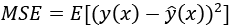

### three types of machine learning

The main task of machine learning is to explore and construct algorithms that can learn from historical data and make predictions on new input data. For a data-driven solution, we need to define (or have it defined by an algorithm) an evaluation function called a loss or cost function, which measures how well the models learn.

- Unsupervised learning: When the learning data only contains indicative signals without any description attached (we call this unlabeled data), it’s up to us to find the structure of the data underneath, discover hidden information, or determine how to describe the data. Unsupervised learning can be used to detect anomalies, such as fraud or defective equipment, or group customers with similar online behaviors for a marketing campaign. 
- Supervised learning: When learning data comes with a description, targets, or desired output besides indicative signals (we call this labeled data), the learning goal is to find a general rule that maps input to output. The learned rule is then used to label new data with unknown output. 
- Reinforcement learning: Learning data provides feedback so that a system adapts to dynamic conditions in order to ultimately achieve a certain goal. The system evaluates its performance based on the feedback responses and reacts accordingly.

### Overfitting, underfitting, and the bias-variance trade-off

#### Overfitting

Reaching the right fit model is the goal of a machine learning task. We call this situation `high variance` in machine learning.

What if the model overfits?
- Overfitting means a model fits the existing observations too well but fails to predict future new observations.

**Variance** measures the spread of the prediction, which is the variability of the prediction. It can be calculated as follows:

Here, ŷ is the prediction, and E[] is the expectation or expected value that represents the average value of a random variable, based on its probability distribution in statistics.

The following example demonstrates what a typical instance of overfitting looks like, where the regression curve tries to flawlessly accommodate all observed samples:

#### Underfitting

Underfitting is the opposite of overfitting. It occurs when the model is too simple to capture the underlying pattern of the data.

We describe any of these situations as `high bias` in machine learning, although its variance is low, as the performance in training and test sets is consistent, in a bad way.

**Bias** is the difference between the average prediction and the true value.

Here, ŷ is the prediction and y is the ground truth.

#### The bias-variance trade-off

Recall that bias is the error stemming from incorrect assumptions in the learning algorithm; high bias results in underfitting. 

Variance measures how sensitive the model prediction is to variations in the datasets. 

Minimizing the total error of a model requires a careful balancing of bias and variance.

Given a set of training samples, x1, x2, …, xn, and their targets, y1, y2, …, yn, we want to find a regression function ŷ(x) that estimates the true relation y(x) as correctly as possible. We measure the error of estimation, i.e., how good (or bad) the regression model is, in **mean squared error (MSE)**:

The E denotes the expectation. This error can be decomposed into bias and variance components following the analytical derivation, as shown in the following formula

The term `Bias` measures the error of estimations, and the term `Variance` describes how much the estimation, `ŷ`, moves around its mean, `E[ŷ]`. The more complex the learning model `ŷ(x)` is, and the larger the size of the training samples is, the lower the bias will become. 

We usually employ the cross-validation technique, as well as regularization and feature reduction, to find the optimal model balancing bias and variance and diminish overfitting.

#### Avoiding overfitting
- with cross-validation
- with regularization
- with feature selection and dimensionality reduction

