## Movie Recommendation System

### 1. Start with classification

**Classification** is one of the main instances of supervised learning. Given a training set of data containing observations and their associated categorical outputs, the goal of classification is to learn a general rule that correctly maps the observations (also called features or predictive variables) to the target categories (also called labels or classes).

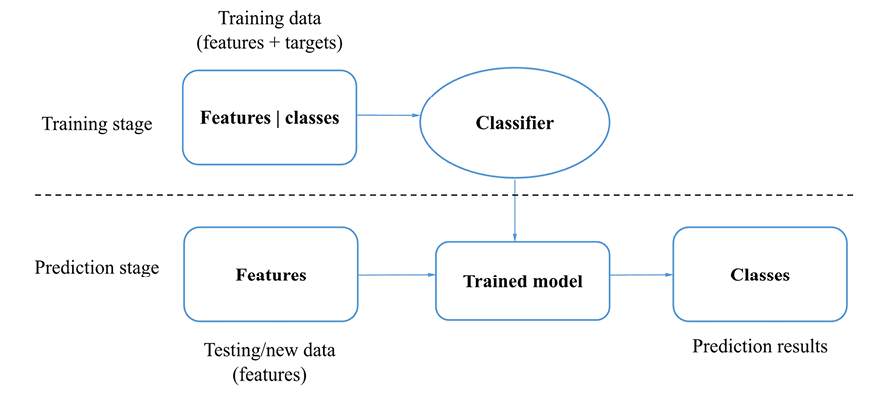

In general, there are three types of classification based on the possibility of class output—binary, multiclass, and multi-label classification.

**Binary classification**
Binary classification classifies observations into one of two possible classes. Spam email filtering we encounter every day is a typical use case of binary classification.

**Multiclass classification**
This type of classification is also referred to as multinomial classification. It allows more than two possible classes, as opposed to only two in binary cases.

**Multi-label classification**
In the first two types of classification, target classes are mutually exclusive and a sample is assigned one, and only one, label. It is the opposite in multi-label classification. 

A typical approach to solving an n-label classification problem is to transform it into a set of n binary classification problems, where each binary classification problem is handled by an individual binary classifier.

### 2. Naive Bayes, Text Classification

The most common way of doing text classification in language processing is instead via supervised machine learning. In supervised learning, we have a data set of input observations, each associated with some correct output (a ‘supervision signal’). The goal of the algorithm is to learn how to map from a new observation to a correct output.

Formally, the task of supervised classification is to take an input `x` and a fixed set of output classes `Y = {y1, y2,..., yM}` and return a predicted class `y ∈ Y`. For text classification, we’ll sometimes talk about `c` (for “class”) instead of `y` as our output variable, and `d` (for “document”) instead of `x` as our input variable. In the supervised situation we have a training set of `N` documents that have each been hand-labeled with a class: `{(d1, c1),....,(dN, cN)}`. Our goal is to learn a classifier that is capable of mapping from a new document `d` to its correct class `c ∈ C`, where `C` is some set of useful document classes. A probabilistic classifier additionally will tell us the probability of the observation being in the class.

**Naive Bayes Classifiers**

Naive Bayes is a probabilistic classifier, meaning that for a document `d`, out of all classes `c ∈ C` the classifier returns the class `ˆc` which has the maximum posterior probability given the document.

we use the hat notation `ˆ` to mean “our estimate of the correct class”, and we use `argmax` to mean an operation that selects the argument (in this case the class `c`) that maximizes a function (in this case the probability `P(c|d)`).

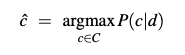

A way to break down any conditional probability `P(x|y)` into three other probabilities:

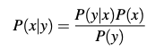

We can substitute the above equation into the equation:

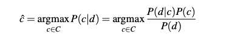

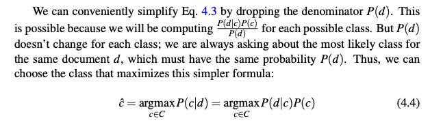

To return to classification: we compute the most probable class `ˆc` given some document `d` by choosing the class which has the highest product of two probabilities: 
- the **prior probability** of the class `P(c)` 
- and the **likelihood** of the document `P(d|c)`:

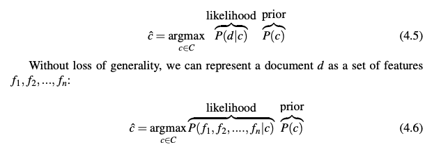

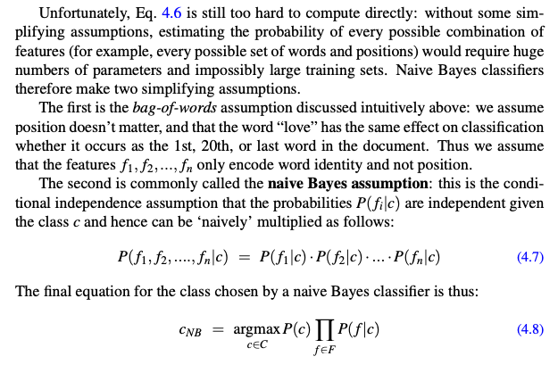

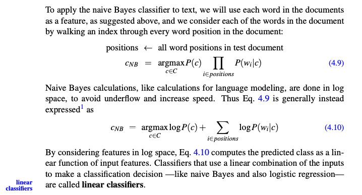

**Training the Naive Bayes Classifier**

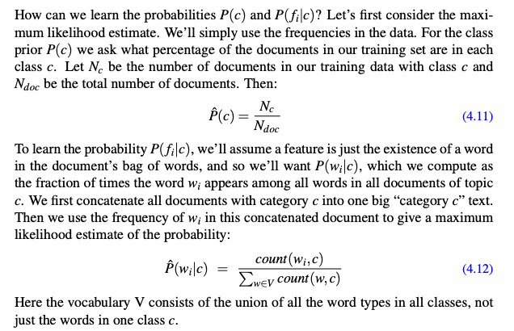

The Problem:

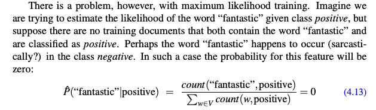

But since naive Bayes naively multiplies all the feature likelihoods together, **zero probabilities** in the likelihood term for any class will cause the probability of the class to be zero, no matter the other evidence!

**Laplace Smoothing**
The simplest solution is the add-one (Laplace) smoothing. While Laplace smoothing is usually replaced by more sophisticated smoothing algorithms in language modeling, it is commonly used in naive Bayes text categorization:

Note once again that it is crucial that the vocabulary V consists of the union of all the word types in all classes, not just the words in one class `c`.

**Example**

Let’s walk through an example of training and testing naive Bayes with add-one smoothing. We’ll use a sentiment analysis domain with the two classes positive (+) and negative (-), and take the following miniature training and test documents simplified from actual movie reviews.

Notes: `V ← vocabulary of D`

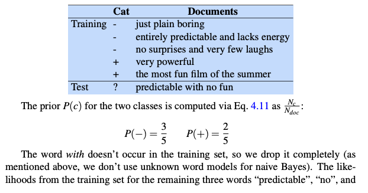

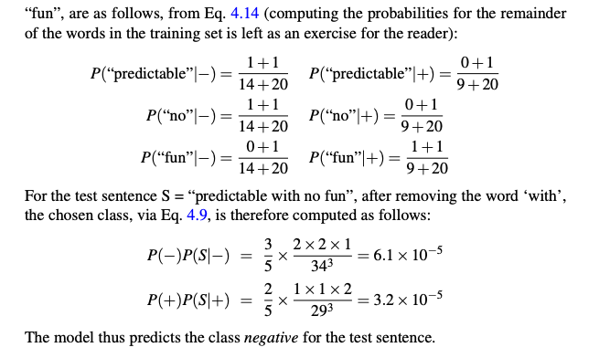

