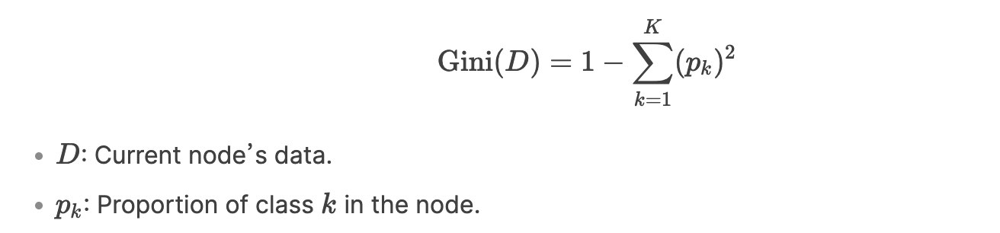
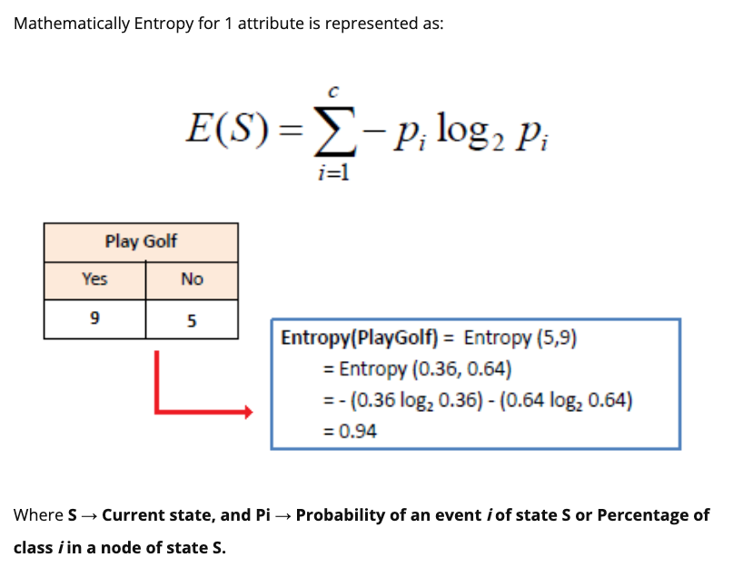
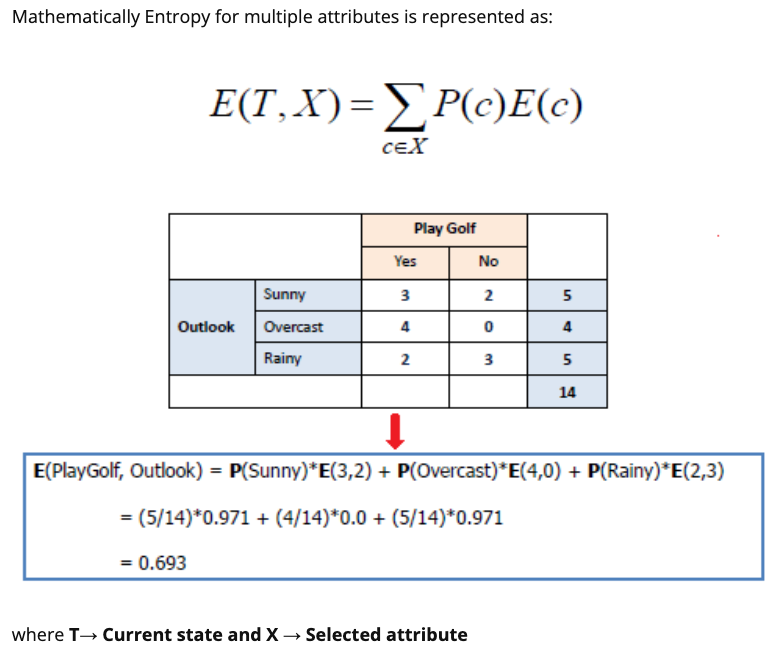
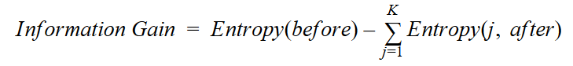
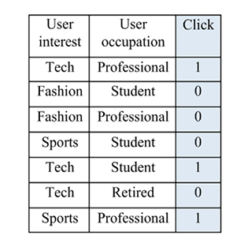

## Ad click-through prediction

Given a user and the page they are visiting, this predicts how likely it is that they will click on a given ad.

The most common measurement of effectiveness is the Click-Through Rate (CTR), which is the ratio of clicks on a specific ad to its total number of views. In general cases without clickbait or spammy content, a higher CTR indicates that an ad is targeted well and that an online advertising campaign is successful.

Click-through prediction entails both the promises and challenges of machine learning. It mainly involves the binary classification of whether a given ad on a given page (or app) will be clicked on by a given user, with predictive features from the following three aspects:
- Ad content and information (category, position, text, format, and so on)
- Page content and publisher information (category, context, domain, and so on)
- User information (age, gender, location, income, interests, search history, browsing history, device, and so on)

**Categorical features**, also known as qualitative features, represent distinct characteristics or groups with a countable number of options.

**Numerical** (also quantitative) **features**, on the other hand, have mathematical meaning as a measurement and are ordered.

### Constructing a decision tree

Construct an accurate decision tree. Popular ones include the following:

- **Iterative Dichotomiser 3 (ID3)**: This algorithm uses a greedy search in a top-down manner by selecting the best attribute to split the dataset on with each iteration without backtracking.
  
- **C4.5**: This is an improved version of ID3 that introduces backtracking. It traverses the constructed tree and replaces the branches with leaf nodes if purity is improved this way.
  
- **Classification and Regression Tree (CART)**: This constructs the tree using binary splitting, which we will discuss in more detail shortly. CART’s flexibility, efficiency, interpretability, and robustness make it a popular choice for various classification and regression tasks.
  
- **Chi-squared Automatic Interaction Detector (CHAID)**: This algorithm is often used in direct marketing. It involves complicated statistical concepts, but basically, it determines the optimal way of merging predictive variables in order to best explain the outcome.

### CART decision tree algorithm

CART（分类与回归树）是一种经典的决策树算法，既能处理分类问题（如判断是否患病），也能处理回归问题（如预测房价）。它的核心思想是通过不断提问，把数据分成更"纯净"的子集

#### The metrics for measuring a split
When selecting the best combination of a feature and a value as the splitting point, two criteria, such as Gini Impurity and Information Gain, can be used to measure the quality of separation.

**Gini Impurity**

This metric measures the impurity rate of the class distribution of data points, or the class mixture rate.

For Classification → Gini Index, Goal: Make subgroups as "pure" as possible (all samples in a subgroup belong to the same class). Split Criterion: Pick the feature and threshold that reduces Gini impurity the most. `A lower Gini Impurity indicates a purer dataset.`

- The overall Gini impurity for the split can be calculated as a weighted average of the Gini impurities for the child nodes, where the weights are proportional to the number of data points in each node.

**Information Gain**

This metric measures the improvement of purity after splitting or, in other words, the reduction of uncertainty due to a split. Higher Information Gain implies better splitting.

We obtain the Information Gain of a split by comparing the `entropy` before and after the split. The higher the entropy, the harder it is to draw any conclusions from that information.

1. Mathematically Entropy for 1 attribute is represented as:

2. Mathematically Entropy for multiple attributes is represented as:

**Information gain** is a statistical property that measures how well a given attribute separates the training examples according to their target classification. 

Information gain is a decrease in entropy. It computes the difference between entropy before split and average entropy after split of the dataset based on given attribute values.

we can conclude that:

Where `before` is the dataset before the split, `K` is the number of subsets generated by the split, and `(j, after)` is subset `j` after the split.

### Implementing a decision tree from scratch

- To begin with, we decide on the first splitting point, the root, by trying out all possible values for each of the two features. We utilize the weighted_impurity function we just defined to calculate the weighted Gini Impurity for each possible combination
