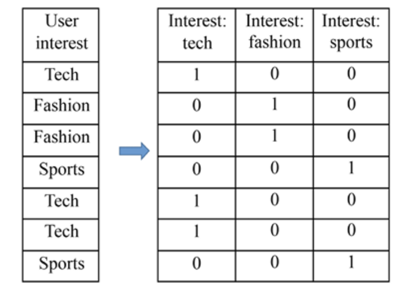
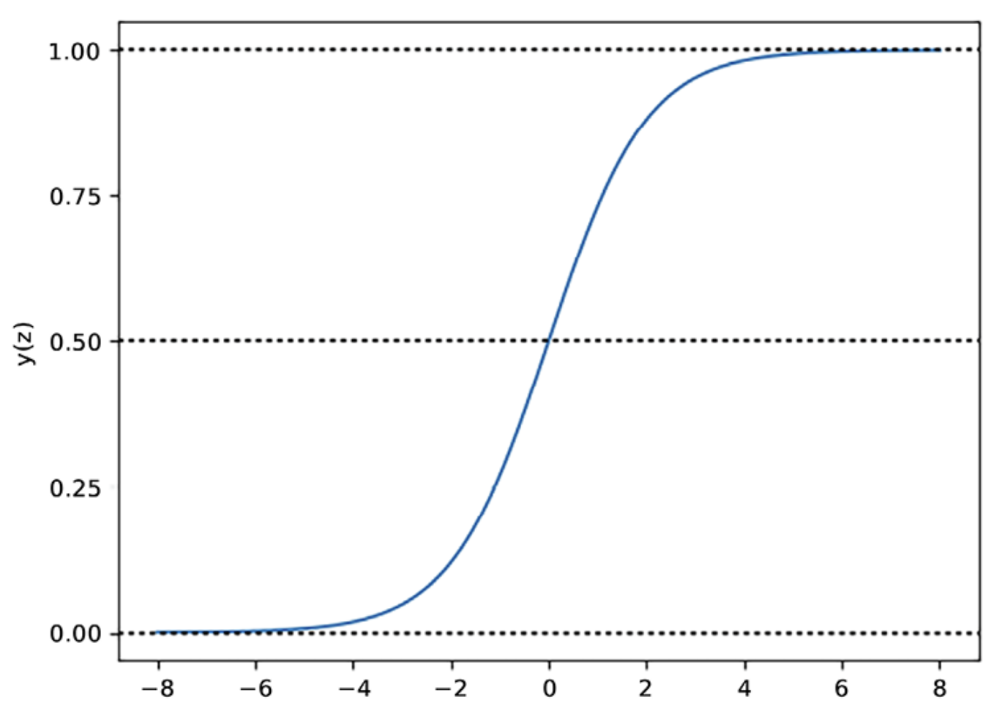

## Predicting Online Ad Click-Through with Logistic Regression

### Converting categorical features to numerical – one-hot encoding and ordinal encoding

**One-hot encoding** converts the categorical feature to k binary features. Each binary feature indicates the presence or absence of a corresponding possible value.

Example: Transforming user interest into numerical features with one-hot encoding



```python
from sklearn.feature_extraction import DictVectorizer

dict_one_hot_encoder = DictVectorizer(sparse=False)

# Convert the user interest dictionary to a one-hot encoded feature matrix
X_encoded = dict_one_hot_encoder.fit_transform(X_dict)

# Print the one-hot encoded feature matrix
print(X_encoded)
```

**Ordinal encoding** converts the categorical feature to a numerical feature.

We prefer transforming a categorical feature with k possible values into a numerical feature with values ranging from 1 to k.

```python
import pandas as pd
df = pd.DataFrame({'score': ['low','high','medium','medium','low']})

mapping = {'low':1, 'medium':2, 'high':3}
df['score'] = df['score'].replace(mapping)

print(df)
# Output: 
#    score
# 0      1
# 1      3
# 2      2
# 3      2
# 4      1
```

### Classifying with logistic regression

`Logistic function` (which is more commonly referred to as the `sigmoid function`) is defined as:

$$
y(z) = \frac{1}{1 + e^{-z}}
$$

Example:

```python
def sigmoid(input):
    return 1.0 / (1 + np.exp(-input))

z = np.linspace(-8, 8, 1000)
y = sigmoid(z)
```



In the `S-shaped curve`, all inputs are transformed into the range from 0 to 1. For positive inputs, a greater value results in an output closer to 1; for negative inputs, a smaller value generates an output closer to 0; when the input is 0, the output is the midpoint, 0.5.

### From the logistic function to logistic regression

In logistic regression, the function input z becomes the weighted sum of features. 

Given a data sample x with n features, x1, x2, …, xn (x represents a feature vector and x = (x1, x2, …, xn)), and `weights` (also called `coefficients`) of the model w (w represents a vector (w1, w2, …, wn)), z is expressed as follows:

$$
z = w_1x_1 + w_2x_2 + \ldots + w_nx_n = w^Tx
$$

The model comes with an `intercept` (also called `bias`), w0, which accounts for the inherent bias or baseline probability. In this instance, the preceding linear relationship becomes:

$$
z = w_0 + w_1x_1 + w_2x_2 + \ldots + w_nx_n = w^Tx
$$

As for the output y(z) in the range of 0 to 1, in the algorithm, it becomes the probability of the target being 1 or the positive class:

$$
\hat{y} = P(y=1|x) = \frac{1}{1 + e^{-w^Tx}}
$$

Hence, logistic regression is a probabilistic classifier, similar to the Naive Bayes classifier.


