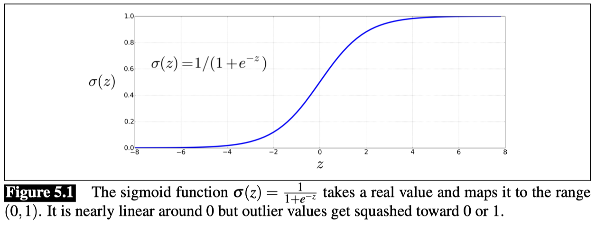
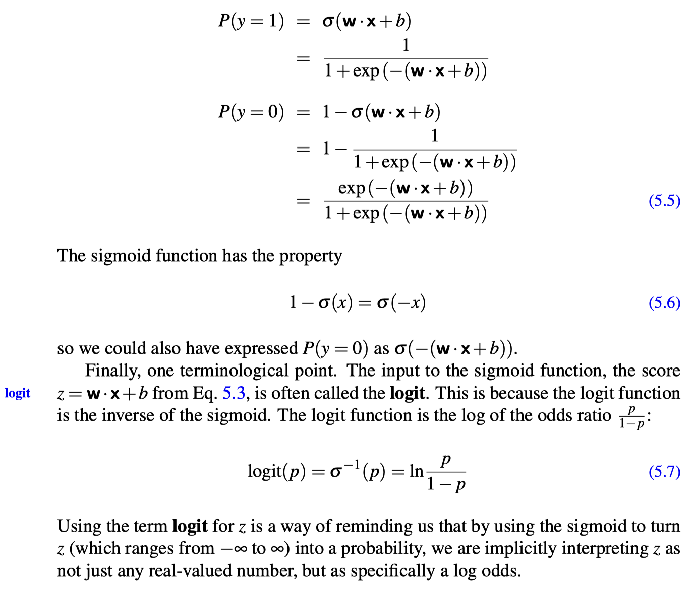
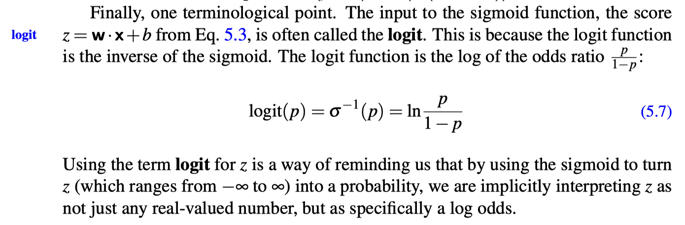

## Logistic Regression

The most important difference between `naive Bayes` and `logistic regression` is that `logistic regression` is a discriminative classifier while `naive Bayes` is a generative classifier.

**Generative model**
A generative model like `naive Bayes` makes use of this **likelihood** term, which expresses how to generate the features of a document `if we knew it was of class c`.

**Discriminative model**
By contrast a discriminative model in this text categorization scenario attempts to directly compute `P(c|d)`. Perhaps it will learn to assign a high weight to document features that directly improve its ability to discriminate between possible classes, even if it couldn’t generate an example of one of the classes.

**Components of a probabilistic machine learning classifier:**

Like naive Bayes, `logistic regression` is a probabilistic classifier that makes use of supervised machine learning. Machine learning classifier require a training corpus of `m` input/output pairs $(x^{(i)}, y^{(i)})$.

A machine learning system for classification then has four components:

1. A **feature representation** of the input. For each input observation $x^{(i)}$, this will be a vector of features $[x_1, x_2, ..., x_n]$. We will generally refer to feature $i$ for input $x^{(j)}$ as $x_i^{(j)}$, sometimes simplified as $x_i$, but we will also see the notation $f_i$, $f_i(x)$, or, for multi-class classification, $f_i(c,x)$.
2. A **classification function** that computes $\hat{y}$, the estimated class, via $p(y|x)$. In the next section we will introduce the **sigmoid** and **softmax** tools for classification.
3. An objective function that we want to optimize for learning, usually involving minimizing a loss function corresponding to error on training examples. We will introduce the **cross-entropy loss function**.
4. An algorithm for optimizing the objective function. We introduce the **stochastic gradient descent** algorithm.

**Logistic regression has two phases:**
- **training**: We train the system (specifically the weights `w` and `b`, introduced below) using stochastic gradient descent and the cross-entropy loss.
- **test**: Given a test example `x` we compute `p(y|x)` and return the higher probability label `y=1` or `y=0`.

### The sigmoid function

The goal of binary logistic regression is to train a classifier that can make a binary decision about the class of a new input observation.
Here we introduce the sigmoid classifier that will help us make this decision.

Consider a single input observation `x`, which we will represent by a vector of features `[x_1, x_2, ..., x_n]`.
The classifier output `y` can be 1 (meaning the observation is a member of the class) or 0 (the observation is not a member of the class).

Logistic regression solves this task by learning, from a training set, a vector of **weights** and a **bias term**.

Each weight $w_i$ is a real number, and is associated with one of the input features $x_i$. The weight $w_i$ represents how important that input feature is to the classification decision, and can be positive or negative. The **bias term**, also called the **intercept**, is another real number that’s added to the weighted inputs.

#### dot product
To make a decision on a test instance — after we’ve learned the weights in training - the classifier first multiplies each $x_i$ by its weight $w_i$, sums up the weighted features, and adds the bias term $b$. The resulting single number $z$ expresses the weighted sum of the evidence for the class.

Eq.1:
$$
z = \sum_{i=1}^{n} w_i x_i + b
$$

We’ll represent such sums using the **dot product** notation from linear algebra. The dot product of two vectors **a** and **b**, written as **a · b**, is the sum of the products of the corresponding elements of each vector. 

Eq.2:
$$
z = w ·x+b
$$

But note that nothing in Eq.2 forces `z` to be a legal probability, that is, to lie between 0 and 1. In fact, since weights are real-valued, the output might even be negative; `z` ranges from `−∞` to `∞`.

#### sigmoid
To create a probability, we’ll pass `z` through the sigmoid function, `σ(z)`. The sigmoid function (named because it looks like an s) is also called the **logistic function**, and gives logistic regression its name.

The sigmoid has the following equation:

Eq.3:
$$
\sigma(z) = \frac{1}{1 + e^{-z}} = \frac{1}{1 + exp(-z)}
$$

If we apply the sigmoid to the sum of the weighted features, we get a number between 0 and 1. To make it a probability, we just need to make sure that the two cases, p(y = 1) and p(y = 0), sum to 1. We can do this as follows:

