## Classification with Logistic Regression

How do we make a decision about which class to apply to a test instance `x`? For a given `x`, we say yes if the probability `P(y = 1|x)` is more than .5, and no otherwise. We call .5 the decision boundary:

Eq.4:
$$
\hat{y} = \begin{cases} 
1 & \text{if } p(y = 1 | x) > 0.5 \\
0 & otherwise
\end{cases}
$$

Examples of applying logistic regression as a classifier for language tasks.

#### Sentiment Classification

Suppose we are doing binary sentiment classification on movie review text, and we would like to know whether to assign the sentiment class `+` or `−` to a review document `doc`. We’ll represent each input observation by the 6 features `x_1 ...x_6` of the input shown in the following table; 

Fig. 5.2 shows the features in a sample mini test document.

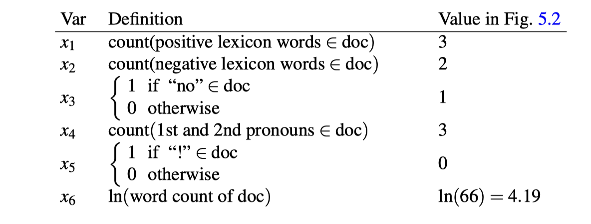

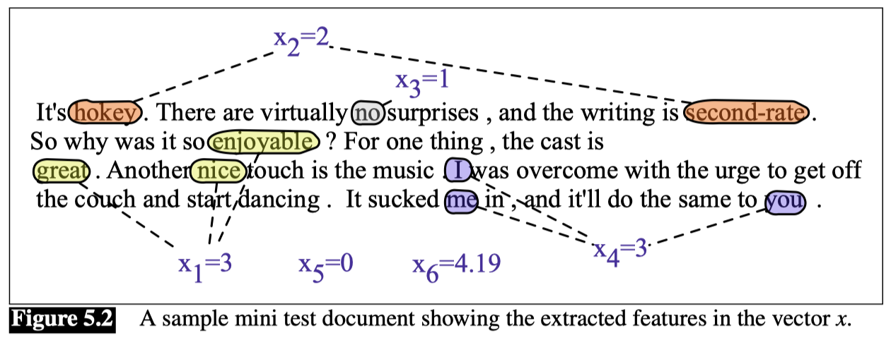

Let’s assume for the moment that we’ve already learned a real-valued weight for each of these features, and that the 6 weights corresponding to the 6 features are `[2.5,−5.0,−1.2,0.5,2.0,0.7]`, while `b = 0.1`.

Given these 6 features and the input review `x`, `P(+|x)` and `P(−|x)` can be computed using Eq.5:

Eq.5:
$$
p(+|x) = P(y = 1 | x) = σ(w ·x+b)
        = σ([2.5,−5.0,−1.2,0.5,2.0,0.7]·[3,2,1,3,0,4.19]+0.1)
        = σ(.833) = 0.70
$$

$$
p(−|x) = P(y = 0 | x) = 1−σ(w ·x+b) = 0.30
$$

#### Other classification tasks and features

**Scaling input features:** When different input features have extremely different ranges of values, it’s common to rescale them so they have comparable ranges. We **standardize** input values by centering them to result in a zero mean and a standard deviation of one (this transformation is sometimes called the **z-score**).

That is, if $µ_i$ is the mean of the values of feature $x_i$ across the $m$ observations in the input dataset, and $σ_i$ is the standard deviation of the values of features $x_i$ across the input dataset, we can replace each feature $x_i$ by a new feature $x_i'$ computed as follows:

Eq.6:
$$
x_i' = \frac{x_i - \mu_i}{\sigma_i}
$$

Where:

$$
\sigma_i = \sqrt{\frac{1}{m} \sum_{j=1}^{m} (x_i^{(j)} - \mu_i)^2}
$$

$$
\mu_i = \frac{1}{m} \sum_{j=1}^{m} x_i^{(j)}
$$

**Normalize:** alternatively, we can normalize the input features values to lie between 0 and 1:

Eq.7:
$$
x_i' = \frac{x_i - \min(x_i)}{\max(x_i) - \min(x_i)}
$$

#### Choosing a classifier
Logistic regression has a number of advantages over naive Bayes. Naive Bayes has overly strong conditional independence assumptions.

When there are many correlated features, logistic regression will assign a more accurate probability than naive Bayes. So logistic regression generally works better on larger documents or datasets and is a common default.

## Multinomial logistic regression

Sometimes we need more than two classes. Perhaps we might want to do 3-way sentiment classification (positive, negative, or neutral). In such cases we use **multinomial logistic regression**, also called **softmax regression**.

In multinomial logistic regression we want to label each observation with a class k from a set of K classes, under the stipulation that only one of these classes is the correct one (sometimes called hard classification; an observation can not be in multiple classes).

Let’s use the following representation: the output `y` for each input `x` will be a vector of length `K`. If class `c` is the correct class, we’ll set $y_c = 1$, and set all the other elements of `y` to be 0, i.e., $y_c = 1$ and $y_j = 0$ ∀$j != c$. 
A vector like this `y`, with one value=1 and the rest 0, is called a **one-hot vector**. The job of the classifier is to produce an estimate vector $\hat{y}$. For each class `k`, the value $\hat{y_k}$ will be the classifier's estimate of the probability $p(y_k = 1|x)$.

**Softmax**
The multinomial logistic classifier uses a generalization of the sigmoid, called the **softmax** function, to compute $p(y_k = 1|x)$. 

The softmax function takes a vector $z = [z_1, z_2, ..., z_K]$ of $K$ arbitrary values and maps them to a probability distribution, with each value in the range $[0,1]$, and all the values summing to 1. Like the sigmoid, it is an exponential function.

For a vector z of dimensionality K, the softmax is defined as:

Eq.8:
$$
softmax(z_i) = \frac{e^{z_k}}{\sum_{j=1}^{K} e^{z_j}} = \frac{exp({z_i})}{\sum_{j=1}^{K} exp({z_j})}     1 ≤ i ≤ K
$$

where $1 ≤ i ≤ K$.

The softmax of an input vector $z = [z_1, z_2, ..., z_K]$ is thus a vector itself:

Eq.9:
$$
softmax(z) = \begin{bmatrix}
\frac{exp(z_1)}{\sum_{j=1}^{K} exp(z_j)},
\frac{exp(z_2)}{\sum_{j=1}^{K} exp(z_j)},
...,
\frac{exp(z_K)}{\sum_{j=1}^{K} exp(z_j)}
\end{bmatrix}
$$

#### Applying softmax in logistic regression

When we apply softmax for logistic regression, the input will (just as for the sigmoid) be the dot product between a weight vector $w_k$ and an input vector $x$ (plus a bias). But now we’ll need separate weight vectors $w_k$ and bias $b_k$ for each of the $K$ classes. The probability of each of our output classes $\hat{y_k}$ can thus be computed as:

Eq.10:
$$
\hat{y_k} = P(y_k = 1|x) = softmax(w_k ·x+b_k) = \frac{exp(w_k ·x+b_k)}{\sum_{j=1}^{K} exp(w_j ·x+b_j)}
$$

The Fig.5.3 shows the difference between binary and multinomial logistic regression by illustrating the weight vector versus weight matrix in the computation of the output class probabilities.

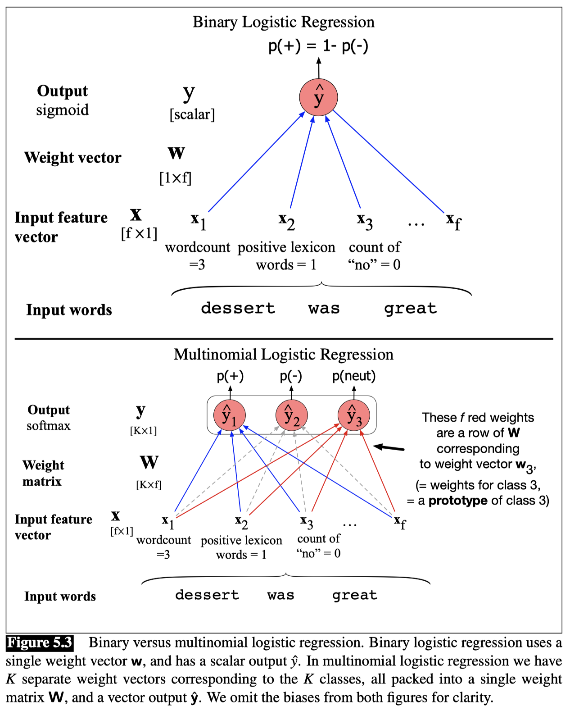

#### Features in Multinomial Logistic Regression
In 3-way multiclass sentiment classification, for example, we must assign each document one of the 3 classes +, −, or 0 (neutral). Now a feature related to exclamation marks might have a negative weight for 0 documents, and a positive weight for + or − documents:

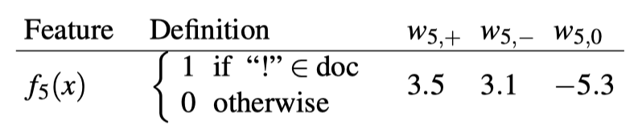

Because these feature weights are dependent both on the input text and the output class, we sometimes make this dependence explicit and represent the features themselves as $f(x,y)$: a function of both the input and the class.

### The cross-entropy loss function

We need a loss function that expresses, for an observation $x$, how close the classifier output ($\hat{y} = σ(w ·x+b)$) is to the correct output ($y$, which is 0 or 1). We’ll call this:

L(y, $\hat{y}$) = How much $\hat{y}$ differs from the true $y$

We do this via a loss function that prefers the correct class labels of the training examples to be more likely. This is called conditional maximum likelihood estimation: we choose the parameters $w,b$ that maximize the log probability of the true $y$ labels in the training data given the observations $x$. The resulting loss function is the negative log likelihood loss, generally called the cross-entropy loss.

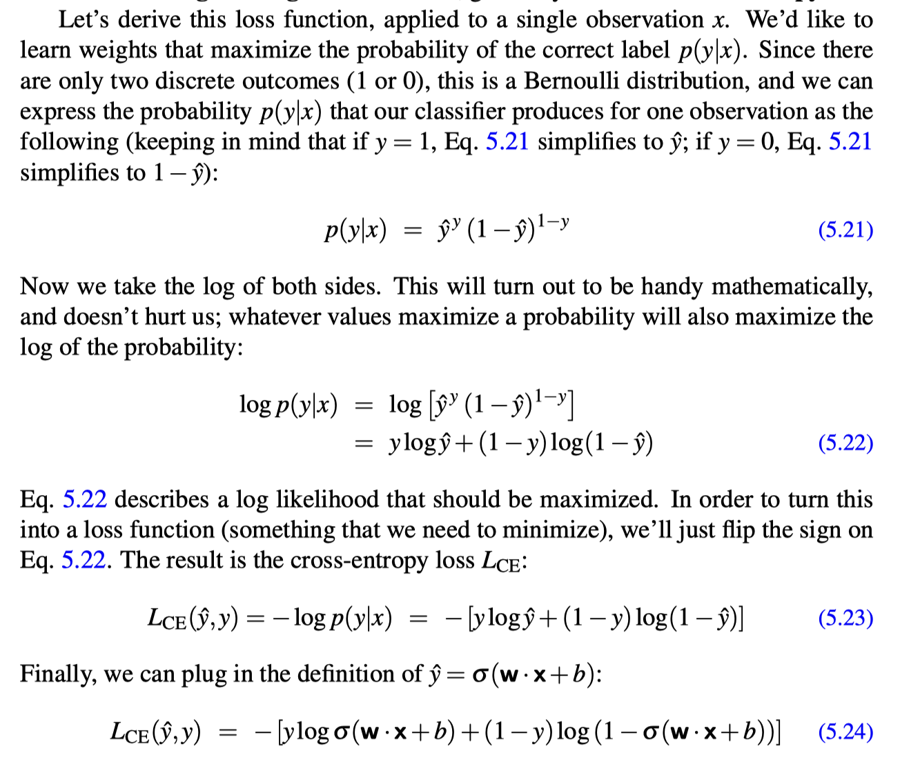

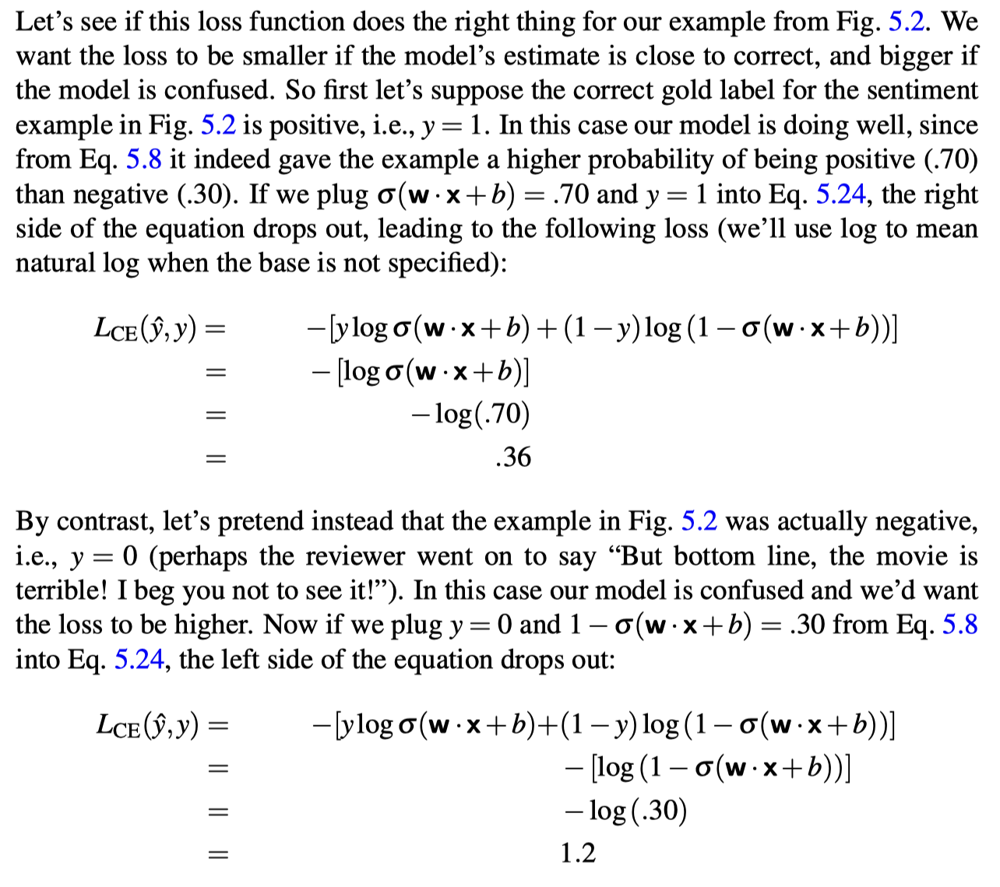

### Gradient Descent
Our goal with gradient descent is to find the optimal weights: minimize the loss function we’ve defined for the model.

In Eq.11 below, we’ll explicitly represent the fact that the cross-entropy loss function $L_{CE}$ is parameterized by the weights.
In machine learning in general we refer to the parameters being learned as θ; in the case of logistic regression `θ = { w,b }`. So the goal is to find the set of weights which minimizes the loss function, averaged over all examples:

Eq.11:

How shall we find the minimum of this (or any) loss function? Gradient descent is a method that finds a minimum of a function by figuring out in which direction (in the space of the parameters θ) the function’s slope is rising the most steeply, and moving in the opposite direction.

**Convex**
For logistic regression, this loss function is conveniently convex. A convex function has at most one minimum; there are no local minima to get stuck in, so gradient descent starting from any point is guaranteed to find the minimum.

Although the algorithm (and the concept of gradient) are designed for direction vectors, let’s first consider a visualization of the case where the parameter of our system is just a single scalar w, shown in Fig. 5.4.

Given a random initialization of `w` at some value $w^1$, and assuming the loss function $L$ happened to have the shape in Fig. 5.4, we need the algorithm to tell us whether at the next iteration we should move left (making $w^2$ smaller than $w^1$) or right (making $w^2$ bigger than $w^1$) to reach the minimum.

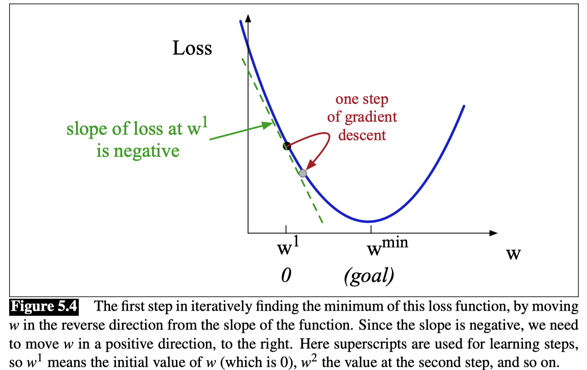

**Gradient**
The gradient descent algorithm answers this question by finding the gradient of the loss function at the current point and moving in the opposite direction. The gradient of a function of many variables is a vector pointing in the direction of the greatest increase in a function.

The gradient is a multi-variable generalization of the slope, so for a function of one variable like the one in Fig. 5.4, we can informally think of the gradient as the slope. The dotted line in Fig. 5.4 shows the slope of this hypothetical loss function at point w = $w^1$ . You can see that the slope of this dotted line is negative. Thus to find the minimum, gradient descent tells us to go in the opposite direction: moving `w` in a positive direction.

**Learning rate**

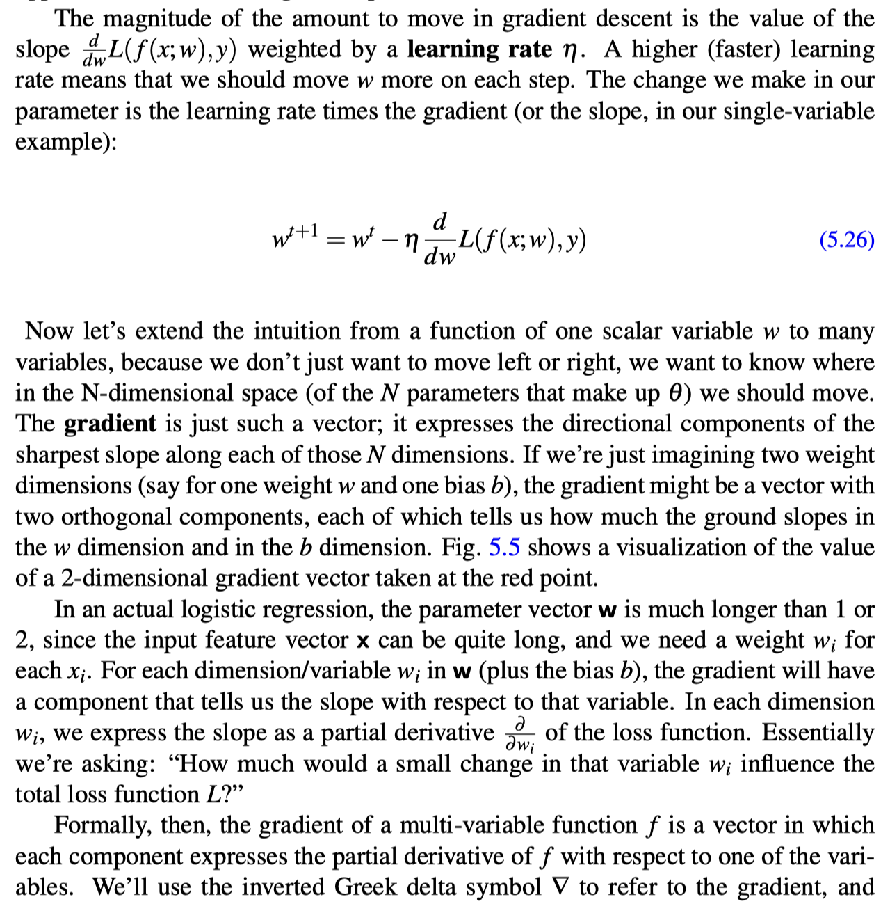

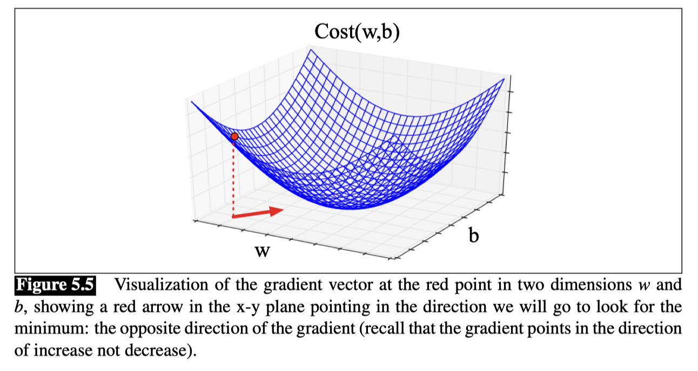

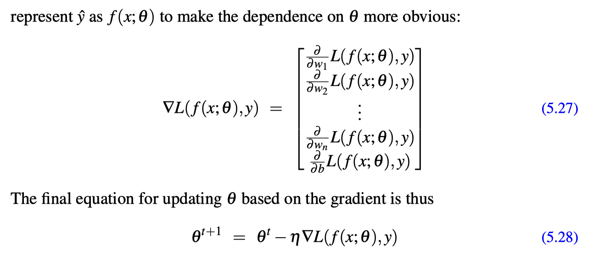

#### The Gradient for Logistic Regression

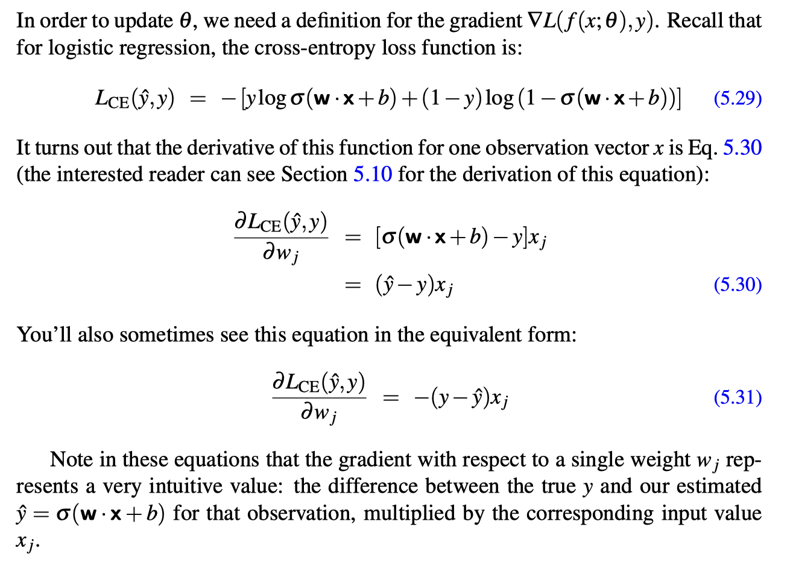

