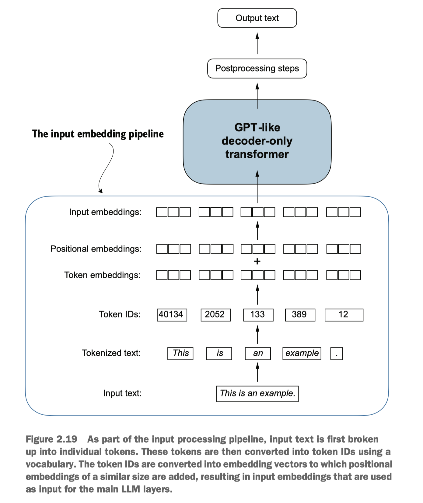

### Understanding word embeddings

The concept of converting data into a vector format is often referred to as **embedding**.
At its core, an embedding is a mapping from discrete objects, such as words, images, or even entire documents, to points in a continuous vector space—the primary purpose of embeddings is to convert nonnumeric data into a format that neural networks can process.

Some of these special tokens are:
- `[BOS]` (beginning of sequence) marks the beginning of text
- `[EOS]` (end of sequence) marks where the text ends (this is usually used to concatenate multiple unrelated texts, e.g., two different Wikipedia articles or two different books, and so on)
- `[PAD]` (padding) if we train LLMs with a batch size greater than 1 (we may include multiple texts with different lengths; with the padding token we pad the shorter texts to the longest length so that all texts have an equal length)
- `[UNK]` to represent words that are not included in the vocabulary

**Note:**
1. Note that GPT-2 does not need any of these tokens mentioned above but only uses an `<|endoftext|>` token to reduce complexity. The `<|endoftext|>` is analogous to the `[EOS]` token mentioned above.

2. GPT also uses the `<|endoftext|>` for padding (since we typically use a mask when training on batched inputs, we would not attend padded tokens anyways, so it does not matter what these tokens are)

3. GPT-2 does not use an `<UNK>` token for out-of-vocabulary words; instead, GPT-2 uses a byte-pair encoding (BPE) tokenizer, which breaks down words into subword units which we will discuss in a later section

4. use the `<|endoftext|>` tokens between two independent sources of text

### BytePair encoding

The BytePair encoding (BPE) tokenizer is a type of subword tokenization that breaks down words into smaller subwords or subunits. It is a popular tokenization technique used in many NLP models, including GPT-2 and GPT-3.

- BPE tokenizers break down unknown words into subwords and individual characters
- GPT-2 used BytePair encoding (BPE) as its tokenizer
- it allows the model to break down words that aren't in its predefined vocabulary into smaller subword units or even individual characters, enabling it to handle out-of-vocabulary words

BPE tokenizers break down unknown words into subwords and individual characters

### Encoding word positions

OpenAI’s GPT models use absolute positional embeddings that are optimized during the training process rather than being fixed or predefined like the positional encodings in the original transformer model. This optimization process is part of the model training itself. For now, let’s create the initial positional embeddings to create the LLM inputs.

