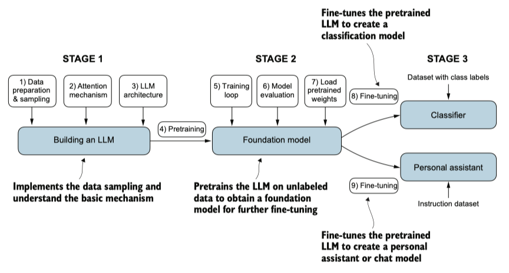

# Building a large language model

The three main stages of coding an LLM are implementing the LLM architecture and data preparation process (stage 1), pretraining an LLM to create a foundation model (stage 2), and fine-tuning the foundation model to become a personal assistant or text classifier (stage 3).

## Stage 1: Implementing the LLM architecture and data preparation process

-> 01-1-embeddings.md

-> 02-1-attention-mechanism.md