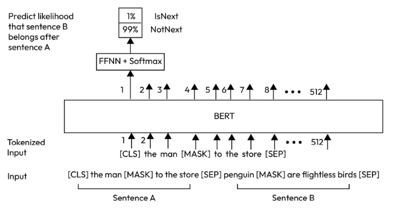
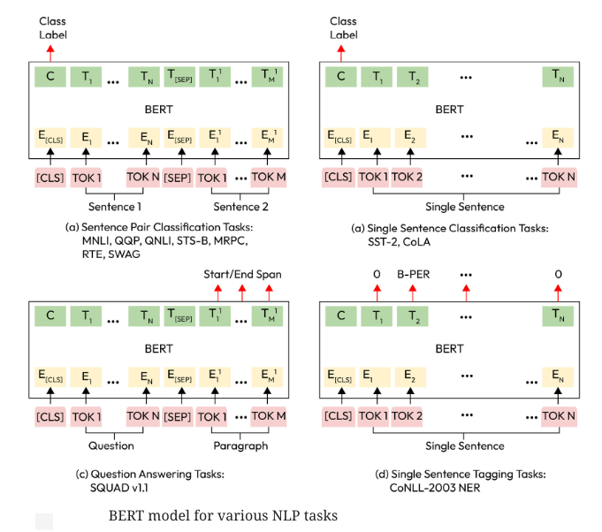
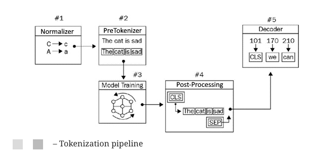

## Autoencoding Language Models

### BERT
BERT was one of the first autoencoding language models to utilize the encoder Transformer stack with slight modifications for language modeling.

The BERT model has two tasks:
1. Masked Language Modeling (MLM)
2. Next Sentence Prediction (NSP)

BERT is trained on is Next Sentence Prediction **(NSP)**

BERT token embeddings provide a contextual embedding for each token. Contextual embedding means each token has an embedding that is completely related to the surrounding tokens.

For BERT, `WordPiece` tokenization is used. Generally, `WordPiece`, `SentencePiece`, and `byte pair encoding (BPE)` are the three most widely known tokenizers, used by different Transformer-based architectures.

The BERT model has different variations with different settings. For example, the size of the input is variable. In the preceding example, it is set to 512, and the maximum sequence size that the model can get as input is 512. 
However, this size includes special tokens, `[CLS]` and `[SEP]`, so it will be reduced to 510.

#### Working with tokenization algorithms

Tokenization is a way of splitting textual input into tokens and assigning an identifier to each token before feeding the neural network architecture.

Simple intuitive solutions for rule-based tokenization are based on using characters, punctuation, or whitespace. Character-based tokenization causes language models to lose the input meaning. 

These modern tokenization procedures consist of two phases: 
- The pre-tokenization phase, which simply splits the input into tokens either using space or language-dependent rules, 
- the tokenization training phase, which trains the tokenizer and builds a base vocabulary of a reasonable size based on tokens. 

#### Byte Pair Encoding (BPE)
BPE is a data compression technique. It scans the data sequence and iteratively replaces the most frequent pair of bytes with a single symbol.

BPE is particularly effective at representing unknown words. However, it may not guarantee the handling of rare words and/or words including rare subwords. In such cases, it associates rare characters with a special symbol, `<UNK>`, which may lead to losing meaning in words a bit. As a potential solution, byte-level BPE (BBPE) has been proposed, which uses a 256-byte set of vocabulary instead of Unicode characters to ensure that every base character is included in the vocabulary.

#### WordPiece tokenization
WordPiece is another popular word segmentation algorithm widely used with BERT, DistilBERT, and ELECTRA.

The WordPiece algorithm uses maximum likelihood estimation to extract the merging rules from a corpus. It first initializes the vocabulary with Unicode characters, which are also called vocabulary symbols. It treats each word in the training corpus as a list of symbols (initially Unicode characters), and then it iteratively produces a new symbol merging two symbols out of all the possible candidate symbol pairs based on the likelihood maximization rather than frequency. 

#### SentencePiece tokenization
The SentencePiece algorithm is designed to overcome this space limitation. It uses a more efficient algorithm that is based on the Unigram language model. It treats the input as a raw input stream where space is part of the character set. The tokenizer using SentencePiece produces the _ character, which is also why we saw _ in the output of the ALBERT model example earlier.

#### The tokenizers library
The tokenizers library is a Python library that provides a simple interface for tokenizing text. It supports several tokenization algorithms, including BPE, WordPiece, and SentencePiece.

The tokenizers library provides several components so that we can build an end-to-end tokenizer from preprocessing the raw text to decoding tokenized unit IDs:

`Normalizer→ PreTokenizer → Modeling → Post-Processor → Decoding`

This pipeline can be explained as follows:
- The normalizer allows us to apply primitive text processing such as lowercasing, stripping, Unicode normalization, and removing accents.
- The PreTokenizer prepares the corpus for the next training phase. It splits the input into tokens depending on the rules, such as whitespace.
- Model training is a subword tokenization algorithm such as BPE, BBPE, and WordPiece, which we’ve discussed already. It discovers subwords/vocabulary and learns generation rules.
- Post-processing provides advanced class construction that is compatible with Transformers models such as BertProcessors. We mostly add special tokens such as `[CLS]` and `[SEP]` to the tokenized input just before feeding the architecture.
- The decoder is in charge of converting token IDs back to the original string. It is just for inspecting what is going on.

