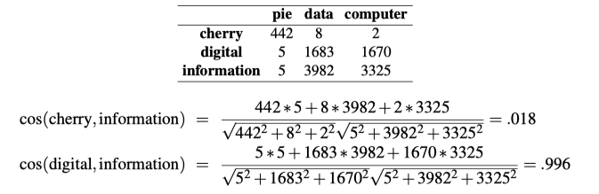
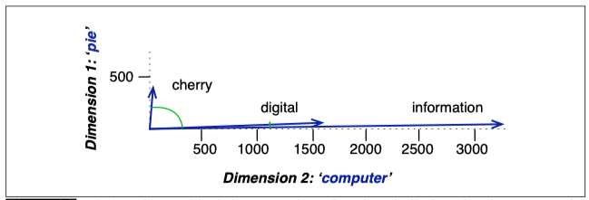

# Vector Semantics and Embeddings

## Vector Semantics
Vector semantics is the standard way to represent word meaning in NLP.

### Word Embeddings
The idea of vector semantics is to represent a word as a point in a multidimensional semantic space that is derived from the distributions of word neighbors. Vectors for representing words are called embeddings.

## Words and Vectors

### Information retrieval
A vector space is a collection of vectors, and is characterized by its dimension.

Information retrieval (IR) is the task of finding the document `d` from the `D` documents in some collection that best matches a query `q`. For IR we’ll therefore also represent a query by a vector, also of length `|V|` , and we’ll need a way to compare two vectors to find how similar they are.

Note that `|V|`, the dimensionality of the vector, is generally the size of the vocabulary.

### Cosine for measuring similarity
To measure similarity between two target words `v` and `w`, we need a metric that takes two vectors (of the same dimensionality, either both with words as dimensions, hence of length `|V|`, or both with documents as dimensions, of length `|D|`) and gives a measure of their similarity. By far the most common similarity metric is the **cosine** of the angle between the vectors.

The cosine—like most measures for vector similarity used in NLP—is based on the dot product operator from linear algebra, also called the inner product:

$$
v \cdot w = \sum_{i=1}^{N} v_i w_i = v_1 w_1 + v_2 w_2 + \cdots + v_N w_N
$$

The dot product acts as a similarity metric because it will tend to be high just when the two vectors have large values in the same dimensions. Alternatively, vectors that have zeros in different dimensions—orthogonal vectors—will have a dot product of 0, representing their strong dissimilarity.

This raw dot product, however, has a problem as a similarity metric: it favors long vectors. The **vector length** is defined as

$$
|v| = \sqrt{v_1^2 + v_2^2 + \cdots + v_N^2} = \sqrt{\sum_{i=1}^{N} v_i^2}
$$

The dot product is higher if a vector is longer, with higher values in each dimension.

This **normalized dot product** turns out to be the same as the cosine of the angle between the two vectors, following from the definition of the dot product between two vectors **a** and **b**:

$$
a \cdot b = |a||b| \cos(\theta)
$$

**Cosine**
The cosine similarity metric between two vectors v and w thus can be computed as:

$$
\cos(v, w) = \frac{v \cdot w}{|v||w|} = \frac{\sum_{i=1}^{N} v_i w_i}{\sqrt{\sum_{i=1}^{N} v_i^2} \sqrt{\sum_{i=1}^{N} w_i^2}}
$$

**Unit vector**
For some applications we pre-normalize each vector, by dividing it by its length, creating a **unit vector** of length 1. Thus we could compute a unit vector from a by dividing it by `|a|`. For unit vectors, the dot product is the same as the cosine.

Example:

The model decides that information is way closer to digital than it is to cherry, a result that seems sensible. The figure below shows a visualization.

### TF-IDF: Weighing terms in the vector

- **Term frequency**
The first is the term frequency: the frequency of the word `t` in the document `d`. We can just use the raw count as the term frequency:

$$
tf(t, d) = count(t, d)
$$

We also need to do something special with counts of 0, since we can't take the log of 0.

$$
tf(t, d) = \begin{cases} 
1 + \log_{10}(count(t, d)) & \text{if } count(t, d) > 0 \\
0 & \text{otherwise}
\end{cases}
$$

If we use log weighting, terms which occur 0 times in a document would have tf = 0, 1 times in a document `tf = 1 + log_10 (1) = 1 + 0 = 1`, 10 times in a document `tf = 1+log_10(10) = 2`.

- **Document frequency**
The document frequency **$df_{t}$** of a term **$t$** is the number of documents it occurs in.

$$
df(t, D) = \sum_{d \in D} \mathbb{I}(t \in d)
$$

- **idf - Inverse document frequency**
The idf is defined using the fraction N/$df_{t}$ , where `N` is the total number of documents in the collection, and $df_{t}$ is the number of documents in which term $t$ occurs.

$$
idf(t, D) = \log_{10}\left(\frac{N}{df(t, D)}\right)
$$

- **tf-idf**
The tf-idf weighted value $w_{t,d}$ for word $t$ in document $d$ thus combines term frequency $tf_{t,d}$ and inverse document frequency $idf_{t}$:

$$
w_{t,d} = tf_{t,d} \times idf_{t}
$$

### Pointwise Mutual Information (PMI)
