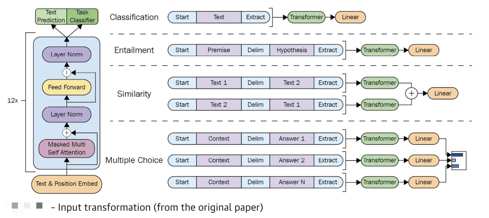

## From Generative Models to Large Language Models

- Generated Pre-trained Transformer 2 (GPT-2)
- Text-to-Text Transfer Transformer (T5) 

The following are popular text-to-text models that keep the encoder and decoder part of the transformer:

- `T5`: Exploring the limits of transfer learning with a unified text-to-text transformer
- `BART`: Bidirectional and Auto-Regressive Transformer
- `PEGASUS`: Pre-training with Extracted Gap-sentences for Abstractive Summarization Sequence-to-Sequence models

### Multi-task training with T5
How to apply multi-task training in a T5 architecture with the SimpleT5 library. 

