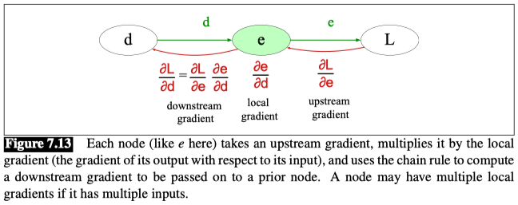
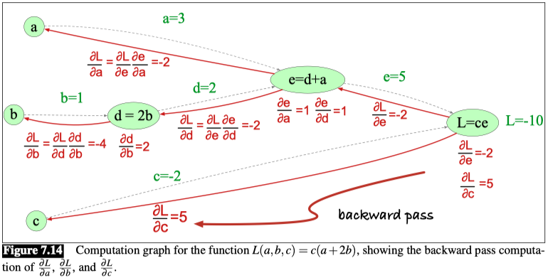
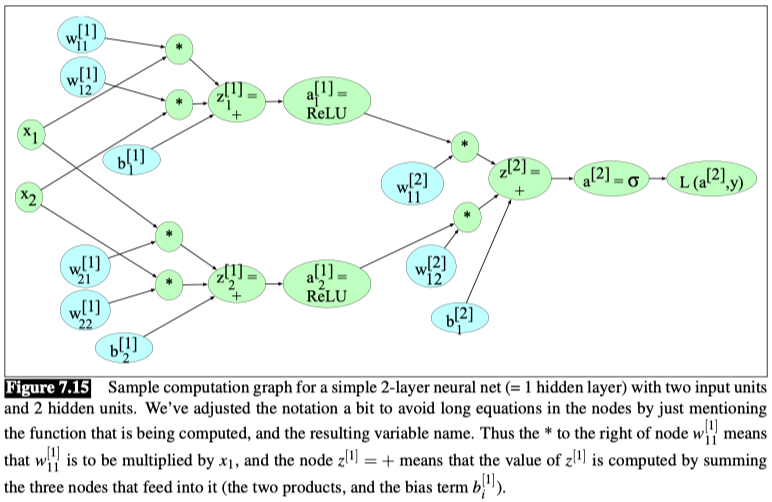

# Neural Network

## 1.Units
The building block of a neural network is a single computational unit. A unit takes a set of real valued numbers as input, performs some computation on them, and produces an output.

- **bias term**

    At its heart, a neural unit is taking a weighted sum of its inputs, with one additional term in the sum called a bias term. Given a set of inputs $x_1, ... x_n$, a unit has a set of corresponding weights $w_1, ... w_n$ and a bias $b$, so the weighted sum $z$ can be represented as:

    $$
    z = \sum_{i=1}^{n} w_i x_i + b
    $$

- **vector**  
  
    Often it’s more convenient to express this weighted sum using vector notation; Thus we’ll talk about z in terms of a weight vector w, a scalar bias b, and an input vector x, and we’ll replace the sum with the convenient **dot product**:

    $$
    z = w x + b
    $$

- **activation**

    The output of a unit is often passed to an activation function $f$, which is a function of the weighted sum. The activation function is a non-linear function that is applied to the weighted sum to produce the unit's output.

    $$
    y = a = f(z)
    $$

We’ll discuss **three popular non-linear functions $f$** below (the sigmoid, the tanh, and the rectified linear unit or ReLU)

- **sigmoid**

    $$
    y = \sigma(z) = \frac{1}{1 + e^{-z}}
    $$

   

    The sigmoid has a number of advantages; it maps the output into the range (0,1), which is useful in squashing outliers toward 0 or 1.

    Gives us the output of a neural unit:

    $$
    y = \sigma(w x + b) = \frac{1}{1 + e^{-(w x + b)}}
    $$

    

- **tanh**

    The tanh function is a scaled version of the sigmoid, and it maps the output into the range (-1,1).

    $$
    y = \tanh(z) = \frac{e^z - e^{-z}}{e^z + e^{-z}}
    $$

- **ReLU**

    The ReLU function is a simple threshold function that outputs the input if it is positive, and 0 otherwise.

    $$
    y = \text{ReLU}(z) = \max(0, z)
    $$

    

## 2. The XOR problem

The XOR problem is a classic problem in machine learning. It is a binary classification problem where the input is a two-dimensional vector and the output is a binary label. The problem is that the XOR function is not linearly separable, meaning that no single line can separate the positive and negative examples.

## 3. Feedforward Neural Networks
A feedforward network is a multilayer network in which the units are connected with no cycles; the outputs from units in each layer are passed to units in the next higher layer, and no outputs are passed back to lower layers. (networks with cycles, called recurrent neural networks.)

**Multi-layer perceptrons (MLPs)**
For historical reasons multilayer networks, especially feedforward networks, are sometimes called multi-layer perceptrons (or MLPs)

Simple feedforward networks have three kinds of nodes: input units, hidden units, and output units.

The core of the neural network is the **hidden layer h** formed of hidden units $h_i$ , each of which is a neural unit.

**In fact, the computation only has three steps:**
1. Multiplying the weight matrix by the input vector $x$, 
2. Adding the bias vector $b$, 
3. Applying the activation function $g$

The output of the hidden layer, the vector $h$, is thus the following:

Eq.1
$$
h = \sigma(W x + b)
$$

Take a moment to convince yourself that the matrix multiplication in Eq.1  will compute the value of each $h_j$ as $\sigma ( \sum_{i=1}^{n} W_{ji} x_i + b_j )$ .

**Normalizing**
More generally for any vector $z$ of dimensionality $d$, the softmax is defined as:

Eq.2
$$
softmax(z_i)= \frac{e^{z_i}}{\sum_{j=1}^{d} e^{z_j}} \quad \text{for} \quad i = 1, ..., d
$$

Here are the final equations for a feedforward network with a single hidden layer, which takes an input vector $x$, outputs a probability distribution $y$, and is parameterized by weight matrices $W$ and $U$ and a bias vector $b$:

$$
h = \sigma(W x + b)
$$

$$
z = U h
$$

$$
y = softmax(z)
$$

## 4. Feedforward networks for NLP: Classification

Let’s begin with a simple 2-layer sentiment classifier. 

$$
x = [x_1, x_2, ... x_N], \text{(each $x_i$ is a hand-designed feature)}
$$

$$
h = \sigma(Wx + b)
$$

$$
z = Uh
$$

$$
\hat{y} = softmax(z)
$$

**Pooling**
One simple baseline is to apply some sort of pooling function to the embeddings of all the words in the input.

For example, for a text with $n$ input words/tokens $w_1, ..., w_n$, we can turn the n embeddings $e(w_1), ..., e(w_n)$ (each of dimensionality $d$) into a single embedding also of dimensionality $d$ by just summing the embeddings, or by taking their mean (summing and then dividing by $n$):

$$
x_{mean} = \frac{1}{n} \sum_{i=1}^{n} e(w_i)
$$

The element-wise max of a set of $n$ vectors is a new vector whose $k$th element is the max of the $k$th elements of all the $n$ vectors.

$$
x = mean(e(w_1), e(w_2), ..., e(w_n))
$$

$$
h = \sigma(Wx + b)
$$

$$
z = Uh
$$

$$
\hat{y} = softmax(z)
$$

## 5. Training neural Networks
A feedforward neural net is an instance of supervised machine learning in which we know the correct output $y$ for each observation $x$.

Steps:
1. First, we’ll need a **loss function** that models the distance between the system output and the gold output, and it’s common to use the loss function used for logistic regression, the **cross-entropy loss**.
2. Second, to find the parameters that minimize this loss function, we’ll use the **gradient descent** optimization algorithm
3. Third, gradient descent requires knowing the gradient of the loss function, the vector that contains the partial derivative of the loss function with respect to each of the parameters. 
   1. How do we partial out the loss over all those intermediate layers? The answer is the algorithm called **error backpropagation** or **backward differentiation**.

### 5.1 Loss function
**Cross-entropy**
The cross-entropy loss that is used in neural networks is the same one we saw for logistic regression.

If the neural network is being used as a **binary classifier**, with the sigmoid at the final layer, the loss function is the same logistic regression loss:

$$
L_{CE}(y, \hat{y}) = - \log p(y|x) = - [y \log \hat{y} + (1-y) \log (1-\hat{y})]
$$

The loss function for a single example **x** is the negative sum of the logs of the **K** output classes, each weighted by their probability $y_k$ in the gold distribution:

$$
L_{CE}(y, \hat{y}) = - \sum_{k=1}^{K} y_k \log \hat{y}_k
$$

**Negative log likelihood loss**
The cross-entropy loss is simply the negative log of the output probability corresponding to the correct class, and we therefore also call this the negative log likelihood loss:

$$
L_{CE}(y, \hat{y}) = - \log \hat{y}_c   
$$

where $c$ is the correct class.

Plugging in the softmax formula, and with $K$ the number of classes, we get:

$$
L_{CE}(y, \hat{y}) = - \log \frac{e^{z_c}}{\sum_{j=1}^{K} e^{z_j}}
$$

### 5.2 Gradient Descent
How do we compute the gradient of this loss function?

Computing the gradient requires the partial derivative of the loss function with respect to each parameter. For a network with one weight layer and sigmoid output, we could simply use the derivative of the loss that we used for logistic regression.

$$
\frac{\partial L_{CE} (y, \hat{y})}{\partial w_{j}} = (\hat{y} - y) x_j = (\sigma(w x + b) - y) x_j
$$

For a network with one weight layer and softmax output (=multinomial logistic regression), for a particular weight $w_{k}$ and input $x_i$, the partial derivative of the loss with respect to $w_{k}$ is:

$$
\frac{\partial L_{CE} (y, \hat{y})}{\partial w_{k,i}} = -(y_k - \hat{y}_k) x_{i} = -(y_k - p(y_k = 1 | x)) x_{i} = -(y_k - \frac{e^{w_k x + b_k}}{\sum_{j=1}^{K} e^{w_j x + b_j}}) x_{i}
$$

But these derivatives only give correct updates for one weight layer: the last one! For deep networks, computing the gradients for each weight is much more complex, since we are computing the derivative with respect to weight parameters that appear all the way back in the very early layers of the network, even though the loss is computed only at the very end of the network.

**Error backpropagation**
The solution to computing this gradient is an algorithm called error backpropagation or backprop. While backprop was invented specially for neural networks, it turns out to be the same as a more general procedure called backward differentiation, which depends on the notion of computation graphs.

### 5.3 Computation graphs
A computation graph is a representation of the process of computing a mathematical expression, in which the computation is broken down into separate operations, each of which is modeled as a node in a graph.

Consider computing the function $L(a,b,c) = c(a+2b)$. If we make each of the component addition and multiplication operations explicit, and add names (d and e) for the intermediate outputs, the resulting series of computations is:

$$
d = 2b
$$

$$
e = a + d
$$

$$
L = c \times e
$$

In the forward pass of a computation graph, we apply each operation left to right, passing the outputs of each computation as the input to the next node.

### 5.4 Backward differentiation
The importance of the computation graph comes from the backward pass, which is used to compute the derivatives that we’ll need for the weight update.

**Chain rule**
Backwards differentiation makes use of the chain rule in calculus.

Suppose we are computing the derivative of a composite function $f(x) = u(v(x))$. The derivative of $f(x)$ is the derivative of $u(x)$ with respect to $v(x)$ times the derivative of $v(x)$ with respect to $x$:

$$
\frac{d f}{d x} = \frac{d u}{d v} \times \frac{d v}{d x}
$$

The chain rule extends to more than two functions. If computing the derivative of a composite function $f(x) = u(v(w(x)))$, the derivative of $f(x)$ is:

$$
\frac{d f}{d x} = \frac{d u}{d v} \times \frac{d v}{d w} \times \frac{d w}{d x}
$$

The intuition of backward differentiation is to pass gradients back from the final node to all the nodes in the graph.

In the backward pass, we compute each of these partials along each edge of the graph from right to left, using the chain rule just as we did above.

Thus we begin by computing the downstream gradients from node L, which are: $\frac{\partial L}{\partial e}$ and $\frac{\partial L}{\partial c}$.

**Backward differentiation for a neural network**

The figure shows a sample computation graph for a 2-layer neural network with $n_0 = 2$, $n_1 = 2$, and $n_2 = 1$, assuming binary classification and hence using a sigmoid output unit for simplicity.

The function that the computation graph is computing is:

$$
z^{[1]} = W^{[1]}x + b^{[1]}
$$

$$
a^{[1]} = ReLU(z^{[1]})
$$

$$
z^{[2]} = W^{[2]}a^{[1]} + b^{[2]}
$$

$$
a^{[2]} = \sigma(z^{[2]})
$$

$$
\hat{y} = a^{[2]}
$$

For the backward pass we’ll also need to compute the loss L. The loss function for binary sigmoid output is:

$$
L = -[y \log \hat{y} + (1-y) \log (1-\hat{y})]
$$

Our output $\hat{y} = a^{[2]}$, so we can rephrase this as:

$$
L(a^{[2]}, y) = -[y \log a^{[2]} + (1-y) \log (1-a^{[2]})]
$$

The weights that need updating (those for which we need to know the partial derivative of the loss function) are shown in teal.

The derivative of the sigmoid $\sigma$ is:

$$
\frac{d \sigma}{d z} = \sigma(z) (1 - \sigma(z))
$$

We’ll also need the derivatives of each of the other activation functions. The derivative of tanh is:

$$
\frac{d \tanh(z)}{d z} = 1 - \tanh^2(z)
$$

The derivative of the ReLU is:

$$
\frac{d ReLU(z)}{d z} = \begin{cases} 
0 & \text{if } z < 0 \\
1 & \text{if } z \geq 0 
\end{cases}
$$

We’ll give the start of the computation, computing the derivative of the loss function $L$ with respect to z, or $\frac{\partial L}{\partial z}$. By the chain rule:

$$
\frac{\partial L}{\partial z} = \frac{\partial L}{\partial a^{[2]}} \times \frac{\partial a^{[2]}}{\partial z}
$$

So let’s first compute $\frac{\partial L}{\partial a^{[2]}}$

$$
L(a^{[2]}, y) = -[y \log a^{[2]} + (1-y) \log (1-a^{[2]})]
$$

$$
\frac{\partial L}{\partial a^{[2]}} = - \frac{y}{a^{[2]}} + \frac{1-y}{1-a^{[2]}}
$$

Next, by the derivative of the sigmoid function, we have:

$$
\frac{\partial a^{[2]}}{\partial z} = a^{[2]} (1 - a^{[2]})
$$

Finally, we can use the chain rule:

$$
\frac{\partial L}{\partial z} = \frac{\partial L}{\partial a^{[2]}} \times \frac{\partial a^{[2]}}{\partial z} = - (\frac{y}{a^{[2]}} - \frac{1-y}{1-a^{[2]}}) \times a^{[2]} (1 - a^{[2]}) = a^{[2]} - y
$$

**Dropout**
Various forms of regularization are used to prevent overfitting. One of the most important is dropout: randomly dropping some units and their connections from the network during training.

At each iteration of training (whenever we update parameters, i.e. each mini-batch if we are using mini-batch gradient descent), we repeatedly choose a probability p and for each unit we replace its output with zero with probability p (and renormalize the rest of the outputs from that layer).

**Hyperparameters**
The parameters of a neural network are the weights W and biases b; those are learned by gradient descent. The hyperparameters are things that are chosen by the algorithm designer; optimal values are tuned on a devset rather than by gradient descent learning on the training set.

