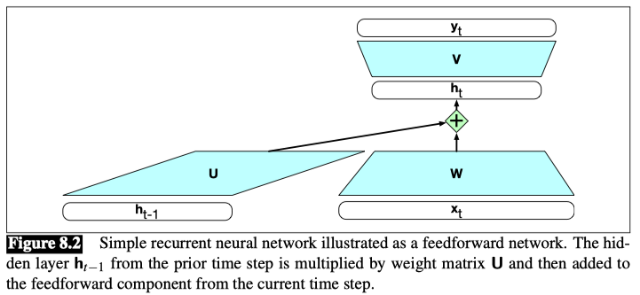
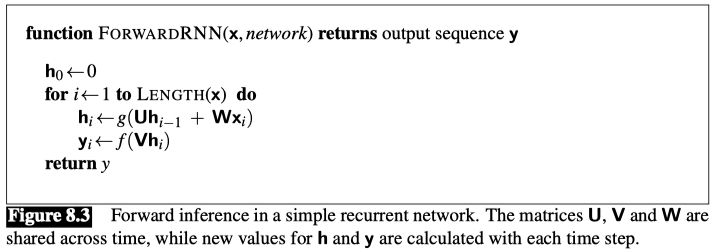
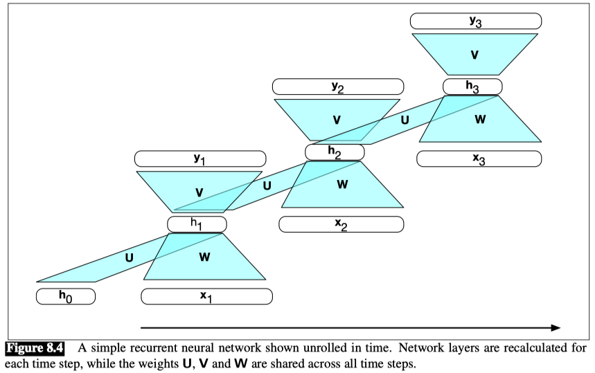
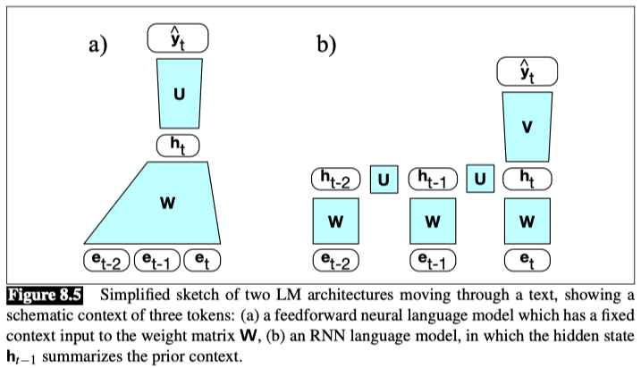
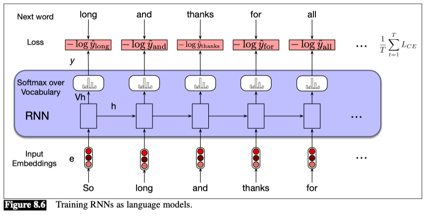

# 1. Recurrent Neural Networks

A recurrent neural network (RNN) is any network that contains a cycle within its network connections, meaning that the value of some unit is directly, or indirectly, dependent on its own earlier outputs as an input.

## 1.1 Inference in RNNs

- To compute an output $y_t$ for an input $x_t$, we need the activation value for the hidden layer $h_t$.
- To calculate this, we multiply the input $x_t$ with the weight matrix $W$, and the hidden layer from the previous time step $h_{t-1}$ with the weight matrix $U$.
- We then add the results together and apply the activation function $g$ to get the hidden layer $h_t$.
- Once we have the values for the hidden layer, we proceed with the usual computation to generate the output vector.

$$ h_t = g(Uh_{t-1} + Wx_t) $$

$$ y_t = f(Vh_t) $$

Let’s refer to the **input, hidden and output layer dimensions as $d_{in}$, $d_h$, and $d_{out}$** respectively.

Given this, our three parameter matrices are: **$W \in \mathbb{R}^{d_h \times d_{in}}$, $U \in \mathbb{R}^{d_h \times d_h}$, and $V \in \mathbb{R}^{d_{out} \times d_h}$**.

We compute $y_t$ via a softmax computation that gives a probability distribution over the possible output classes.

$$ y_t = \text{softmax}(Vh_t) $$

The fact that the computation at time $t$ requires the value of the hidden layer from time $t-1$ mandates an incremental inference algorithm that proceeds from the start of the sequence to the end.

## 1.2 Training

As with feedforward networks, we’ll use a training set, a loss function, and backpropagation to obtain the gradients needed to adjust the weights in these recurrent networks.

As shown in Fig. 8.2, we now have 3 sets of weights to update: $W$, the weights from the input layer to the hidden layer, $U$, the weights from the previous hidden layer to the current hidden layer, and finally $V$, the weights from the hidden layer to the output layer.

**backpropagation through time**
Tailoring the backpropagation algorithm to this situation leads to a two-pass algorithm for training the weights in RNNs. 
- In the first pass, we perform forward inference, computing $h_t$, $y_t$, accumulating the loss at each step in time, saving the value of the hidden layer at each step for use at the next time step. 
- In the second phase, we process the sequence in reverse, computing the required gradients as we go, computing and saving the error term for use in the hidden layer for each step backward in time. 

## 2. RNNs as Language Models

Let’s see how to apply RNNs to the language modeling task.

Language models give us the ability to assign such a conditional probability to every possible next word, giving us a distribution over the entire vocabulary. We can also assign probabilities to entire sequences by combining these conditional probabilities with the chain rule:

$$ P(w_{1:n}) = \prod_{i=1}^n P(w_i | w_{1:i-1}) $$

### 2.1 Forward Inference in an RNN language model

The input sequence $X = [x_1;...;x_t;...;x_N]$ consists of a series of words each represented as a one-hot vector of size $|V| \times 1$, and the output prediction, $y$, is a vector representing a probability distribution over the vocabulary.

At each step, the model uses the word embedding matrix $E$ to retrieve the embedding for the current word, multiples it by the weight matrix $W$, and then adds it to the hidden layer from the previous step (weighted by weight matrix $U$) to compute a new hidden layer.

This hidden layer is then used to generate an output layer which is passed through a softmax layer to generate a probability distribution over the entire vocabulary. That is, at time $t$:

$$ e_t = E x_t $$

$$ h_t = g(Uh_{t-1} + We_t) $$

$$ \hat{y}_t = \text{softmax}(Vh_t) $$

When we do language modeling with RNNs,it’s convenient to make the assumption that the embedding dimension $d_e$ and the hidden dimension $d_h$ are the same. So we’ll just call both of these the **model dimension $d$**.

- So the embedding matrix $E$ is of shape $[d \times |V|]$, and $x_t$ is a one-hot vector of shape $[|V| \times 1]$.

- The product $e_t$ is thus of shape $[d \times 1]$. $W$ and $U$ are of shape $[d \times d]$, so $h_t$ is also of shape $[d \times 1]$.

- $V$ is of shape $[|V| \times d]$, so the result of $Vh$ is a vector of shape $[|V| \times 1]$.

This vector can be thought of as a set of scores over the vocabulary given the evidence provided in $h$. Passing these scores through the softmax normalizes the scores into a probability distribution.

The probability that a particular word $k$ in the vocabulary is the next word is represented by $\hat{y}_t [k]$, the $k$th component of $\hat{y}_t$:

$$ P(w_{t+1} = k | w_{1:t}) = \hat{y}_t [k] $$

The probability of an entire sequence is just the product of the probabilities of each item in the sequence, where we’ll use $\hat{y}_i [w_i]$ to mean the probability of the true word $w_i$ at time step $i$.

$$ P(w_{1:n}) = \prod_{i=1}^n P(w_i | w_{1:i-1}) = \prod_{i=1}^n \hat{y}_i [w_i] $$

## 2.2 Training an RNN language model

To train an RNN as a language model, we use the same self-supervision (or self-training) algorithm that we used for feedforward networks.

We take a corpus of text as training material and at each time step $t$ ask the model to predict the next word.

$$ L_{CE} = - \sum_{w\in V} y_t[w] \log \hat{y}_t[w] $$

In the case of language modeling, the correct distribution $y_t$ comes from knowing the next word. This is represented as a one-hot vector corresponding to the vocabulary where the entry for the actual next word is 1, and all the other entries are 0.

Thus, the cross-entropy loss for language modeling is determined by the probability the model assigns to the correct next word. So at time $t$ the CE loss is the negative log probability the model assigns to the next word in the training sequence.

$$ L_{CE}(\hat{y}_t, y_t) = - \log \hat{y}_t[w_{t+1}] $$

Thus at each word position $t$ of the input, the model takes as input the correct word $w_t$ together with $h_{t-1}$, encoding information from the preceding $w_{1:t-1}$, and uses them to compute a probability distribution over possible next words so as to compute the model’s loss for the next token $w_{t+1}$.

Then we move to the next word, we ignore what the model predicted for the next word and instead use the correct word $w_{t+1}$ along with the prior history encoded in $h_{t-1}$ to estimate the probability of token $w_{t+2}$.

## 2.3 Weight Typing

The columns of $E$ represent the word embeddings for each word in the vocabulary learned during the training process with the goal that words that have similar meaning and function will have similar embeddings.    

And, since when we use RNNs for language modeling we make the assumption that the embedding dimension and the hidden dimension are the same (= the model dimension $d$), the embedding matrix $E$ has shape $[d \times |V|]$.

And the final layer matrix $V$ provides a way to score the likelihood of each word in the vocabulary given the evidence present in the final hidden layer of the network through the calculation of $Vh$.

$V$ is of shape $[|V| \times d]$. That is, is, the rows of $V$ are shaped like a transpose of $E$, meaning that $V$ provides a second set of learned word embeddings.

**Weight tying**

Instead of having two sets of embedding matrices, language models use a single embedding matrix, which appears at both the input and softmax layers. That is, we dispense with $V$ and use $E$ at the start of the computation and $E^T$, because the shape of $V$ is the transpose of $E$ at the end. Using the same matrix (transposed) in two places is called **weight tying**. 

The weight-tied equations for an RNN language model then become:

$$ e_t = E x_t $$

$$ h_t = g(Uh_{t-1} + We_t) $$

$$ \hat{y}_t = \text{softmax}(E^T h_t) $$

