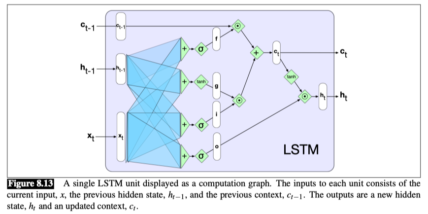
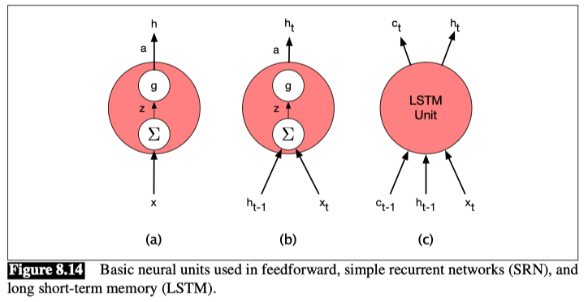
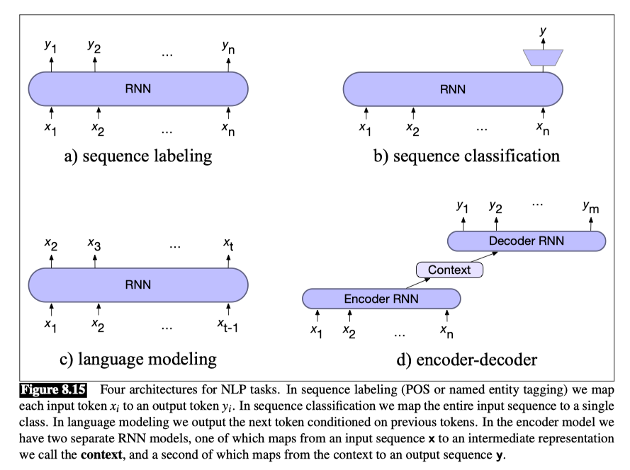

# LSTM

Long short-term memory (LSTM) networks are a type of recurrent neural network that are designed to avoid the problem of vanishing gradients.

LSTMs divide the context management problem into two subproblems: 
- Removing information no longer needed from the context, a
- Adding information likely to be needed for later decision making.

**Forget gate**

- The purpose of this gate is to delete information from the context that is no longer needed. 

- The forget gate computes a weighted sum of the previous state’s hidden layer and the current input and passes that through a sigmoid.

- This mask is then multiplied element-wise by the context vector to remove the information from context that is no longer required.

Element-wise multiplication of two vectors (represented by the operator ⊙ , and sometimes called the **Hadamard product**) is the vector of the same dimension as the two input vectors, where each element i is the product of element i in the two input vectors:

$$ f_t = \sigma(U_f h_{t-1} + W_f x_t) $$

$$ c_{t-1} \odot f_t $$

- Here, **$\sigma$ is the sigmoid function, which squashes the values of the input vector to be between 0 and 1.**
- $h_{t-1}$ is the hidden state from the previous time step
- and $x_t$ is the current input
- $U_f$ and $W_f$ are the weight matrices for the forget gate

The next task is to compute the actual information we need to extract from the previous hidden state and current inputs—the same basic computation we’ve been using for all our recurrent networks.

$$ g_t = \tanh(U_g h_{t-1} + W_g x_t) $$

**Add gate**
Next, we generate the mask for the add gate to select the information to add to the current context.

$$ i_t = \sigma(U_i h_{t-1} + W_i x_t) $$

$$ j_t = i_t \odot g_t $$

Next, we add this to the modified context vector to get our new context vector.

$$ c_t = j_t + k_t $$

**Output gate**
The final gate we’ll use is the output gate which is used to **decide what information is required for the current hidden state** (as opposed to what information needs to be preserved for future decisions).

$$ o_t = \sigma(U_o h_{t-1} + W_o x_t) $$

$$ h_t = o_t \odot \tanh(c_t) $$

The figure above shows the complete computation for a single LSTM unit. Given the appropriate weights for the various gates, an LSTM accepts as input the context layer, and hidden layer from the previous time step, along with the current input vector. It then generates updated context and hidden vectors as output.

It is the hidden state, $h_t$, that provides the output for the LSTM at each time step. This output can be used as the input to subsequent layers in a stacked RNN, or at the final layer of a network $h_t$ can be used to provide the final output of the LSTM.

## Gated Units, Layers and Networks

- At the far left, (a) is the basic feedforward unit where a single set of weights and a single activation function determine its output, and when arranged in a layer there are no connections among the units in the layer.
- Next, (b) represents the unit in a simple recurrent network. Now there are two inputs and an additional set of weights to go with it. However, there is still a single activation function and output.
  
## Summary: Common RNN NLP Architectures

