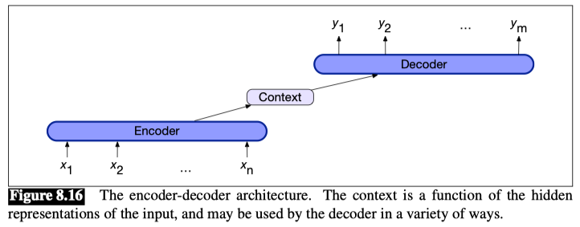
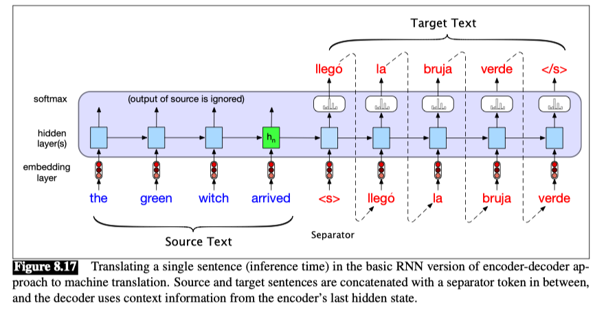
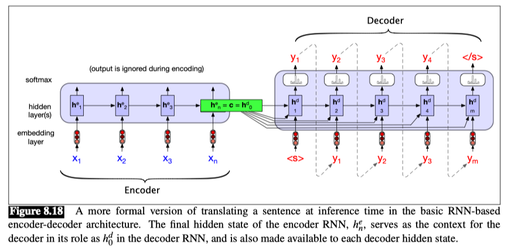
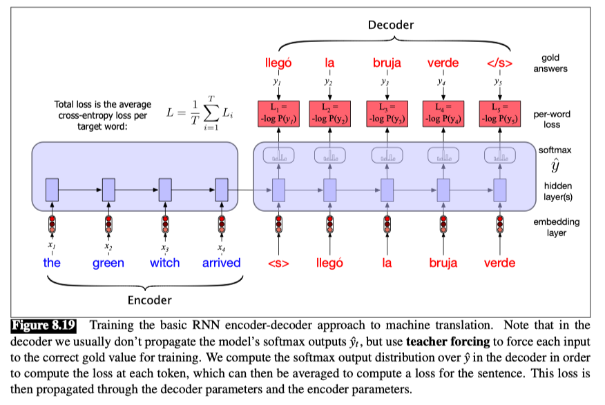

# The Encoder-Decoder Model with RNNs

**Encoder-decoder** networks, sometimes called sequence-to-sequence networks, are models capable of generating contextually appropriate, arbitrary length, output sequences given an input sequence.

Encoder-decoder networks have been applied to a very wide range of applications including summarization, question answering, and dialogue, but they are particularly popular for machine translation.

The key idea underlying these networks is the use of an **encoder** network that takes an input sequence and creates a contextualized representation of it, often called the context. This representation is then passed to a **decoder** which generates a taskspecific output sequence.

Encoder-decoder networks consist of three conceptual components:
1. An **encoder** that accepts an input sequence, $x_{1:n}$, and generates a corresponding sequence of contextualized representations, $h_{1:n}$. LSTMs, convolutional networks, and transformers can all be employed as encoders.
2. A **context vector**, c, which is a function of $h_{1:n}$, and conveys the essence of the input to the decoder.
3. A **decoder**, which accepts $c$ as input and generates an arbitrary length sequence of hidden states $h_{1:m}$, from which a corresponding sequence of output states $y_{1:m}$ can be obtained.

We’ll build up the equations for encoder-decoder models by starting with the conditional RNN language model $p(y)$, the probability of a sequence $y$.

$$ p(y) = p(y_1)p(y_2|y_1)p(y_3|y_1,y_2) \cdots p(y_m|y_1,y_2,\cdots,y_{m-1}) $$

In RNN language modeling, at a particular time $t$, we pass the prefix of $t − 1$ tokens through the language model, using forward inference to produce a sequence of hidden states, ending with the hidden state corresponding to the last word of the prefix. We then use the final hidden state of the prefix as our starting point to generate the next token.

More formally, if g is an activation function like tanh or ReLU, a function of the input at time t and the hidden state at time $t − 1$, and the softmax is over the set of possible vocabulary items, then at time t the output y t and hidden state h t are computed as:

$$ h_t = g( h_{t-1}, x_t) $$

$$ \hat{y}_t = \text{softmax}(h_t) $$

**Sentence separation**

Let’s use `<s>` for our sentence separator token, and let’s think about translating an English source text (“the green witch arrived”), to a Spanish sentence (“llegó la bruja verde”).

Let’s use x to refer to the source text (in this case in English) plus the separator token `<s>`, and y to refer to the target text y (in this case in Spanish). Then an encoder-decoder model computes the probability p(y | x) as follows:

$$ p(y|x) = p(y_1|x)p(y_2|y_1,x)p(y_3|y_1,y_2,x) \cdots p(y_m|y_1,y_2,\cdots,y_{m-1},x) $$

The figure below shows the encoder-decoder model for this example.

To translate a source text, we run it through the network performing forward inference to generate hidden states until we get to the end of the source.

Then we begin autoregressive generation, asking for a word in the context of the hidden layer from the end of the source input as well as the end-of-sentence marker.

Subsequent words are conditioned on the previous hidden state and the embedding for the last word generated.

Let’s formalize and generalize this model a bit in Fig. 8.18.

- The elements of the network on the left process the input sequence x and comprise the **encoder**.
- The entire purpose of the encoder is to generate a contextualized representation of the input. 
  - This representation is embodied in the final hidden state of the encoder, **$h_{n}^e$**. This representation, also called $c$ for **context**, is then passed to the decoder.
- The simplest version of the **decoder** network would take this state and use it just to initialize the first hidden state of the decoder
  - the first decoder RNN cell would use c as its prior hidden state $h_0^d$.
  - The decoder would then autoregressively generates a sequence of outputs, an element at a time, until an end-of-sequence marker is generated.

$$ h_t^d = g(\hat{y}_{t-1}, h_{t-1}^d, c) $$

Now we’re ready to see the full equations for this version of the decoder in the basic encoder-decoder model, with context available at each decoding timestep.

$$ c = h_n^e $$

$$ h_0^d = c $$

$$ h_t^d = g(\hat{y}_{t-1}, h_{t-1}^d, c) $$

$$ \hat{y}_t = \text{softmax}(h_t^d) $$

Thus $\hat{y}_t$ is a vector of probabilities over the vocabulary, representing the probability of each word occurring at time $t$. To generate text, we sample from this distribution $\hat{y}_t$.

## Training the Encoder-Decoder Model

The decoder during inference uses its own estimated output $\hat{y}_t$ as the input for the next time step $x_{t+1}$.

In training, therefore, it is more common to use **teacher forcing** in the decoder. Teacher forcing means that we force the system to use the gold target token from training as the next input $x_{t+1}$, rather than allowing it to rely on the (possibly erroneous) decoder output $\hat{y}_t$.

