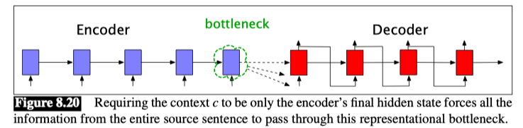
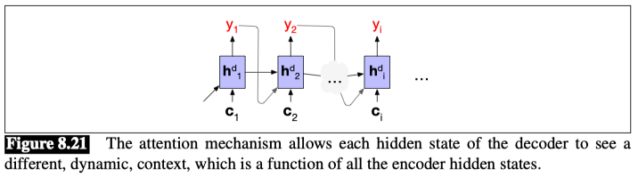
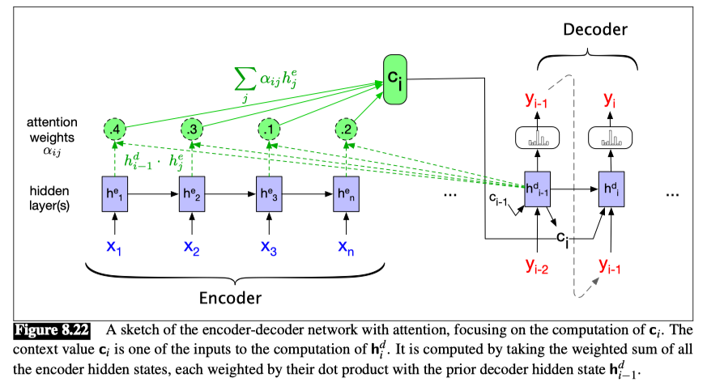

# Attention

The simplicity of the encoder-decoder model is its clean separation of the encoder-which builds a representation of the source text—from the decoder, which uses this context to generate a target text.

In the model as we’ve described it so far, this context vector is $h_n$, the hidden state of the last ($n^{th}$ ) time step of the source text. 

This final hidden state is thus acting as a **bottleneck**: `it must represent absolutely everything about the meaning of the source text, since the only thing the decoder knows about the source text is what’s in this context vector.`Information at the beginning of the sentence, especially for long sentences, may not be equally well represented in the context vector.

## Attention mechanism

The attention mechanism is a solution to the bottleneck problem, a way of allowing the decoder to get information from all the hidden states of the encoder, not just the last hidden state.

In the attention mechanism, as in the vanilla encoder-decoder model, the context vector $c$ is a single vector that is a function of the hidden states of the encoder. But instead of being taken from the last hidden state, it’s a weighted average of **all** the hidden states of the decoder.

And this weighted average is also informed by part of the decoder state as well, the state of the decoder right before the current token $i$.

That is, $c = f(h_1^e, \cdots, h_n^e, h_{i-1}^d)$.

Attention thus replaces the static context vector with one that is dynamically derived from the encoder hidden states, but also informed by and hence different for each token in decoding.

This context vector, $c_i$, is generated anew with each decoding step $i$ and takes all of the encoder hidden states into account in its derivation.

We then make this context available during decoding by conditioning the computation of the current decoder hidden state on it (along with the prior hidden state and the previous output generated by the decoder), as we see in this equation:

$$ h_i^d = g(\hat{y}_{i-1}, h_{i-1}^d, c_i) $$

- The first step in computing $c_i$ is to compute how much to focus on each encoder state, how relevant each encoder state is to the decoder state captured in $h_{i-1}^d$.
- We capture relevance by computing— at each state $i$ during decoding—a score $(h_{j}^e, h_{i-1}^d)$ for each encoder state $j$.

## Dot-product attention

The simplest such score, called dot-product attention, implements relevance as similarity: measuring how similar the decoder hidden state is to an encoder hidden state, by computing the dot product between them:

$$ \text{score}(h_j^e, h_{i-1}^d) = h_j^e \cdot h_{i-1}^d $$

The score that results from this dot product is a scalar that reflects the degree of similarity between the two vectors. The vector of these scores across all the encoder hidden states gives us the relevance of each encoder state to the current step of the decoder.

To make use of these scores, we’ll normalize them with a **softmax** to create a vector of weights, $\alpha_{ij}$, that tells us the proportional relevance of each encoder hidden state $j$ to the prior hidden decoder state, $h_{i-1}^d$.

$$ \alpha_{ij} = \text{softmax}(\text{score}(h_j^e, h_{i-1}^d)) = \frac{\exp(\text{score}(h_j^e, h_{i-1}^d))}{\sum_{k=1}^n \exp(\text{score}(h_k^e, h_{i-1}^d))} $$

Finally, given the distribution in $\alpha$, we can compute a fixed-length context vector for the current decoder state by taking a weighted average over all the encoder hidden states.

$$ c_i = \sum_{j=1}^n \alpha_{ij} h_j^e $$

With this, we finally have a fixed-length context vector that takes into account information from the entire encoder state that is dynamically updated to reflect the needs of the decoder at each step of decoding.

It’s also possible to create more sophisticated scoring functions for attention models. Instead of simple dot product attention, we can get a more powerful function that computes the relevance of each encoder hidden state to the decoder hidden state by parameterizing the score with its own set of weights, $W_s$.

$$ \text{score}(h_j^e, h_{i-1}^d) = h_j^e \cdot W_s \cdot h_{i-1}^d $$

The weights $W_s$, which are then trained during normal end-to-end training, give the network the ability to learn which aspects of similarity between the decoder and encoder states are important to the current application. 

This bilinear model also allows the encoder and decoder to use different dimensional vectors, whereas the simple dot-product attention requires that the encoder and decoder hidden states have the same dimensionality. 

**Note:**
**关键组件详解**
1. 编码器（Encoder）
   - 输入序列 𝑥1, 𝑥2, . . . , 𝑥n 被送入编码器的隐藏层（通常是 RNN、LSTM 或 Transformer 的一部分）。
   - 编码器输出的是每个时刻的隐藏状态 $h_j^e$，其中 $j=1,2,...,n$。

2. 注意力机制（Attention）
   - 解码器在生成第 $i$ 个输出 $y_i$ 时，会计算一个上下文向量 $c_i$。
   - 上下文向量 $c_i$ 是所有编码器隐藏状态的加权和: $c_i = \sum_{j=1}^n \alpha_{ij} h_j^e$
     - $\alpha_{ij}$ 是注意力权重，表示在第 $i$ 个解码步骤中，编码器第 $j$ 个隐藏状态对当前输出的“关注度”。
     - 注意力权重是通过解码器上一个隐藏状态 $h_{i-1}^d$ 和每一个编码器隐藏状态 $h_j^e$ 的打分函数（通常是点积或其他）计算出来的
     - 在图中：
       - 虚线箭头表示打分过程, 即计算 $\alpha_{ij}$
       - 实线箭头表示加权求和过程, 即计算 $c_i$
       - 图中绿色圆圈中的数字（例如 0.4、0.3、0.1、0.2）是具体的注意力权重 $\alpha_{ij}$

3. 解码器（Decoder）
   - 解码器在生成第 $i$ 个输出 $y_i$ 时
     - 输入包括前一个时刻的隐藏状态 $h_{i-1}^d$ 和前一个输出 $y_{i-1}$， 以及上下文向量 $c_i$
     - 解码器使用这些信息来计算当前时刻的隐藏状态 $h_i^d$，并生成当前时刻的输出 $y_i$

