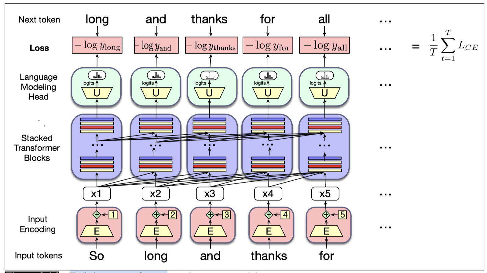

# The Training

Recall that large language models are trained with cross-entropy loss, also called the negative log likelihood loss. At time t the cross-entropy loss is the negative log probability the model assigns to the next word in the training sequence, $−log P(w_{t+1})$.

The figure above illustrates the **general training approach**.

1. At each step, given all the preceding words, the final transformer layer produces an output distribution over the entire vocabulary. 

2. During training, the probability assigned to the correct word by the model is used to calculate the cross-entropy loss for each item in the sequence. 

3. The loss for a training sequence is the average cross-entropy loss over the entire sequence. 

4. The weights in the network are adjusted to minimize the average CE loss over the training sequence via gradient descent.

# Summary

- **Transformers** are non-recurrent networks based on **multi-head attention**, a kind of **self-attention**. A multi-head attention computation takes an input vector x i and maps it to an output a i by adding in vectors from prior tokens, weighted by how relevant they are for the processing of the current word.

- A **transformer block** consists of a **residual stream** in which the input from the prior layer is passed up to the next layer, with the output of different components added to it. These components include a **multi-head attention layer** followed by a **feedforward layer**, each preceded by layer normalizations. Transformer blocks are stacked to make deeper and more powerful networks.

- The input to a transformer is computed by adding an embedding (computed with an **embedding matrix**) to a **positional encoding** that represents the sequential position of the token in the window.

- Language models can be built out of stacks of transformer blocks, with a language model head at the top, which applies an unembedding matrix to the output H of the top layer to generate the logits, which are then passed through a softmax to generate word probabilities.

- Transformer-based language models have a wide context window (200K tokens or even more for very large models with special mechanisms) allowing them to draw on enormous amounts of context to predict upcoming words.

- There are various computational tricks for making large language models more efficient, such as the **KV cache** and **parameter-efficient fine-tuning**.