# Overview of the Transformer architecture

The attention mechanism is an important part of these models and plays a very crucial role. Before Transformer models, the attention mechanism was proposed as a helper for improving conventional DL models such as RNNs. To understand Transformers and their impact on NLP, we will first study the attention mechanism.

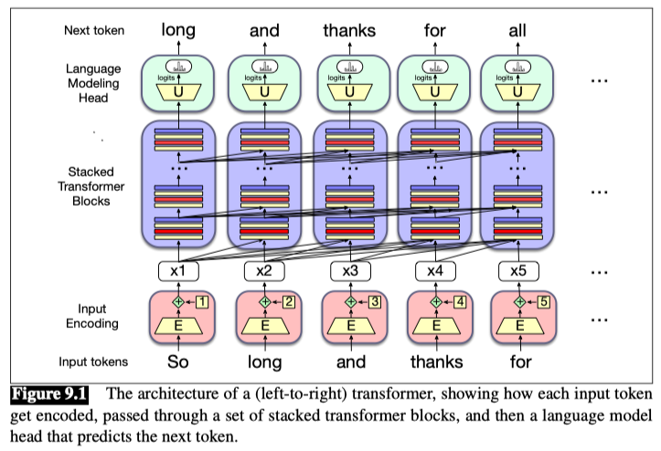

A transformer has three major components. At the center are columns of transformer blocks.

- Each block is a multilayer network (a **multi-head attention** layer, feedforward networks and layer normalization steps) that maps an input vector $x_i$ in column i (corresponding to input token i) to an output vector $h_i$. The set of n blocks maps an entire **context window** of input vectors $(x_1, ..., x_n)$ to a window of output vectors $(h_1, ..., h_n)$ of the same length. A column might contain from 12 to 96 or more stacked blocks.
- The column of blocks is preceded by the **input encoding** component, which processes an input token (like the word thanks) into a contextual vector representation, using an embedding matrix E and a mechanism for encoding token position. Each column is followed by a language modeling head, which takes the embedding output by the final transformer block, passes it through an unembedding matrix U and a softmax over the vocabulary to generate a single token for that column.

## Attention mechanism

The attention mechanism is a mechanism that allows the model to focus on the most important parts of the input sequence. It is a mechanism that allows the model to attend to the most important parts of the input sequence.

The attention mechanism computes how much attention to give an input token by performing a `dot product` between the query vector and its key vector.

### Self-attention

Self-attention is a mechanism that allows the model to attend to the most important parts of the input sequence. It is a mechanism that allows the model to attend to the most important parts of the input sequence.

Self-attention is a basic form of a scaled self-attention mechanism. This mechanism uses an input matrix and produces an attention score between various items Q is known as the query, K is known as the key, and V is noted as the value.

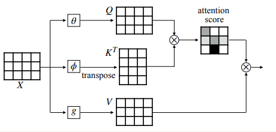
So, X is the input word sequence, and we calculate three values from that which is **Q(Query)**, **K(Key)** and **V(Value)**.

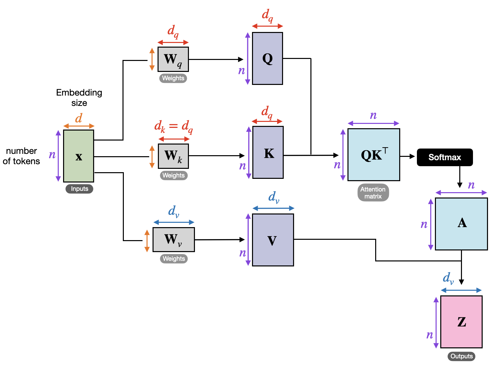

- **Query (Q)**: What we're looking for
- **Key (K)**: What we match against
- **Value (V)**: The information to extract

The task is to find the important words from the Keys for the Query word. This is done by passing the query and key to a mathematical function (usually matrix multiplication followed by softmax). The resulting context vector for Q is the multiplication of the probability vector obtained by the softmax with the Value.

When the Query, Key, and Value are all generated from the same input sequence **X**, it is called **Self-Attention**.

### Scaled dot-product attention mechanism
A scaled dot-product attention mechanism is very similar to a self-attention (dot-product) mechanism except it uses a scaling factor.

### Multi-head attention

Multi-head attention is a mechanism that allows the model to attend to the most important parts of the input sequence. It is a mechanism that allows the model to attend to the most important parts of the input sequence.

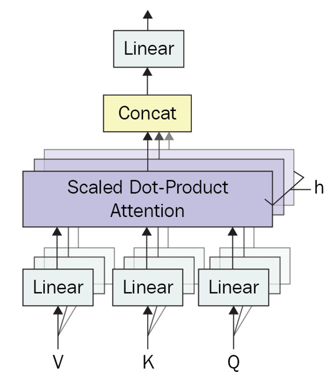

Mathematical Formulation: For each head ‘h’, the attention mechanism is defined as:

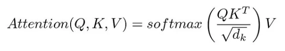
where `Q`, `K`, and `V` are the query, key, and value matrices, respectively, and `d_k` is the dimension of the key vectors.

In multi-head attention, these heads are computed in parallel:

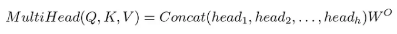
where each head `head_i` is an attention function, and `W^o` is a learned linear transformation.

### A Transformer architecture

A Transformer architecture is a type of architecture that is used to build NLP models. It is a type of architecture that is used to build NLP models.

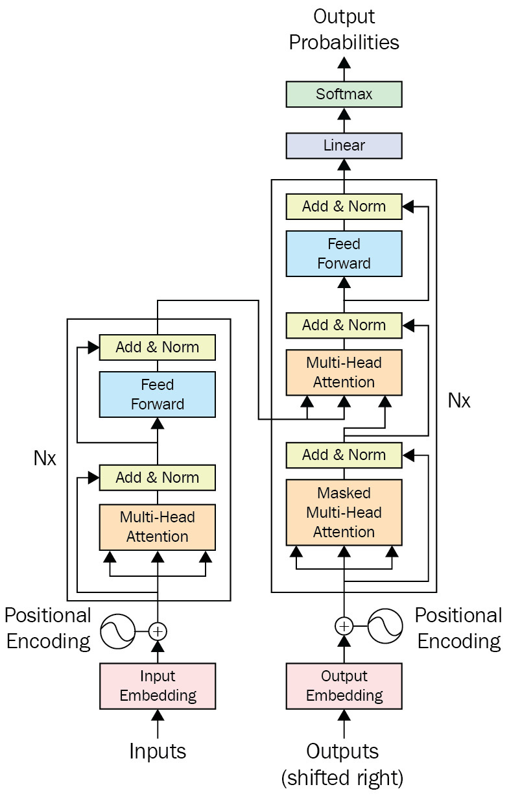

#### Tokens and embeddings

Tokens are the basic units of the input sequence. They are the individual words or characters in the input sequence.

Embeddings are the vectors that represent the tokens. They are the vectors that represent the tokens.

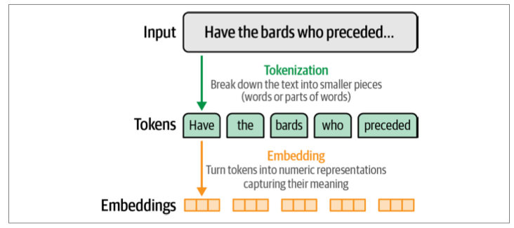
Language models deal with text in small chunks called tokens. For the language model to compute language, it needs to turn tokens into numeric representations called embeddings.

**Token embeddings**

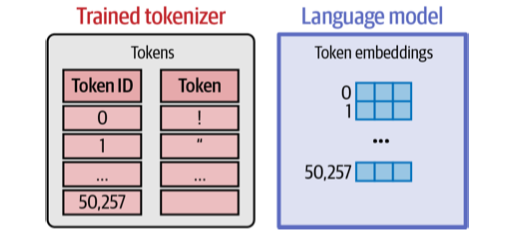
A language model holds an embedding vector associated with each token in its tokenizer.

#### An Overview of Transformer Models

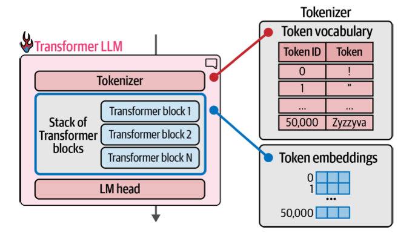
A Transformer LLM is made up of a tokenizer, a stack of Transformer blocks, and a language modeling head.

**Parallel Token Processing and Context Size**

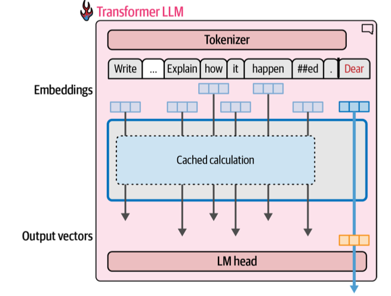
When generating text, it’s important to cache the computation results of previous tokens instead of repeating the same calculation over and over again.

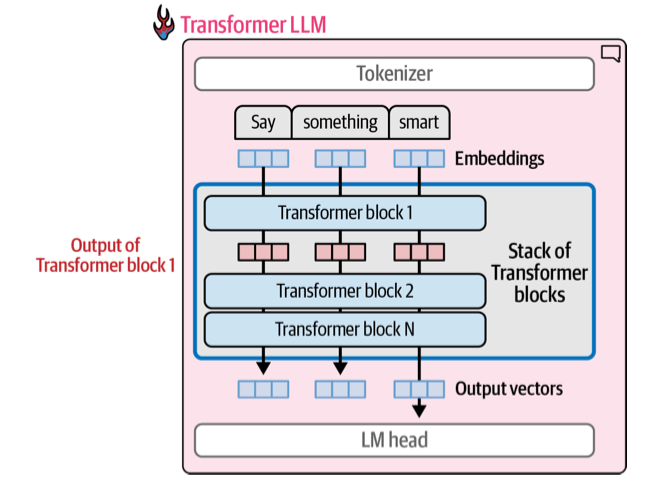
The bulk of the Transformer LLM processing happens inside a series of Transformer blocks, each handing the result of its processing as input to the subsequent block.

A **Transformer block** is made up of two successive components:
1. The **attention layer** is mainly concerned with incorporating relevant information from other input tokens and positions
2. The **feedforward layer** houses the majority of the model’s processing capacity

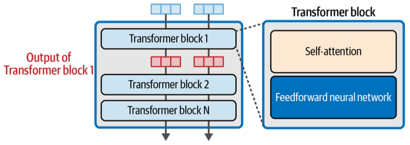

