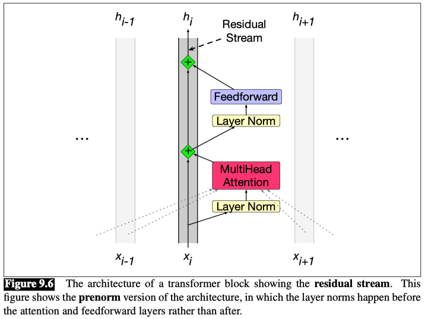

# Transformer blocks

The self-attention calculation lies at the core of what’s called a transformer block, which, in addition to the self-attention layer, includes three other kinds of layers: 
1. a feedforward layer, 
2. residual connections, 
3. normalizing layers (colloquially called “layer norm”).

### Residual stream

In the residual stream viewpoint, we consider the processing of an individual token $i$ through the transformer block as a single stream of $d$-dimensional representations for token position $i$. This residual stream starts with the original input vector, and the various components read their input from the residual stream and add their output back into the stream.

This initial embedding gets passed up (by **residual connections**), and is progressively added to by the other components of the transformer: the **attention layer** that we have seen, and the **feedforward layer** that we will introduce.

**Feedforward layer**
The feedforward layer is a fully-connected 2-layer network, i.e., one hidden layer, two weight matrices. The weights are the same for each token position $i$ , but are different from layer to layer. It is common to make the dimensionality $d_{ff}$ of the hidden layer of the feedforward network be larger than the model dimensionality $d$. (For example in the original transformer model, $d = 512$ and $d_{ff} = 2048$.)

$$
\text{FFN}(x_i) = ReLU(x_iW_1 + b_1)W_2 + b_2
$$

### Layer Norm
At two stages in the transformer block we normalize the vector, this process is called **layer norm**. It is one of many forms of normalization that can be used to improve training performance in deep neural networks by keeping the values of a hidden layer in a range that facilitates gradient-based training.

Layer norm is a variation of the z-score from statistics, applied to a single vector in a hidden layer. Layer norm is **not** applied to an entire transformer layer, but just to the embedding vector of a single token. Thus the input to layer norm is a single vector of dimensionality $d$ and the output is that vector normalized, again of dimensionality $d$.

- The first step in layer normalization is to calculate the mean, $\mu$, and standard deviation, $\sigma$, over the elements of the vector to be normalized.

- Given an embedding vector $x$ of dimensionality $d$, these values are calculated as follows.

$$
\mu = \frac{1}{d} \sum_{i=1}^{d} x_i
$$

$$
\sigma = \sqrt{\frac{1}{d} \sum_{i=1}^{d} (x_i - \mu)^2}
$$

- Given these values, the vector components are normalized by subtracting the mean from each and dividing by the standard deviation. The result of this computation is a new vector with zero mean and a standard deviation of one.

$$
\hat{x} = \frac{x - \mu}{\sigma}
$$

- Finally, in the standard implementation of layer normalization, two learnable parameters, $\gamma$ and $\beta$, representing gain and offset values, are introduced.

$$
LayerNorm(x) = \gamma \frac{x - \mu}{\sigma} + \beta
$$

The function computed by a transformer block can be expressed by breaking it down with one equation for each component computation, using t (of shape [1 × d]) to stand for transformer and superscripts to demarcate each computation inside the block:

**Eq-1:**
$$
t_i^{1} = LayerNorm(x_i)
$$

**Eq-2:**
$$
t_i^{2} = MultiHeadAttention(t_i^{1}, [t_i^{1}, ..., t_N^{1}])
$$

**Eq-3:**
$$
t_i^{3} = t_i^{2} + x_i
$$

**Eq-4:**
$$
t_i^{4} = LayerNorm(t_i^{3})
$$

**Eq-5:**
$$
t_i^{5} = FFN(t_i^{4})
$$

**Eq-6:**
$$
h_i = t_i^{5} + t_i^{3}
$$

Notice that the only component that takes as input information from other tokens (other residual streams) is multi-head attention, looks at all the neighboring tokens in the context.

The output from attention, however, is then added into this token’s embedding stream.

Crucially, the input and output dimensions of transformer blocks are matched so they can be stacked.

Each token vector $x_i$ at the input to the block has dimensionality $d$, and the output $h_i$ also has dimensionality $d$. Transformers for large language models stack many of these blocks, from 12 layers (used for the T5 or GPT-3-small language models) to 96 layers (used for GPT-3 large), to even more for more recent models.

**Eq-3** and following are just the equation for a single transformer block, but the residual stream metaphor goes through all the transformer layers, from the first transformer blocks to the 12th, in a 12-layer transformer.
- At the earlier transformer blocks, the residual stream is representing the current token. 
- At the highest transformer blocks, the residual stream is usually representing the following token, since at the very end it’s being trained to predict the next token.