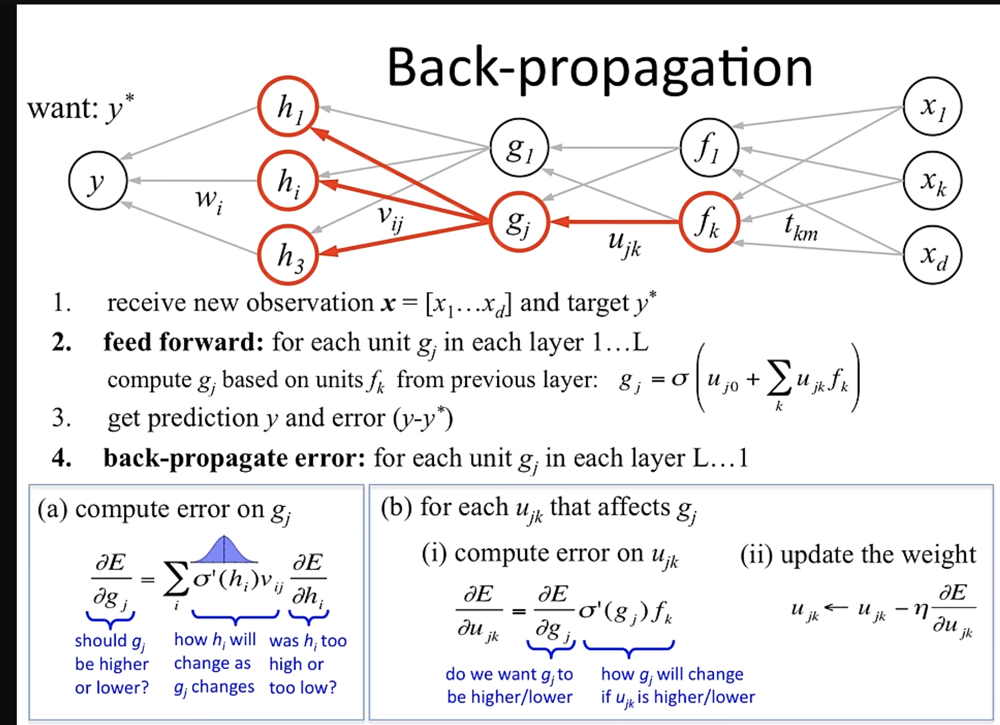

### Backpropagation

Backpropagation is a key algorithm for training neural networks by efficiently calculating the gradients needed to adjust the network's weights. Here's a step-by-step breakdown in an easy-to-understand format:

#### 1. Forward Pass: Compute Predictions and Loss
- **Input → Network → Output:** Feed input data through the network. Each layer applies weights, biases, and activation functions (e.g., sigmoid, ReLU) to produce an output.

- **Calculate Loss:** Compare the network’s final output to the true target using a loss function (e.g., mean squared error for regression, cross-entropy for classification).

#### 2. Backward Pass: Propagate Errors to Calculate Gradients
The goal is to determine how much each weight contributed to the error. We do this layer by layer, starting from the output:

**Step 1: Compute Output Layer Gradients**

- **Loss Gradient:** Calculate the derivative of the loss with respect to the network’s output.
Example: For mean squared error, this is (prediction − target).

- **Weight Gradients (Output Layer):** Multiply this error by the activation of the previous layer (chain rule). This tells us how to adjust the output layer’s weights.

**Step 2: Propagate to Hidden Layers**

- **Error at Layer `l`:** Use the error from layer `l+1` (already computed) and the weights connecting `l` to `l+1`. Multiply them to distribute the error backward.

- **Activation Derivatives:** Multiply by the derivative of the activation function used in layer `l`.
Example: For sigmoid, derivative is `σ(x) * (1 − σ(x))`; for ReLU, it’s `1` if input > 0, else `0`.

- **Weight Gradients (Hidden Layers):** Multiply this adjusted error by the activations from the previous layer (e.g., the input data for the first hidden layer).

#### 3. Update Weights with Gradient Descent

Adjust each weight by subtracting a small fraction (learning rate) of its gradient.
Formula:
`New Weight=Old Weight−(Learning Rate×Gradient)`

