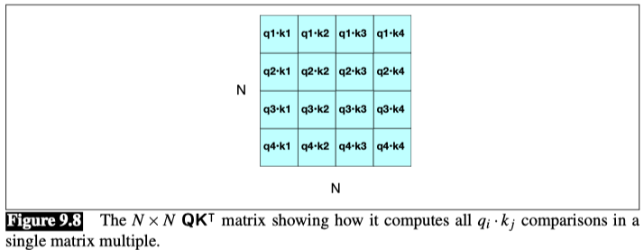
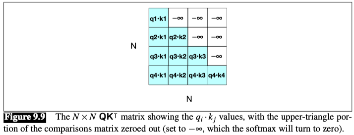
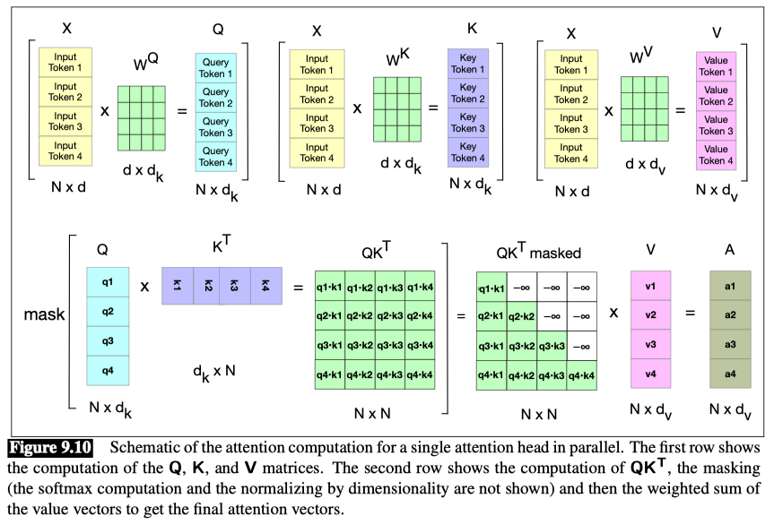

# Parallelize Computation using a single matrix

We do this by packing the input embeddings for the N tokens of the input sequence into a single matrix `X` of size `[N × d]`. Each row of `X` is the embedding of one token of the input. Transformers for large language models commonly have an input length `N` from 1K to 32K; much longer contexts of 128K or even up to millions of tokens can also be achieved with architectural changes like special long-context mechanisms that we don’t discuss here.

### Parallelizing attention

Let’s first see this for a single attention head and then turn to multiple heads, and then add in the rest of the components in the transformer block.

For one head we multiply $X$ by the key, query, and value matrices $W^Q$ of shape $[d ×d_k]$, $W^K$ of shape $[d ×d_k]$, and $W^V$ of shape $[d ×d_v]$, to produce matrices $Q$ of shape $[N ×d_k]$, $K$ of shape $[N ×d_k]$, and $V$ of shape $[N ×d_v]$, containing all the key, query, and value vectors:

$$
Q = XW^Q, \quad K = XW^K, \quad V = XW^V
$$

Given these matrices we can compute all the requisite query-key comparisons simultaneously by multiplying $Q$ and $K^T$ in a single matrix multiplication. The product is of shape $N ×N$, visualized in Fig.

Once we have this $QK^T$ matrix, we can very efficiently scale these scores, take the softmax, and then multiply the result by $V$ resulting in a matrix of shape $N ×d$: a vector embedding representation for each token in the input. We’ve reduced the entire self-attention step for an entire sequence of $N$ tokens for one head to the following computation:

$$
\text{head} = \text{softmax}(\text{mask}(\frac{QK^T}{\sqrt{d_k}}))V
$$

$$
A = head \times W^O
$$

### Masking out the future
You may have noticed that we introduced a mask function in Eq. above.

This is because the self-attention computation as we’ve described it has a problem:

**the calculation of $QK^T$ results in a score for each query value to every key value, including those that follow the query.** 

This is inappropriate in the setting of language modeling: guessing the next word is pretty simple if you already know it!

- To fix this, the elements in the upper-triangular portion of the matrix are set to −∞, which the softmax will turn to zero, thus eliminating any knowledge of words that follow in the sequence.
- This is done in practice by **adding a mask matrix $M$ in which $M_{ij} = -\infty \forall j > i$ (i.e. for the upper-triangular portion) and $M_{ij} = 0$ otherwise. Fig. below shows the resulting masked $QK^T$ matrix.** 

Fig. 9.10 shows a schematic of all the computations for a single attention head parallelized in matrix form.

### Parallelizing multi-head attention

In multi-head attention, as with self-attention, the input and output have the model dimension $d$, the key and query embeddings have dimensionality $d_k$, and the value embeddings are of dimensionality $d_v$ (again, in the original transformer paper $d_k$= $d_v$= 64, $A = 8$, and $d = 512$).

1. Thus for each head $i$, we have weight layers $W^Q_i$ of shape $[d × d_k]$, $W^K_i$ of shape $[d × d_k]$, and $W^V_i$ of shape $[d × d_v]$, and these get multiplied by the inputs packed into $X$ to produce $Q$ of shape $[N × d_k]$, $K$ of shape $[N × d_k]$, and $V$ of shape $[N × d_v]$. &  

2. The output of each of the A heads is of shape $N × d_v$, and so the output of the multi-head layer with A heads consists of A matrices of shape $N × d_v$.   

3. To make use of these matrices in further processing, they are concatenated to produce a single output with dimensionality $N × hd_v$.  

4. Finally, we use a final linear projection $W^O$ of shape $[Ad_v × d]$, that reshape it to the original output dimension for each token.

Multiplying the concatenated $N ×hd_v$ matrix output by $W^O$ of shape $[Ad_v ×d]$ yields the self-attention output $A$ of shape $[N ×d]$.

$$
Q^i = XW^{Qi}, \quad K^i = XW^{Ki}, \quad V^i = XW^{Vi}
$$

$$
\text{head}_i = \text{SelfAttention}(Q^i, K^i, V^i) = \text{softmax}(\frac{Q^iK^i}{\sqrt{d_k}})V^i
$$

$$
\text{MultiHeadAttention}(X) = (\text{head}_1 ⊕ \text{head}_2 ⊕ \ldots ⊕ \text{head}_A)W^O
$$

**Putting it all together with the parallel input matrix $X$**
The function computed in parallel by an entire layer of $N$ transformer blocks over the entire $N$ input tokens can be expressed as:

Eq. 9.37:
$$
O = X + \text{MultiHeadAttention}(LayerNorm(X))
$$

Eq. 9.38:
$$
H = O + \text{FFN}(LayerNorm(O))
$$

Note that in Eq. 9.37 we are using $X$ to mean the input to the layer, wherever it comes from. For the first layer, as we will see in the next section, that input is the initital `word + positional embedding vectors` that we have been describing by $X$. But for subsequent layers $k$, the input is the output from the previous layer $H^{k-1}$. We can also break down the computation performed in a transformer layer, showing one equation for each component computation.

We’ll use $T$ (of shape $[N ×d]$) to stand for transformer and superscripts to demarcate each computation inside the block, and again use $X$ to mean the input to the block from the previous layer or the initial embedding:

$$
T^1 = LayerNorm(X)
$$

$$
T^2 = \text{MultiHeadAttention}(T^1)
$$

$$
T^3 = T^2 + X
$$

$$
T^4 = LayerNorm(T^3)
$$

$$
T^5 = \text{FFN}(T^4)
$$

$$
H = T^5 + T^3
$$

Here when we use a notation like $FFN(T^3)$ we mean that the same FFN is applied in parallel to each of the N embedding vectors in the window. 

Similarly, each of the $N$ tokens is normed in parallel in the LayerNorm. 

Crucially, the input and output dimensions of transformer blocks are matched so they can be stacked. 

Since each token $x_i$ at the input to the block is represented by an embedding of dimensionality $[1×d]$, that means the input $X$ and output $H$ are both of shape $[N ×d]$.

