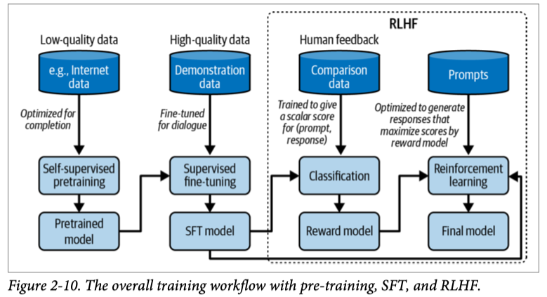

## Post-Training

Post-training starts with a pre-trained model.

Every model’s post-training is different. However, in general, post-training consists of two steps:
1. **Supervised finetuning (SFT)**: Finetune the pre-trained model on high-quality instruction data to optimize models for conversations instead of completion.
2. **Preference finetuning**: Further finetune the model to output responses that align with human preference. Preference finetuning is typically done with reinforcement learning (RL). Techniques for preference finetuning include **reinforcement learning from human feedback (RLHF)**.

Let me highlight the difference between pre-training and post-training another way. For language-based foundation models, pre-training optimizes token-level quality, where the model is trained to predict the next token accurately. However, users don’t care about token-level quality—they care about the quality of the entire response. Post-training, in general, optimizes the model to generate responses that users prefer.

The figure shows the overall workflow of pre-training, SFT, and preference finetuning, assuming you use RLHF for the last step. You can approximate how well a model aligns with human preference by determining what steps the model creators have taken.

### Hallucination
Hallucinations are fatal for tasks that depend on factuality. It’s hard to devise a way to eliminate hallucinations without understanding why hallucinations occur in the first place. There are currently two hypotheses about why language models hallucinate.

The first hypothesis, is that a language model hallucinates because it can’t differentiate between the data it’s given and the data it generates. 

The second hypothesis is that hallucination is caused by the mismatch between the model’s internal knowledge and the labeler’s internal knowledge.
