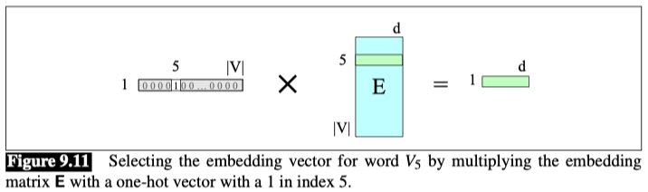
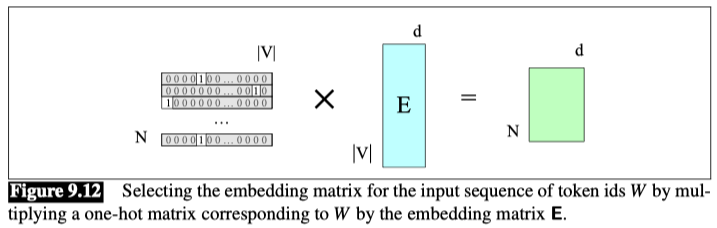
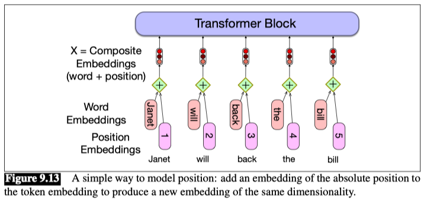

# The input: embeddings for token and position

### Embedding 
Let’s talk about where the input $X$ comes from.

Given a sequence of $N$ tokens ($N$ is the context length in tokens), the matrix $X$ of shape $[N × d]$ has an `embedding` for each word in the context. The transformer does this by separately computing two embeddings: an `input token embedding`, and an `input positional embedding`.

The set of initial embeddings are stored in the embedding matrix $E$, which has a row for each of the $|V|$ tokens in the vocabulary. Thus each word is a row vector of $d$ dimensions, and $E$ has shape $[|V| × d]$.

For example, 

Given an input token string like `Thanks for all the`, we first convert the tokens into vocabulary indices (these were created when we first tokenized the input using BPE or SentencePiece). So the representation of `thanks for all the` might be $w = [5,4000,10532,2224]$. Next we use indexing to select the corresponding rows from $E$, (row 5, row 4000, row 10532, row 2224).

### One-hot vector
Another way to think about selecting token embeddings from the embedding matrix is to represent tokens as one-hot vectors of shape $[1 × |V|]$, i.e., with one dimension for each word in the vocabulary.

Recall that in a `one-hot vector` all the elements are 0 except one, the element whose dimension is the word’s index in the vocabulary, which has value 1.

Multiplying by a one-hot vector that has only one non-zero element $x_i = 1$ simply selects out the relevant row vector for word $i$, resulting in the embedding for word $i$, as depicted in Fig. 9.11.

We can extend this idea to represent the entire token sequence as a matrix of one-hot vectors, one for each of the N positions in the transformer’s context window, as shown in Fig. 9.12.

### positional embeddings

These token embeddings are not position-dependent. To represent the position of each token in the sequence, we combine these token embeddings with **positional embeddings** specific to each position in an input sequence.

### Absolute position
Where do we get these positional embeddings? 

The simplest method, called **absolute position**, is to start with randomly initialized embeddings corresponding to each possible input position up to some maximum length.

To produce an input embedding that captures positional information, we just add the word embedding for each input to its corresponding positional embedding. The individual token and position embeddings are both of size $[1×d]$, so their sum is also $[1×d]$, This new embedding serves as the input for further processing.

The final representation of the input, the matrix $X$, is an $[N ×d]$ matrix in which each row $i$ is the representation of the $i$th token in the input, computed by adding $E[id(i)]$—the embedding of the $id$ of the token that occurred at position $i$—, to $P[i]$, the positional embedding of position $i$.

**A potential problem** with the simple position embedding approach is that there will be plenty of training examples for the initial positions in our inputs and correspondingly fewer at the outer length limits. These latter embeddings may be poorly trained and may not generalize well during testing.

### Relative position

A more complex style of positional embedding methods extend this idea of capturing relationships even further to directly represent relative position instead of absolute position, often implemented in the attention mechanism at each layer rather than being added once at the initial input.

