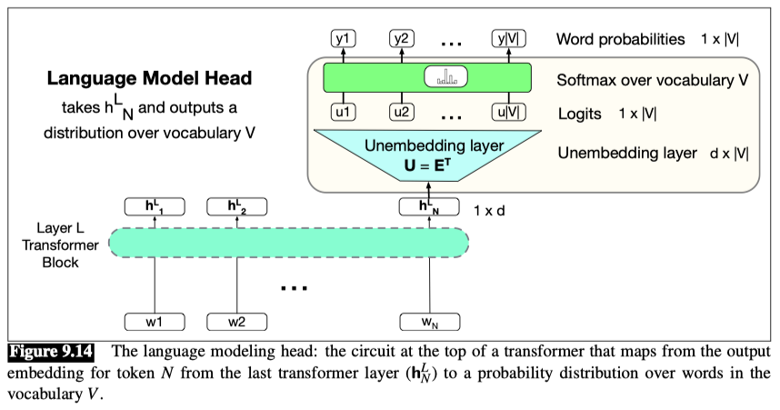
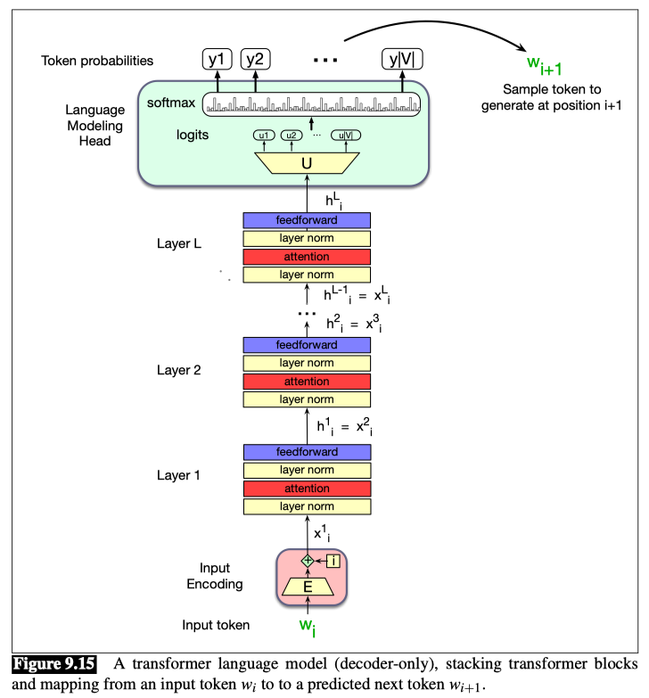

# The Language Modeling Head

### Language modeling head

The last component of the transformer we must introduce is the language modeling head.

The job of the language modeling head is to take the output of the final transformer layer from the last token $N$ and use it to predict the upcoming word at position $N + 1$.

Fig. 9.14 shows how to accomplish this task, taking the output of the last token at the last layer (the d-dimensional output embedding of shape $[1 × d]$) and producing a probability distribution over words.

**logit**
- The first module in Fig. 9.14 is a linear layer, whose job is to project from the output $h^{L}_N$, which represents the output token embedding at position $N$ from the final block $L$, (hence of shape $[1×d]$) to the `logit vector`, or score vector, that will have a single score for each of the $|V|$ possible words in the vocabulary $V$. The logit vector $u$ is thus of dimensionality $1×|V|$.

**weight tying**
- This linear layer can be learned, but more commonly we tie this matrix to (the transpose of) the embedding matrix $E$.

Recall that in `weight tying`, we use the same weights for two different matrices in the model.

Thus at the input stage of the transformer the embedding matrix (of shape $[ | V | ×d]$) is used to map from a one-hot vector over the vocabulary (of shape $[1 × |V|]$) to an embedding (of shape $[1 × d]$). 

And then in the language model head, **$E^T$**, the transpose of the embedding matrix (of shape $[d × | V | ]$) is used to map back from an embedding (shape $[1×d]$) to a vector over the vocabulary (shape $[1× | V | ]$). 

In the learning process, $E$ will be optimized to be good at doing both of these mappings. We therefore sometimes call the transpose $E^T$ the `unembedding layer` because it is performing this reverse mapping.

**A softmax layer turns the logits $u$ into the probabilities $y$ over the vocabulary.**

$$
u = h^{L}_N E^T
$$  

$$
y = \text{softmax}(u)
$$

We can use these probabilities to do things like help assign a probability to a given text.

Fig. 9.15 shows the total stacked architecture for one token $i$. Note that the input to each transformer layer $x^{l}_i$ is the same as the output from the preceding layer $h^{l-1}_i$.

### Decoder-only model
A terminological note before we conclude: You will sometimes see a transformer used for this kind of unidirectional causal language model called a `decoder-only model`.

This is because this model constitutes roughly half of the `encoder-decoder` model for transformers that we’ll see how to apply to machine translation.

