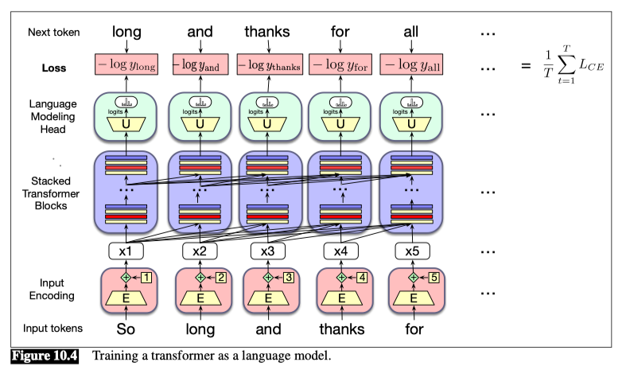

## 1.Large Language Models with Transformers

### 1.1 Conditional generation

Conditional generation is the task of generating text conditioned on an input piece of text. That is, we give the LLM an input piece of text, generally called a prompt, and then have the LLM continue generating text token by token, conditioned on the prompt and the previously generated tokens.

**So why should we care about predicting upcoming words or tokens?**

The insight of large language modeling is that **many practical NLP tasks can be cast as word prediction**, and that a powerful-enough language model can solve them with a high degree of accuracy.

### Text summarization

Conditional generation can even be used to accomplish tasks that must generate longer responses. Consider the task of text summarization, which is to take a long text, such as a full-length article, and produce an effective shorter summary of it.

### 1.2 Greedy decoding
Which words do we generate at each step?

- One simple way to generate words is to always generate the most likely word given the context.

Generating the most likely word given the context is called **greedy decoding**.

Thus in greedy decoding, at each time step in generation, the output $y_t$ is chosen by computing the probability for each possible output (every word in the vocabulary) and then choosing the highest probability word (the argmax):

$$y_t = \text{argmax}_{y} P(y_{t+1} | y_1, \ldots, y_t)$$

In practice, however, we don’t use greedy decoding with large language models.

- A major problem with greedy decoding is that because the words it chooses are (by definition) extremely predictable, the resulting text is generic and often quite repetitive.

## 2.Sampling for LLM Generation

### 2.1 Decoding
The core of the generation process for large language models is the task of choosing the single word to generate next based on the context and based on the probabilities that the model assigns to possible words.

This task of choosing a word to generate based on the model’s probabilities is called **decoding**.

### 2.2 Autoregressive generation
Repeatedly choosing the next word conditioned on our previous choices is called autoregressive generation or causal LM generation.

### 2.3 Sampling
The most common method for decoding in large language models is **sampling**.

We can formalize this algorithm for generating a sequence of words $W = w_1, w_2, \ldots, w_N$ until we hit the end-of-sequence token, using $x \sim p(x)$ to mean ‘choose $x$ by sampling from the distribution $p(x)$:

$i←1$
$w_i ∼ p(w)$
$while \space w_i \neq EOS $
    $ \space \space \space \space i←i + 1$
    $ \space \space \space \space w_i ∼ p(w_i | w_1, \ldots, w_{i-1})$

The algorithm above is called **random sampling**.

#### 2.3.1Top-k sampling
**Top-k sampling** is a simple generalization of greedy decoding. Instead of choosing the single most probable word to generate, we first truncate the distribution to the top k most likely words, renormalize to produce a legitimate probability distribution, and then randomly sample from within these k words according to their renormalized probabilities.

1. Choose in advance a number of words $k$
2. For each word in the vocabulary $V$, use the language model to compute the likelihood of this word given the context $P(w_i | w_1, \ldots, w_{i-1})$
3. Sort the words by their likelihood, and throw away any word that is not one of the top k most probable words.
4. Renormalize the scores of the k words to be a legitimate probability distribution.
5. Randomly sample a word from within these remaining k most-probable words according to its probability.

When $k = 1$, top-k sampling is identical to greedy decoding.

#### 2.3.2 Nucleus or top-p sampling
One problem with top-k sampling is that k is fixed, but the shape of the probability distribution over words differs in different contexts.

An alternative, called **top-p sampling** or **nucleus sampling**. To keep not the top k words, but the top p percent of the probability mass.

Given a distribution $P(w_t | w_{<t})$, we sort the distribution from most probable, and then the top-p vocabulary $V^{(p)}$ is the smallest set of words such that

$$\sum_{w_i \in V^{(p)}} P(w_i | w_{<t}) \geq p$$

#### 2.3.3 Temperature sampling
In temperature sampling, we don’t truncate the distribution, but instead reshape it.

- We implement this intuition by simply dividing the logit by a temperature parameter $τ$ before we normalize it by passing it through the softmax. 
- In low-temperature sampling, $τ ∈ (0,1]$.
- Thus instead of computing the probability distribution over the vocabulary directly from the logit as in the following

$$y=\text{softmax}(u)$$

- we instead first divide the logits by $τ$, computing the probability vector $y$ as

$$y=\text{softmax}(\frac{u}{τ})$$

**Why does this work?**
When $τ$ is close to 1 the distribution doesn’t change much. But the lower $τ$ is, the larger the scores being passed to the softmax (dividing by a smaller fraction $τ ≤ 1$ results in making each score larger). 
Recall that one of the useful properties of a softmax is that it tends to push high values toward 1 and low values toward 0. Thus when larger numbers are passed to a softmax the result is a distribution with increased probabilities of the most high-probability words and decreased probabilities of the low probability words, making the distribution more greedy. As $τ$ approaches 0 the probability of the most likely word approaches 1.

## 3. Pretraining Large Language Models

### 3.1 Self-supervised training algorithm

The cross-entropy loss for language modeling is determined by the probability the model assigns to the correct next word.

So at time $t$ the CE loss can be simplified as the negative log probability the model assigns to the next word in the training sequence.

$$L_{CE}(\hat{y}_t, y_t) = -\log \hat{y}_t[w_{t+1}]$$

- Thus at each word position $t$ of the input, the model takes as input the correct sequence of tokens $w_{1:t}$, and uses them to compute a probability distribution over possible next words so as to compute the model’s loss for the next token $w_{t+1}$.
- Then we move to the next word, we ignore what the model predicted for the next word and instead use the correct sequence of tokens $w_{1:t+1}$ to estimate the probability of token $w_{t+2}$.
- This idea that we always give the model the correct history sequence to predict the next word is called **teacher forcing**.

The figure above illustrates the general training approach. 
- At each step, given all the preceding words, the final transformer layer produces an output distribution over the entire vocabulary. 
- During training, the probability assigned to the correct word is used to calculate the cross-entropy loss for each item in the sequence. 
- The loss for a training sequence is the average cross-entropy loss over the entire sequence. 
- The weights in the network are adjusted to minimize the average CE loss over the training sequence via gradient descent.

There the calculation of the outputs and the losses at each step was inherently serial given the recurrence in the calculation of the hidden states. With transformers, each training item can be processed in parallel since the output for each element in the sequence is computed separately.

### 3.2 Fine tuning

- Continued pretraining:
  - retrain all the parameters of the model on this new data, using the same method (word prediction) and loss function (cross-entropy loss) as for pretraining.
- Parameter-efficient finetuning (PEFT):
  - Freeze some of the parameters and train only a subset of parameters on the new data.
- Supervised finetuning (SFT)

## 4. Evaluating Large Language Models

### 4.1 Perplexity
One way to evaluate language models is to measure how well they predict unseen text.

We instantiate this intuition by using perplexity to measure the quality of a language model.

The perplexity of a model $θ$ on an unseen test set is the inverse probability that $θ$ assigns to the test set, normalized by the test set length. For a test set of $n$ tokens $w_{1:n}$, the perplexity is

**Eq. 10.7**
$$\text{Perplexity}_θ(w_{1:n}) = P_θ(w_{1:n})^{-\frac{1}{n}} = \sqrt[n]{\frac{1}{P_θ(w_{1:n})}}$$

To visualize how perplexity can be computed as a function of the probabilities the LM computes for each new word, we can use the chain rule to expand the computation of probability of the test set:

**Eq. 10.8**
$$\text{Perplexity}_θ(w_{1:n}) = \sqrt[n]{\prod_{i=1}^{n} \frac{1}{P_θ(w_i | w_{<i})}}$$

Note that because of the inverse in Eq. 10.7, the higher the probability of the word sequence, the lower the perplexity. 
**Thus the the lower the perplexity of a model on the data, the better the model.**
Minimizing perplexity is equivalent to maximizing the test set probability according to the language model.

