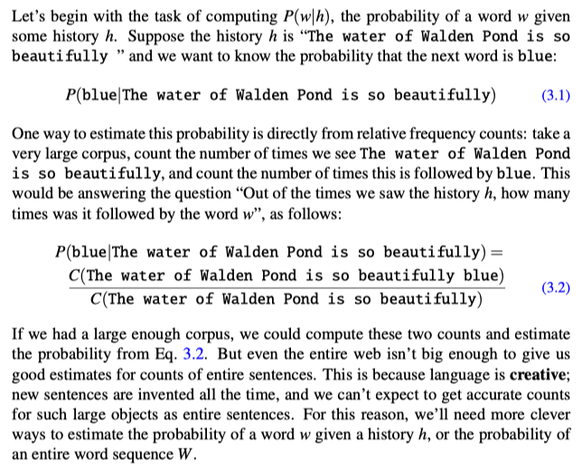

## N-gram Language Models

A language model is a machine learning model that predicts upcoming words. More formally, a language model assigns a probability to each possible next word, or equivalently gives a probability distribution over possible next works.

Why would we want to predict upcoming words, or know the probability of a sentence? `One reason is for generation: choosing contextually better words.`

### 1. The n-gram language model
An n-gram is a sequence of n words. a 2-gram (which we’ll call bigram) is a two-word sequence of words like The water, or water of, and a 3gram (a trigram) is a three-word sequence of words like The water of, or water of Walden.

To represent the probability of a particular random variable $X_i$ taking on the value “the”, or `P($X_i$ = “the”)`, we will use the simplification $P(the)$. 
We’ll represent a sequence of `n` words either as $w_1 ...w_n$ or $w_{1:n}$. Thus the expression $w_{1:n-1}$ means the string $w_1, w_2, ..., w_{n-1}$, but we’ll also be using the equivalent notation $w_{<n}$, which can be read as “all the elements of w from $w_1$ up to and including $w_{n-1}$”. For the joint probability of each word in a sequence having a particular value $P(X_1 = w_1, X_2 = w_2, X_3 = w_3, ..., X_n = w_n)$ we’ll use $P(w_1, w_2, ..., w_n)$.

Now, how can we compute probabilities of entire sequences like $P(w_1, w_2, ..., w_n)$?
One thing we can do is decompose this probability using the **chain rule of probability**:

$$
P(X_1 ..., X_n) = P(X_1)P(X_2 | X_1)P(X_3 | X_1, X_2) ... P(X_n | X_1, X_2, ..., X_{n-1}) = \prod_{i=1}^{n} P(X_i | X_1, X_2, ..., X_{i-1})
$$

Applying the chain rule to words, we get:

$$
P(w_{1:n}) = P(w_1)P(w_2 | w_1)P(w_3 | w_{1:2}) ... P(w_n | w_{1:n-1}) = \prod_{i=1}^{n} P(w_i | w_{1:i-1})
$$

#### The Markov assumption
The intuition of the n-gram model is that instead of computing the probability of a word given its entire history, we can **approximate** the history by just the last few words.

The **bigram** model, for example, approximates the probability of a word given all the previous words $P(w_n | w_{1:n-1})$ by using only the conditional probability given the preceding word $P(w_n | w_{1:n-1})$. In other words, instead of computing the probability `P(blue | The water of Walden Pond is so beautifully)`

we approximate it with the probability: `P(blue | beautifully)`

When we use a bigram model to predict the conditional probability of the next word, we are thus making the following approximation:

$$
P(w_n | w_{1:n-1}) \approx P(w_n | w_{n-1})
$$

The assumption that the probability of a word depends only on the previous word is called a **Markov assumption**. Markov models are the class of probabilistic models that assume we can predict the probability of some future unit without looking too far into the past.

Let’s see a general equation for this n-gram approximation to the conditional probability of the next word in a sequence. We’ll use `N` here to mean the n-gram size, so `N = 2` means **bigrams** and `N = 3` means **trigrams**. Then we approximate the probability of a word given its entire context as follows:

$$
P(w_n | w_{1:n-1}) \approx P(w_n | w_{n-N+1:n-1})
$$

Given the bigram assumption for the probability of an individual word, we can compute the probability of a complete word sequence by substituting the bigram approximation into the chain rule:

$$
P(w_{1:n}) \approx \prod_{k=1}^{n} P(w_i | w_{k-1})
$$

#### How to estimate probabilities
How do we estimate these bigram or n-gram probabilities? An intuitive way to estimate probabilities is called **maximum likelihood estimation** or **MLE**. We get the MLE estimate for the parameters of an n-gram model by getting counts from a corpus, and **normalizing** the counts so that they lie between 0 and 1.

For probabilistic models, normalizing means dividing by some total count so that the resulting probabilities fall between 0 and 1 and sum to 1.

For example, to compute a particular bigram probability of a word $w_n$ given a previous word $w_{n-1}$, we’ll compute the count of the bigram $C(w_{n-1} w_n)$ and normalize by the sum of all the bigrams that share the same first word $w_{n-1}$:

$$
P(w_n | w_{n-1}) = \frac{C(w_{n-1} w_n)}{\sum_{w'} C(w_{n-1} w')}
$$

We can simplify this equation, since the sum of all bigram counts that start with a given word $w_{n-1}$ must be equal to the unigram count for that word $w_{n-1}$:

$$
P(w_n | w_{n-1}) = \frac{C(w_{n-1} w_n)}{\sum_{w'} C(w_{n-1} w')} = \frac{C(w_{n-1} w_n)}{C(w_{n-1})}
$$

For the general case of MLE n-gram parameter estimation:

**Equation 3.12:**
$$
P(w_n | w_{n-N+1:n-1}) = \frac{C(w_{n-N+1:n-1} w_n)}{C(w_{n-N+1:n-1})}
$$

Equation 3.12 estimates the n-gram probability by dividing the observed frequency of a particular sequence by the observed frequency of a prefix. This ratio is called a **relative frequency**.

#### Dealing with scale in large n-gram models

**Log probabilities** 
Language model probabilities are always stored and computed in log space as log probabilities. This is because probabilities are (by definition) less than or equal to 1, and so the more probabilities we multiply together, the smaller the product becomes.

By adding log probabilities instead of multiplying probabilities, we get results that are not as small. We do all computation and storage in log space, and just convert back into probabilities if we need to report probabilities at the end by taking the exp of the logprob:

$$
p_1 × p_2 × p_3 × p_4 = \exp(\log p_1 + \log p_2 + \log p_3 + \log p_4)
$$

### 2. Evaluating Language Models: Training and Test Sets
The best way to evaluate the performance of a language model is to embed it in an application and measure how much the application improves.

In order to evaluate any machine learning model, we need to have at least three distinct data sets: the training set, the development set, and the test set.
- The **training set** is the data we use to learn the parameters of our model; for simple n-gram language models it’s the corpus from which we get the counts that we normalize into the probabilities of the n-gram language model.
- The **test set** is a different, held-out set of data, not overlapping with the training set, that we use to evaluate the model.
- The **development set** is a set of data that we do all our testing on this dataset until the very end, and then we test on the test set once to see how good our model is.

### 3. Perplexity
The metric we use is, a function of probability called **perplexity**, is one of the most important metrics in NLP, used for evaluating large language models as well as n-gram models.

The perplexity (sometimes abbreviated as PP or PPL) of a language model on a test set is the inverse probability of the test set (one over the probability of the test set), normalized by the number of words (or tokens). For this reason it’s sometimes called the per-word or per-token perplexity. We normalize by the number of words `N` by taking the `Nth` root. For a test set W = $w_1$ $w_2$ ... $w_N$, the perplexity is:

$$
PP(W) = P(w_1, w_2, ..., w_n)^{-\frac{1}{n}} = \sqrt[n]{\frac{1}{P(w_1, w_2, ..., w_n)}}
$$

Or we can use the chain rule to expand the probability of W:

**Eq.3.15:**
$$
PP(W) = \sqrt[n]{\frac{1}{P(w_1, w_2, ..., w_n)}} = \sqrt[n]{\frac{1}{\prod_{i=1}^{n} P(w_i | w_{1:i-1})}}
$$

Note that because of the inverse in Eq.3.15, the higher the probability of the word sequence, the lower the perplexity. **Thus the the lower the perplexity of a model on the data, the better the model.**

Minimizing perplexity is equivalent to maximizing the test set probability according to the language model. Meanwhile, we just have to remember that **perplexity has an inverse relationship with probability**i.

The perplexity of W computed with a bigram language model is still a geometric mean, but now of the inverse of the bigram probabilities:

**Eq.3.16:**
$$
PP(W) = \sqrt[n]{\frac{1}{\prod_{i=1}^{n} P(w_i | w_{i-1})}}
$$

#### Perplexity as Weighted Average Branching Factor
Perplexity can also be thought of as the weighted average branching factor of a language. The branching factor of a language is the number of possible next words that can follow any word.

### 4. Smoothing

#### Laplace Smoothing
The simplest way to do smoothing is to add one to all the n-gram counts, before we normalize them into probabilities. All the counts that used to be zero will now have a count of 1, the counts of 1 will be 2, and so on. This algorithm is called Laplace smoothing.

Let’s start with the application of Laplace smoothing to unigram probabilities. Recall that the unsmoothed maximum likelihood estimate of the unigram probability of the word $w_i$ is its count $c_i$ normalized by the total number of word tokens $N$:

$$
P(w_i) = \frac{c_i}{N}
$$

Laplace smoothing merely adds one to each count (hence its alternate name **add-one** smoothing). Since there are `V` words in the vocabulary and each one was incremented, we also need to adjust the denominator to take into account the extra `V` observations.

$$
P_{laplace}(w_i) = \frac{c_i + 1}{N + V}
$$

Recall that normal bigram probabilities are computed by normalizing each row of counts by the unigram count:

$$
P_{MLE}(w_n | w_{n-1}) = \frac{C(w_{n-1} w_n)}{C(w_{n-1})}
$$

For add-one smoothed bigram counts, we need to augment the unigram count in the denominator by the number of total word types in the vocabulary `V`:

$$
P_{laplace}(w_n | w_{n-1}) = \frac{C(w_{n-1} w_n) + 1}{C(w_{n-1}) + V} = \frac{C^*(w_{n-1} w_n)}{C(w_{n-1})}
$$

**Add-k smoothing**
One alternative to add-one smoothing is to move a bit less of the probability mass from the seen to the unseen events. Instead of adding 1 to each count, we add a fractional count k (0.5? 0.01?). This algorithm is therefore called **add-k smoothing**.

$$
P_{add-k}(w_n | w_{n-1}) = \frac{C(w_{n-1} w_n) + k}{C(w_{n-1}) + kV}
$$

### 4. Perplexity’s Relation to Entropy

**Entropy**
**Entropy** is a measure of information. Given a random variable X ranging over whatever we are predicting (words, letters, parts of speech), the set of which we’ll call χ, and with a particular probability function, call it p(x), the entropy of the random variable X is:

$$
H(X) = - \sum_{x \in \chi} p(x) \log_2 p(x)
$$

The log can, in principle, be computed in any base. If we use log base 2, the resulting value of entropy will be measured in **bits**.

For a grammar, for example, we will be computing the entropy of some sequence of words W = { $w_1, w_2, ..., w_n$ } . One way to do this is to have a variable that ranges over sequences of words. For example we can compute the entropy of a random variable that ranges over all sequences of words of length n in some language L as follows:

$$
H(w_1, w_2, ..., w_n) = - \sum_{w_{1:n} \in L} P(w_{1:n}) \log_2 P(w_{1:n})
$$

**Entropy rate**
We could define the **entropy rate** (we could also think of this as the per-word entropy) as the entropy of this sequence divided by the number of words:

$$
\frac{1}{n}H(w_{1:n}) = - \frac{1}{n} \sum_{w_{1:n} \in L} P(w_{1:n}) \log_2 P(w_{1:n})
$$

If we think of a language as a stochastic process `L` that produces a sequence of words, and allow `W` to represent the sequence of words $w_1, ..., w_n$, then L’s entropy rate `H(L)` is defined as:

$$
H(L) = \lim_{n \to \infty} \frac{1}{n}H(w_{1:n}) = - \lim_{n \to \infty} \frac{1}{n} \sum_{w_{1:n} \in L} P(w_{1:n}) \log_2 P(w_{1:n})
$$

The Shannon-McMillan-Breiman theorem states that if the language is regular in certain ways:

$$
H(L) =  \lim_{n \to \infty} - \frac{1}{n} \log_2 P(w_{1:n})
$$

**Cross-entropy**
The cross-entropy is useful when we don’t know the actual probability distribution `p` that generated some data. It allows us to use some `m`, which is a model of `p` (i.e., an approximation to `p`). The cross-entropy of `m` on `p` is defined by:

$$
H(p, m) = \lim_{n \to \infty} - \frac{1}{n} \sum_{w \in L} p(w_1, w_2, ..., w_n) \log_2 m(w_1, w_2, ..., w_n)
$$

That is, we draw sequences according to the probability distribution p, but sum the log of their probabilities according to m.

Again, following the Shannon-McMillan-Breiman theorem, for a stationary ergodic process:

$$
H(p, m) = \lim_{n \to \infty} - \frac{1}{n} \log_2 m(w_1, w_2, ..., w_n)
$$

This means that, as for entropy, we can estimate the cross-entropy of a model m on some distribution p by taking a single sequence that is long enough instead of summing over all possible sequences.

What makes the cross-entropy useful is that the cross-entropy `H(p,m)` is an upper bound on the entropy `H(p)`. For any model `m`:

$$
H(p) \leq H(p, m)
$$

The more accurate m is, the closer the cross-entropy `H(p,m)` will be to the true entropy `H(p)`. Thus, the difference between `H(p,m)` and `H(p)` is a measure of how accurate a model is.

We are finally ready to see the relation between perplexity and cross-entropy. This approximation to the cross-entropy of a model M = P($w_i$ | $w_{i-N+1:i-1}$) on a sequence of words W is:

$$
H(W) = − \frac{1}{n} \log_2 P(w_1, w_2, ..., w_n)
$$

The perplexity of a model P on a sequence of words W is now formally defined as 2 raised to the power of this cross-entropy:

$$
PP(W) = 2^{H(W)} = P(w_1, w_2, ..., w_n)^{-\frac{1}{n}} = \sqrt[n]{\frac{1}{P(w_1, w_2, ..., w_n)}}
$$

