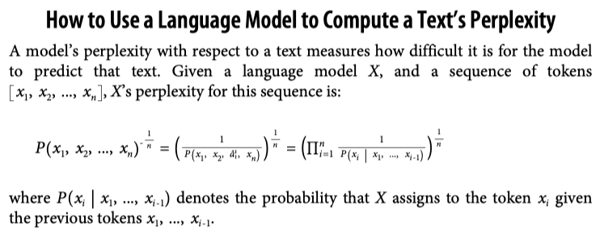

## Evaluation Methodology

### Understanding Language Modeling Metrics
All four metrics—cross entropy, perplexity, bits-per-character (BPC) and bits-per-byte (BPB)—are closely related.

**Entropy**
Entropy measures how much information, on average, a token carries. The higher the entropy, the more information each token carries, and the more bits are needed to represent a token.

**Cross Entropy**
When you train a language model on a dataset, your goal is to get the model to learn the distribution of this training data. In other words, your goal is to get the model to predict what comes next in the training data. A language model’s cross entropy on a dataset measures how difficult it is for the language model to predict what comes next in this dataset.

A model’s cross entropy on the training data depends on two qualities:
1. The training data’s predictability, measured by the training data’s entropy
2. How the distribution captured by the language model diverges from the true distribution of the training data

Entropy and cross entropy share the same mathematical notation, H. Let P be the true distribution of the training data, and Q be the distribution learned by the language model. Accordingly, the following is true:
- The training data’s entropy is, therefore, `H(P)`.
- The divergence of `Q` with respect to `P` can be measured using the Kullback–Leibler (KL) divergence, which is mathematically represented as $D_{KL}(P || Q)$.
- The model’s cross entropy with respect to the training data is therefore:

$$
H(P, Q) = H(P) + D_{KL}(P || Q)
$$

**Bits-per-Character and Bits-per-Byte**
One unit of entropy and cross entropy is bits.

**Perplexity**
Perplexity is the exponential of entropy and cross entropy. Perplexity is often shortened to PPL.

Given a dataset with the true distribution P, its perplexity is defined as:

$$
PPL(P, Q) = 2^{H(P)}
$$

The perplexity of a language model (with the learned distribution Q) on this dataset is defined as:

$$
PPL(P, Q) = 2^{H(P, Q)}
$$

If cross entropy measures how difficult it is for a model to predict the next token, perplexity measures the amount of uncertainty it has when predicting the next token. Higher uncertainty means there are more possible options for the next token.

Popular ML frameworks, including TensorFlow and PyTorch, use `nat` (natural log) as the unit for entropy and cross entropy. Nat uses the `base of e`, the base of natural logarithm. 8 If you use `nat` as the unit, perplexity is the exponential of `e`:

$$
PPL(P, Q) = e^{H(P, Q)}
$$

**Perplexity Interpretation and Use Cases**
What’s considered a good value for perplexity depends on the data itself and how exactly perplexity is computed, such as how many previous tokens a model has access to. Here are some general rules:

- More structured data gives lower expected perplexity
  - More structured data is more predictable.
- The bigger the vocabulary, the higher the perplexity
  - Intuitively, the more possible tokens there are, the harder it is for the model to predict the next token.
- The longer the context length, the lower the perplexity
  - The more context a model has, the less uncertainty it will have in predicting the next token.

