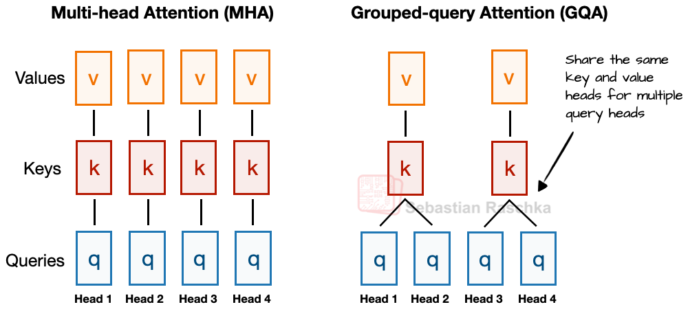
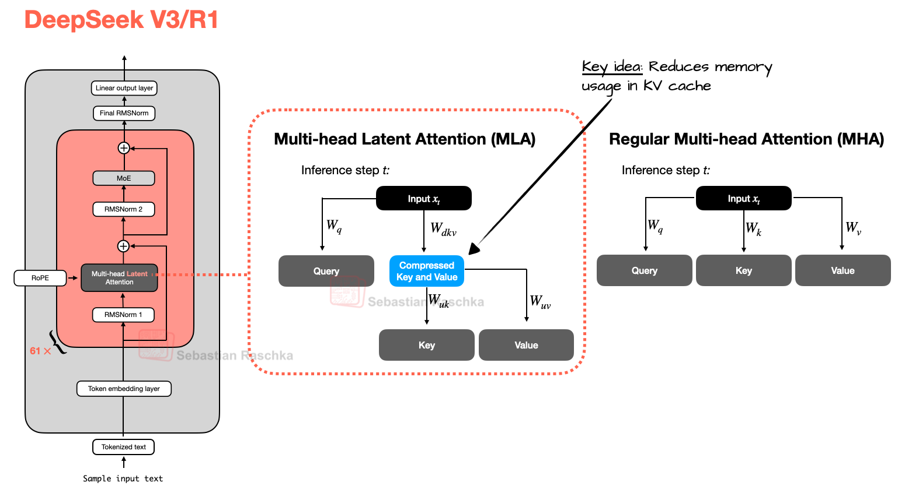
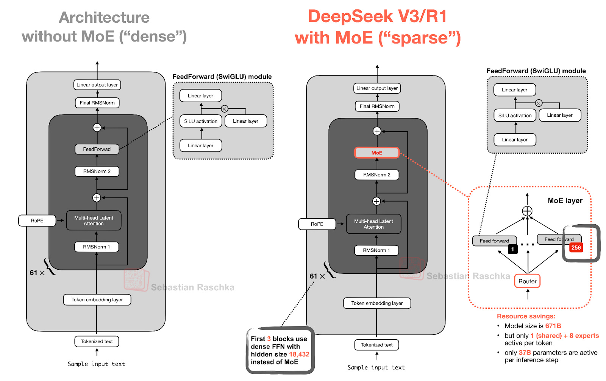
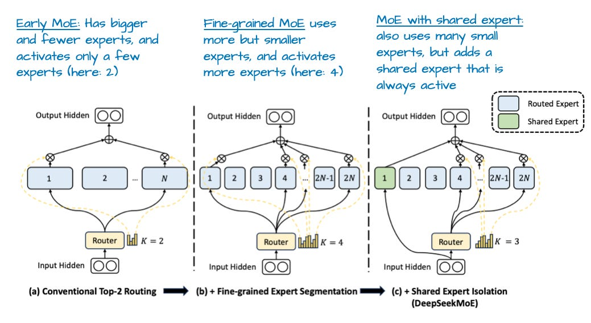

### 1. DeepSeek V3/R1
DeepSeek R1 is a reasoning model built on top of the DeepSeek V3 architecture, which was introduced in December 2024.

DeepSeek V3 that improved its computational efficiency and distinguish it from many other
- Multi-Head Latent Attention (MLA)
- Mixture-of-Experts (MoE)

#### 1.1 Multi-Head Latent Attention (MLA)
Before discussing Multi-Head Latent Attention (MLA), let's briefly go over some background to motivate why it's used. For that, let's start with **Grouped-Query Attention (GQA)**, which has become the new standard replacement for a more compute- and parameter-efficient alternative to Multi-Head Attention (MHA) in recent years.

So, here's a brief GQA summary. Unlike MHA, where each head also has its own set of keys and values, to reduce memory usage, GQA groups multiple heads to share the same key and value projections.

For example, as further illustrated in Figure, if there are 2 key-value groups and 4 attention heads, then heads 1 and 2 might share one set of keys and values, while heads 3 and 4 share another. This reduces the total number of key and value computations, which leads to lower memory usage and improved efficiency (without noticeably affecting the modeling performance, according to ablation studies).

So, the core idea behind GQA is to reduce the number of key and value heads by sharing them across multiple query heads. This (1) lowers the model's parameter count and (2) reduces the memory bandwidth usage for key and value tensors during inference since fewer keys and values need to be stored and retrieved from the KV cache.

Now, Multi-Head Latent Attention (MLA) offers a different memory-saving strategy that also pairs particularly well with KV caching. Instead of sharing key and value heads like GQA, MLA compresses the key and value tensors into a lower-dimensional space before storing them in the KV cache.

At inference time, these compressed tensors are projected back to their original size before being used, as shown in the Figure below. This adds an extra matrix multiplication but reduces memory usage.

(As a side note, the queries are also compressed, but only during training, not inference.)

To summarize this section before we move on to the next architecture component, MLA is a clever trick to reduce KV cache memory use while even slightly outperforming MHA in terms of modeling performance.

#### 1.2 Mixture-of-Experts (MoE)
The other major architectural component in DeepSeek worth highlighting is its use of Mixture-of-Experts (MoE) layers. While DeepSeek did not invent MoE, it has seen a resurgence this year, and many of the architectures we will cover later also adopt it.

The core idea in MoE is to replace each FeedForward module in a transformer block with multiple expert layers, where each of these expert layers is also a FeedForward module. This means that we swap a single FeedForward block for multiple FeedForward blocks, as illustrated in the Figure below.

The FeedForward block inside a transformer block (shown as the dark gray block in the figure above) typically contains a large number of the model's total parameters. (Note that the transformer block, and thereby the FeedForward block, is repeated many times in an LLM; in the case of DeepSeek-V3, 61 times.)

So, replacing a single FeedForward block with multiple FeedForward blocks (as done in a MoE setup) substantially increases the model's total parameter count. However, the key trick is that we don't use ("activate") all experts for every token. Instead, a router selects only a small subset of experts per token. (In the interest of time, or rather article space, I'll cover the router in more detail another time.)

Because only a few experts are active at a time, MoE modules are often referred to as sparse, in contrast to dense modules that always use the full parameter set. However, the large total number of parameters via an MoE increases the capacity of the LLM, which means it can take up more knowledge during training. The sparsity keeps inference efficient, though, as we don't use all the parameters at the same time.

For example, DeepSeek-V3 has 256 experts per MoE module and a total of 671 billion parameters. Yet during inference, only 9 experts are active at a time (1 shared expert plus 8 selected by the router). This means just 37 billion parameters are used per inference step as opposed to all 671 billion.

One notable feature of DeepSeek-V3's MoE design is the use of a shared expert. This is an expert that is always active for every token. This idea is not new and was already introduced in the DeepSeek 2024 MoE and 2022 DeepSpeedMoE papers.

The benefit of having a shared expert was first noted in the DeepSpeedMoE paper, where they found that it boosts overall modeling performance compared to no shared experts. This is likely because common or repeated patterns don't have to be learned by multiple individual experts, which leaves them with more room for learning more specialized patterns.

#### 1.3 DeepSeek Summary

To summarize, DeepSeek-V3 is a massive 671-billion-parameter model that, at launch, outperformed other open-weight models, including the 405B Llama 3. Despite being larger, it is much more efficient at inference time thanks to its Mixture-of-Experts (MoE) architecture, which activates only a small subset of (just 37B) parameters per token.

Another key distinguishing feature is DeepSeek-V3's use of Multi-Head Latent Attention (MLA) instead of Grouped-Query Attention (GQA). Both MLA and GQA are inference-efficient alternatives to standard Multi-Head Attention (MHA), particularly when using KV caching. While MLA is more complex to implement, a study in the DeepSeek-V2 paper has shown it delivers better modeling performance than GQA.

