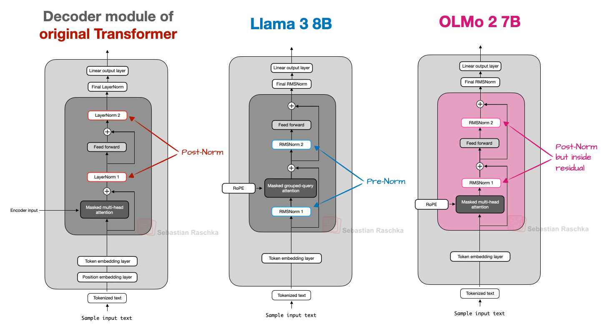

## 2. OLMo 2

The OLMo series of models by the non-profit Allen Institute for AI is noteworthy due to its transparency in terms of training data and code, as well as the relatively detailed technical reports.

Another thing worth mentioning is that OLMo 2 still uses traditional Multi-Head Attention (MHA) instead of MLA or GQA.

#### 2.1 Normalization Layer Placement
Overall, OLMo 2 largely follows the architecture of the original GPT model, similar to other contemporary LLMs. However, there are some noteworthy deviations. Let's start with the normalization layers.

Similar to Llama, Gemma, and most other LLMs, OLMo 2 switched from LayerNorm to RMSNorm.

But since RMSNorm is old hat (it's basically a simplified version of LayerNorm with fewer trainable parameters), let's look at the placement of the normalization layers. The original transformer (from the "Attention is all you need" paper) placed the two normalization layers in the transformer block after the attention module and the FeedForward module, respectively.

This is also known as Post-LN or Post-Norm.

GPT and most other LLMs that came after placed the normalization layers before the attention and FeedForward modules, which is known as Pre-LN or Pre-Norm. A comparison between Post- and Pre-Norm is shown in the figure below.



In OLMo 2, instead of placing the normalization layers before the attention and FeedForward layers, they place them after, as shown in the figure above. However, notice that in contrast to the original transformer architecture, the normalization layers are still inside the residual layers.

So, why did they move the position of the normalization layers? The reason is that it helped with training stability. Unfortunately the results of the reordering together with QK-Norm, which is a separate concept. So, it’s hard to tell how much the normalization layer reordering contributed by itself.

#### 2.2 QK-Norm
QK-Norm is essentially yet another RMSNorm layer. It's placed inside the Multi-Head Attention (MHA) module and applied to the queries (q) and keys (k) before applying RoPE.

To illustrate this, below is an excerpt of a Grouped-Query Attention (GQA) layer I wrote for my Qwen3 from-scratch implementation (the QK-norm application in GQA is similar to MHA in OLMo):

```python
class GroupedQueryAttention(nn.Module):
    def __init__(
        self, d_in, num_heads, num_kv_groups,
        head_dim=None, qk_norm=False, dtype=None
    ):
        # ...

        if qk_norm:
            self.q_norm = RMSNorm(head_dim, eps=1e-6)
            self.k_norm = RMSNorm(head_dim, eps=1e-6)
        else:
            self.q_norm = self.k_norm = None

    def forward(self, x, mask, cos, sin):
        b, num_tokens, _ = x.shape

        # Apply projections
        queries = self.W_query(x) 
        keys = self.W_key(x)
        values = self.W_value(x) 

        # ...

        # Optional normalization
        if self.q_norm:
            queries = self.q_norm(queries)
        if self.k_norm:
            keys = self.k_norm(keys)

        # Apply RoPE
        queries = apply_rope(queries, cos, sin)
        keys = apply_rope(keys, cos, sin)

        # Expand K and V to match number of heads
        keys = keys.repeat_interleave(self.group_size, dim=1)
        values = values.repeat_interleave(self.group_size, dim=1)

        # Attention
        attn_scores = queries @ keys.transpose(2, 3)
        # ...

```
As mentioned earlier, together with Post-Norm, QK-Norm stabilizes the training. Note that QK-Norm was not invented by OLMo 2 but goes back to the 2023 Scaling Vision Transformers paper.

#### 2.3 OLMo 2 Summary

In short, the noteworthy OLMo 2 architecture design decisions are primarily the RMSNorm placements: RMSNorm after instead of before the attention and FeedForward modules (a flavor of Post-Norm), as well as the addition of RMSNorm for the queries and keys inside the attention mechanism (QK-Norm), which both, together, help stabilize the training loss.


