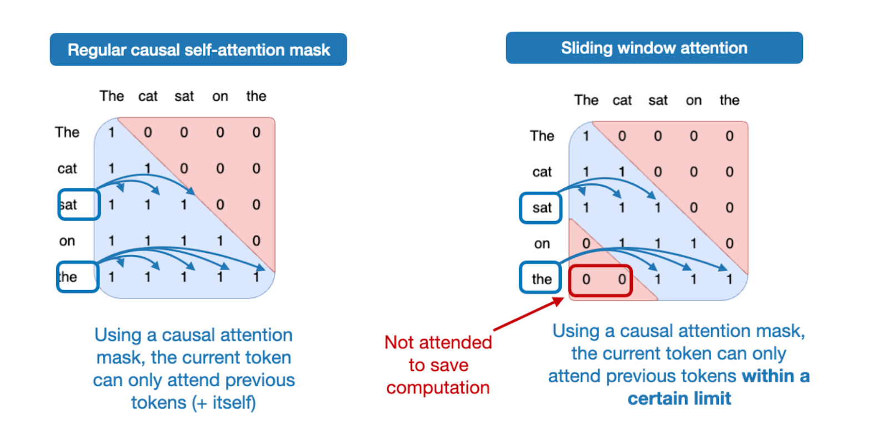
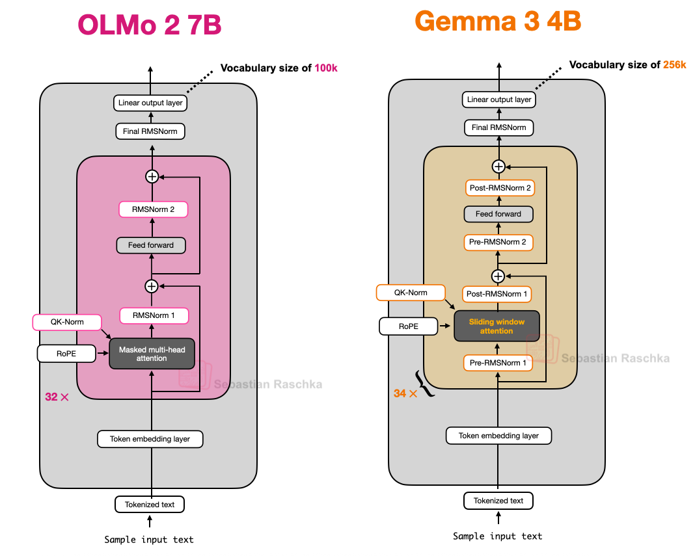

## 3. Gemma 3

One of the distinguishing aspects of Google's Gemma is the rather large vocabulary size (to support multiple languages better), and the stronger focus on the 27B size (versus 8B or 70B). But note that Gemma 2 also comes in smaller sizes: 1B, 4B, and 12B.

The 27B size hits a really nice sweet spot: it's much more capable than an 8B model but not as resource-intensive as a 70B model, and it runs just fine locally on my Mac Mini.

So, what else is interesting in Gemma 3? As discussed earlier, other models like Deepseek-V3/R1 use a Mixture-of-Experts (MoE) architecture to reduce memory requirements at inference, given a fixed model size. (The MoE approach is also used by several other models we will discuss later.)

Gemma 3 uses a different "trick" to reduce computational costs, namely sliding window attention.

#### 3.1 Sliding Window Attention
So, what is sliding window attention? If we think of regular self-attention as a global attention mechanism, since each sequence element can access every other sequence element, then we can think of sliding window attention as local attention, because here we restrict the context size around the current query position. This is illustrated in the figure below.

Note that sliding window attention can be used with both Multi-Head Attention and Grouped-Query Attention; Gemma 3 uses grouped-query attention.

As mentioned above, sliding window attention is also referred to as local attention because the local window surrounds and moves with the current query position. In contrast, regular attention is global as each token can access all other tokens.

Now, as briefly mentioned above, the Gemma 2 predecessor architecture also used sliding window attention before. The difference in Gemma 3 is that they adjusted the ratio between global (regular) and local (sliding) attention.

For instance, Gemma 2 uses a hybrid attention mechanism that combines sliding window (local) and global attention in a 1:1 ratio. Each token can attend to a 4k-token window of nearby context.

Where Gemma 2 used sliding window attention in every other layer, Gemma 3 now has a 5:1 ratio, meaning there's only 1 full attention layer for every 5 sliding windows (local) attention layers; moreover, the sliding window size was reduced from 4096 (Gemma 2) to just 1024 (Gemma 3). This shifts the model's focus towards more efficient, localized computations.

#### 3.2 Normalization Layer Placement in Gemma 3
A small but interesting thing to highlight is that Gemma 3 uses RMSNorm in both a Pre-Norm and Post-Norm setting around its grouped-query attention module.

This is similar to Gemma 2 but still worth highlighting, as it differs from (1) the Post-Norm used in the original transformer (“Attention is all you need”), (2) the Pre-Norm, which was popularized by GPT-2 and used in many other architectures afterwards, and (3) the Post-Norm flavor in OLMo 2 that we saw earlier.

#### 3.3 Gemma
In summary, Gemma 3 is a large-scale language model that uses a unique combination of normalization layer placement and sliding window attention to improve training stability.

Also, Gemma 3 has a unique normalization layer placement, placing RMSNorm layers both before and after the attention and FeedForward modules.

One of the changes in Gemma 3n to achieve better efficiency is the so-called Per-Layer Embedding (PLE) parameters layer. The key idea here is to keep only a subset of the model's parameters in GPU memory. Token-layer specific embeddings, such as those for text, audio, and vision modalities, are then streamed from the CPU or SSD on demand.

