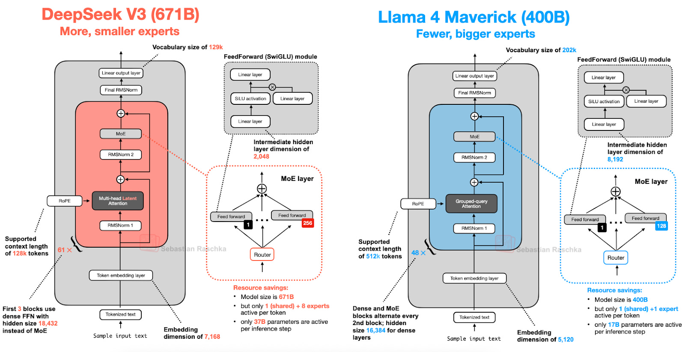

## 4. Llama 4

The extensive introductory discussion on Mixture-of-Experts (MoE) earlier in this article pays off again. Llama 4 has also adopted an MoE approach and otherwise follows a relatively standard architecture that is very similar to DeepSeek-V3, as shown in the figure below. (Llama 4 includes native multimodal support, similar to models like Gemma and Mistral. However, since this article focuses on language modeling, we only focus on the text model.)

While the Llama 4 Maverick architecture looks very similar to DeepSeek-V3 overall, there are some interesting differences worth highlighting.

First, Llama 4 uses Grouped-Query Attention similar to its predecessors, whereas DeepSeek-V3 uses Multi-Head Latent Attention, which we discussed at the beginning of this article. Now, both DeepSeek-V3 and Llama 4 Maverick are very large architectures, with DeepSeek-V3 being approximately 68% larger in its total parameter count. However, with 37 billion active parameters, DeepSeek-V3 has more than twice as many active parameters as Llama 4 Maverick (17B).

Llama 4 Maverick uses a more classic MoE setup with fewer but larger experts (2 active experts with 8,192 hidden size each) compared to DeepSeek-V3 (9 active experts with 2,048 hidden size each). Also, DeepSeek uses MoE layers in each transformer block (except the first 3), whereas Llama 4 alternates MoE and dense modules in every other transformer block.

#### 4.1 Llama 4
In summary, Llama 4 Maverick is a large-scale language model that uses a Mixture-of-Experts (MoE) architecture to improve training stability.

