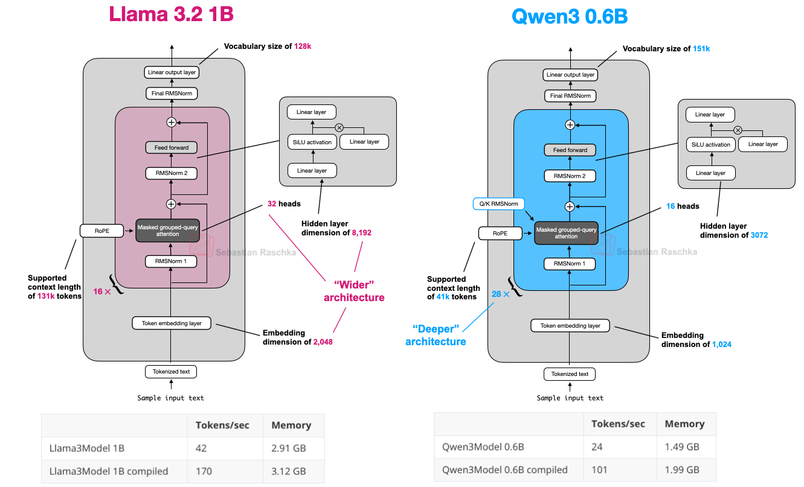
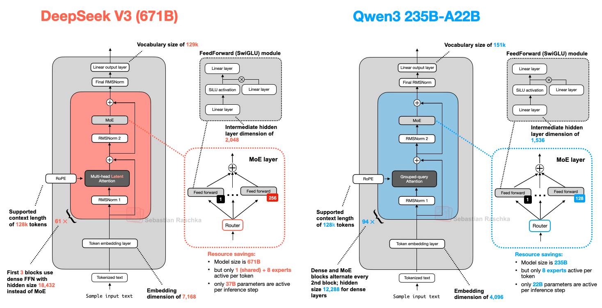

## 5. Qwen3 

### 5.1 Qwen3-Dense

### 5.2 Qwen3-MoE

As mentioned at the beginning of this article, MoE variants help reduce inference costs for large base models. Offering both dense and MoE versions gives users flexibility depending on their goals and constraints.

Dense models are typically more straightforward to fine-tune, deploy, and optimize across various hardware.

On the other hand, MoE models are optimized for scaling inference. For instance, at a fixed inference budget, they can achieve a higher overall model capacity (i.e., knowledge uptake during training due to being larger) without proportionally increasing inference costs.

By releasing both types, the Qwen3 series can support a broader range of use cases: dense models for robustness, simplicity, and fine-tuning, and MoE models for efficient serving at scale.

As shown in the figure above, the DeepSeek-V3 and Qwen3 235B-A22B architectures are remarkably similar. What's noteworthy, though, is that the Qwen3 model moved away from using a shared expert (earlier Qwen models, such as Qwen2.5-MoE did use a shared expert).

