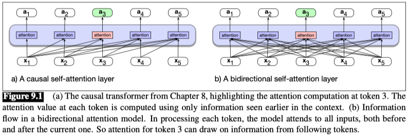
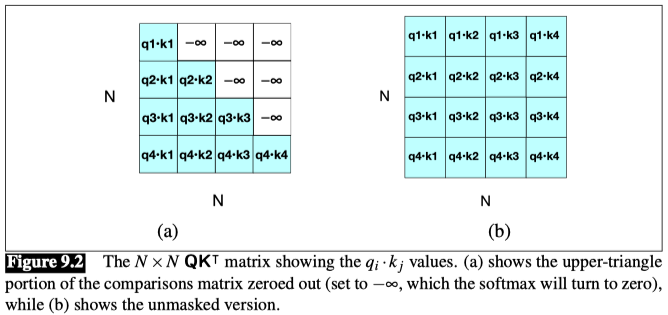
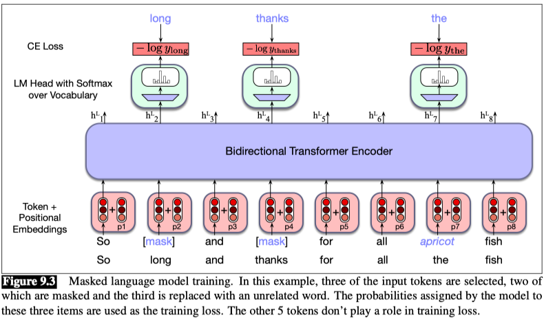

## Bidirectional Transformer Encoders

### 1. The architecture for bidirectional masked models

$$ head = softmax\left(mask\left(\frac{QK^T}{\sqrt{d_k}}\right)\right)V $$

The figure shows the masked version of $QK^T$ and the unmasked version. For bidirectional attention, we use the unmasked version of Fig. 9.2b. Thus the attention computation for bidirectional attention is exactly the same as Eq. 9.1 but with the mask removed:

$$ head = softmax\left(\frac{QK^T}{\sqrt{d_k}}\right)V $$

### 2. Training Bidirectional Encoders

Masked Language Modeling (MLM) is a training objective for bidirectional transformers that masks out some of the tokens in the input sequence and then trains the model to predict the masked tokens.

The MLM training objective is to predict the original inputs for each of the masked tokens and the cross-entropy loss from these predictions drives the training process for all the parameters in the model.

In MLM training, the model is presented with a series of sentences from the training corpus in which a percentage of tokens (15% in the BERT model) have been randomly chosen to be manipulated by the masking procedure:
- 80% of the time: The token is replaced with the special vocabulary token named `[MASK]`
- 10% of the time: The token is replaced with a random token from the vocabulary
- 10% of the time: The token is left unchanged

We then train the model to guess the correct token for the manipulated tokens.

**Why the three possible manipulations?**
Adding the [MASK] token creates a mismatch between pretraining and downstream finetuning or inference, since when we employ the MLM model to perform a downstream task, we don’t use any [MASK] tokens. If we just replaced tokens with the [MASK], the model might only predict tokens when it sees a [MASK], but we want the model to try to always predict the input token.

