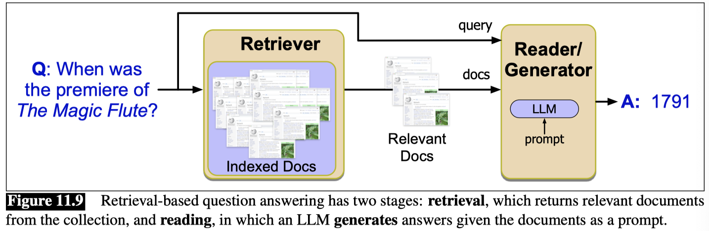
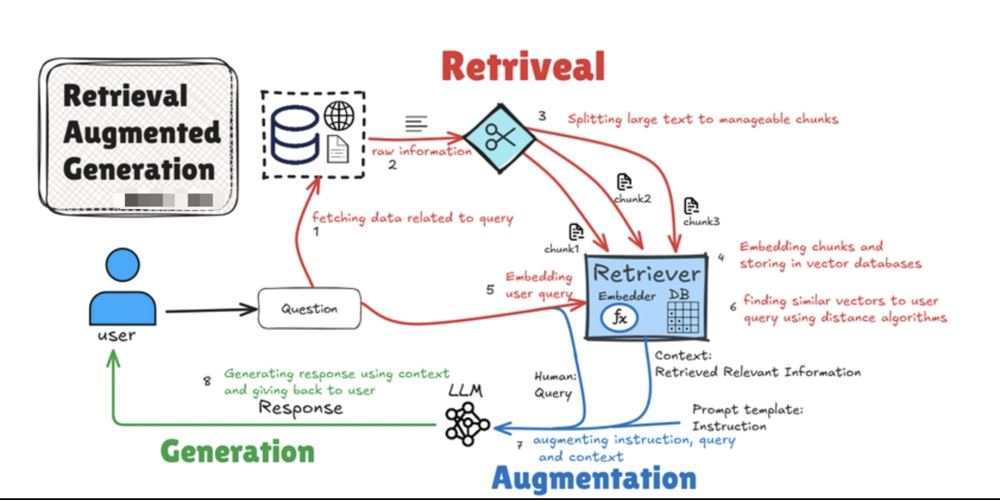

## Information Retrieval

**Information retrieval** or IR is the name of the field encompassing the retrieval of all manner of media based on user information needs.

The IR task we consider is called ad hoc retrieval, in which a user poses a query to a retrieval system, which then returns an ordered set of documents from some collection. A document refers to whatever unit of text the system indexes and retrieves (web pages, scientific papers, news articles, or even shorter passages like paragraphs). A collection refers to a set of documents being used to satisfy user requests. A term refers to a word in a collection, but it may also include phrases. Finally, a query represents a user’s information need expressed as a set of terms.


### TF-IDF

$$ \text{tf-idf}(t, d) = \text{tf}(t, d) \times \text{idf}(t, d) $$

**Term Frequency (TF)**

$$ \text{tf}(t, d) = \frac{\text{count}(t, d)}{\text{total terms in d}} $$

**Inverse Document Frequency (IDF)**

$$ \text{idf}(t, d) = \log_{10} \frac{\text{total documents}}{\text{documents with term t}} $$

#### TF-IDF two problems
- **Linear growth of term frequency**: TF increases linearly; if a term appears 10 times, its weight is 10 times that of a single occurrence. However, actual relevance does not increase linearly—if "apple" appears 10 times, it is not necessarily twice as relevant as if it appeared 5 times.
- **Document length bias**: Long documents naturally have higher term frequencies, making them more likely to score higher. A 1000-word document vs. a 100-word document, the longer document tends to score higher.

### BM25

BM25 adds two parameters: 
- **k**, a knob that adjust the balance between term frequency and IDF, and 
- **b**, which controls the importance of document length normalization. 

The BM25 score of a document d given a query q is:

$$ \text{bm25}(d, q) = \sum_{t \in q} \text{idf}(t, d) \times \frac{\text{tf}(t, d) }{{\text{tf}(t, d) + k \times (1 - b + b \times \frac{\text{length of d}}{\text{average length of documents}})}} $$

## Answering Questions with RAG

The method of generating based on retrieved documents is called retrieval-augmented generation or RAG, and the two components are sometimes called, for historical reasons, the retriever and the reader



Retrieval-based question answering has two stages: 
- **retrieval**, which returns relevant documents from the collection, and
- **reading**, in which an LLM generates answers given the documents as a prompt.

### Retrieval-Augmented Generation

the probability of a string from the previous tokens:

$$ P(x_1, x_2, \ldots, x_n) = \prod_{i=1}^n P(x_i | x_1, x_2, \ldots, x_{i-1}) $$

simple conditional generation for question answering adds a prompt like Q: , followed by a query q , and A:, all concatenated:

$$ P(x_1, x_2, \ldots, x_n) = \prod_{i=1}^n P([Q: q], [A: x_i]) $$



**RAG workflow = retrieve relevant context → augment prompt → generate grounded answer.**

```
[Offline]  Documents → Chunking → Embedding → Vector DB
                                                ↑
[Online]   Query → Embedding → Similarity Search → Retrieved Chunks
                                                ↓
                                       Prompt + Retrieved Context
                                                ↓
                                            LLM Generation
                                                ↓
                                             Final Answer
```

#### Example

**Step 1: Document Chunking (Offline)**
Split documents into semantic chunks:


| Chunk | Content                                                                                                            | Source |
|-------|--------------------------------------------------------------------------------------------------------------------|--------|
| C1    | "The phrase 'the cat sat on the mat' is a classic example for teaching basic English sentence structure."           | Doc1   |
| C2    | "Cats are obligate carnivores requiring meat in their diet."                                                       | Doc2   |
| C3    | "Teaching English beginners starts with simple subject-verb-object sentences like 'the cat sat on the mat'."        | Doc3   |

**Step 2: Embedding & Indexing (Offline)**
Convert chunks into vectors and store in a vector database:


| Chunk | Vector        |
|-------|--------------|
| C1    | [0.9, 0.1]   |
| C2    | [0.2, 0.8]   |
| C3    | [0.85, 0.15] |

Store in vector database (FAISS, Milvus, etc.)

**Step 3: Query Input (Online)**

Query the vector database with a search query:

`Query: "What is the significance of 'the cat sat on the mat' in language learning?"`

**Step 4: Query Embedding (Online)**

Encode query using same embedding model:
```
Query vector: [0.87, 0.13]
```

**Step 5: Similarity Search (Online)**

Find top-K most similar chunks (cosine similarity):

| Chunk | Vector        | Similarity |
|-------|--------------|------------|
| C1    | [0.9, 0.1]   | 0.99       |
| C3    | [0.85, 0.15] | 0.98       |
| C2    | [0.2, 0.8]   | 0.38       |

Retrieved: C1, C3

**Step 6: Prompt Construction (Online)**

``` 
System: Answer based ONLY on the provided context.

Context:
[1] The phrase 'the cat sat on the mat' is a classic example for teaching basic English sentence structure.
[3] Teaching English beginners starts with simple subject-verb-object sentences like 'the cat sat on the mat'.

Question: What is the significance of 'the cat sat on the mat' in language learning?

Answer:
```

**Step 7: LLM Generation (Online)**
LLM generates response using retrieved context:

```
'The cat sat on the mat' is significant in language learning as a classic example for teaching basic English sentence structure [1]. It demonstrates a simple subject-verb-object pattern, which is ideal for beginners [3]. The sentence clearly shows:
- Subject: the cat
- Verb: sat
- Object/preposition: on the mat
```

**Step 8: Return Answer (Online)**

Final response delivered to user with citations.

**Summary**

- RAG retrieves relevant context from a vector database
- LLM generates answers based on retrieved context
- RAG provides grounded, contextually relevant responses
