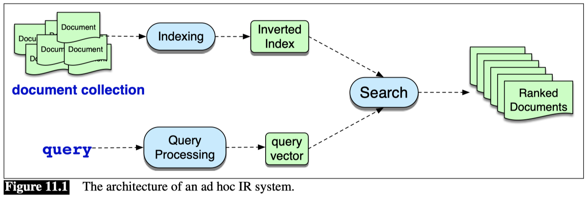

## Information Retrieval

**Information retrieval** or IR is the name of the field encompassing the retrieval of all manner of media based on user information needs.

The IR task we consider is called ad hoc retrieval, in which a user poses a query to a retrieval system, which then returns an ordered set of documents from some collection. A document refers to whatever unit of text the system indexes and retrieves (web pages, scientific papers, news articles, or even shorter passages like paragraphs). A collection refers to a set of documents being used to satisfy user requests. A term refers to a word in a collection, but it may also include phrases. Finally, a query represents a user’s information need expressed as a set of terms.

### TF-IDF

$$ \text{tf-idf}(t, d) = \text{tf}(t, d) \times \text{idf}(t, d) $$

**Term Frequency (TF)**

$$ \text{tf}(t, d) = \frac{\text{count}(t, d)}{\text{total terms in d}} $$

**Inverse Document Frequency (IDF)**

$$ \text{idf}(t, d) = \log_{10} \frac{\text{total documents}}{\text{documents with term t}} $$

#### TF-IDF two problems
- **Linear growth of term frequency**: TF increases linearly; if a term appears 10 times, its weight is 10 times that of a single occurrence. However, actual relevance does not increase linearly—if "apple" appears 10 times, it is not necessarily twice as relevant as if it appeared 5 times.
- **Document length bias**: Long documents naturally have higher term frequencies, making them more likely to score higher. A 1000-word document vs. a 100-word document, the longer document tends to score higher.

### BM25

BM25 adds two parameters: 
- **k**, a knob that adjust the balance between term frequency and IDF, and 
- **b**, which controls the importance of document length normalization. 

The BM25 score of a document d given a query q is:

$$ \text{bm25}(d, q) = \sum_{t \in q} \text{idf}(t, d) \times \frac{\text{tf}(t, d) }{{\text{tf}(t, d) + k \times (1 - b + b \times \frac{\text{length of d}}{\text{average length of documents}})}} $$