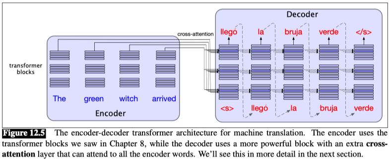
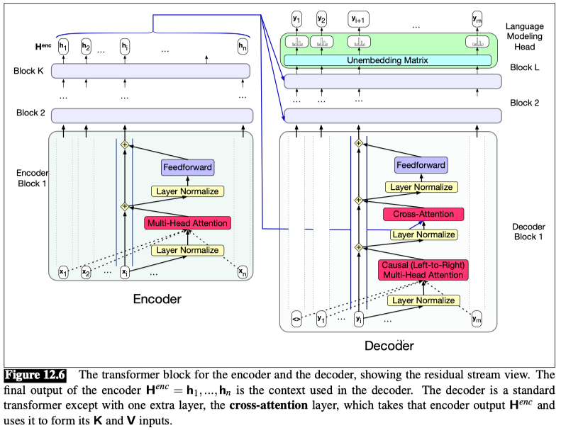

## Machine Translation (MT)

The standard architecture for MT is the encoder-decoder transformer or sequence-to-sequence model.

The systems are then trained to maximize the probability of the sequence of tokens in the target language $y_1 ,...,y_m$ given the sequence of tokens in the source language $x_1 ,...,x_n$:

$$ p(y_1 ,...,y_m | x_1 ,...,x_n) $$

Rather than use the input tokens directly, the encoder-decoder architecture consists of two components, an encoder and a decoder. The encoder takes the input words $x = [x_1 ,...,x_n]$ and produces an intermediate context $h$. At decoding time, the system takes $h$ and, word by word, generates the output $y$:

$$ h = encoder(x) $$

$$ y_{t+1} = decoder(h, y_1 ,...,y_t), t  \in [1 ,...,m] $$

The encoder-decoder architecture is made up of two transformers: 
- an encoder
- a decoder, which is augmented with a special new layer called the cross-attention layer.

That is, where in standard multi-head attention the input to each attention layer is X, in cross attention the input is the the final output of the encoder $H^{enc} = [h_1 ,...,h_n]$. $H^{enc}$ is of shape $[n × d]$, each row representing one input token. To link the keys and values from the encoder with the query from the prior layer of the decoder, we multiply the encoder output $H^{enc}$ by the cross-attention layer’s key weights $W^K$ and value weights $W^V$. The query comes from the output from the prior decoder layer $H^{dec[l-1]}$, which is multiplied by the cross-attention layer’s query weights $W^Q$:

$$ Q = H^{dec[l-1]} W^Q $$

$$ K = H^{enc} W^K $$

$$ V = H^{enc} W^V $$

$$ CrossAttention(Q,K,V) = softmax\left(\frac{QK^T}{\sqrt{d_k}}\right)V $$

### Decoding in MT: Beam Search

Beam Search = 在每个生成步骤，不是只选一个最好的词，而是保留多个可能的候选序列，最终选出整体最优的。

A problem with greedy decoding is that what looks high probability at word t might turn out to have been the wrong choice once we get to word t +1.

The **beam search** algorithm maintains multiple choices until later when we can see which one is best.

$$score(y) = log(P(y | x)) = \sum_{i=1}^t log(P(y_i | y_{<i}, x)) $$

### Minimum Bayes Risk Decoding

Minimum Bayes Risk Decoding = 不是选"最可能"的翻译，而是选"与其他好翻译最相似"的翻译

**Problem: high probability ≠ high quality**

MBR does not directly select the highest probability translation, but instead chooses the translation that minimizes the expected risk.

$$y^* = \arg\min_{y \in H} \sum_{x \in H} P(x | f) \cdot \ell(y,x) $$

where $H$ is the set of all possible translations, $f$ is the source sentence, and $\ell(y,x)$ is the loss function, $P(x | f)$ is the probability of the translation $x$ given the source sentence $f$.

