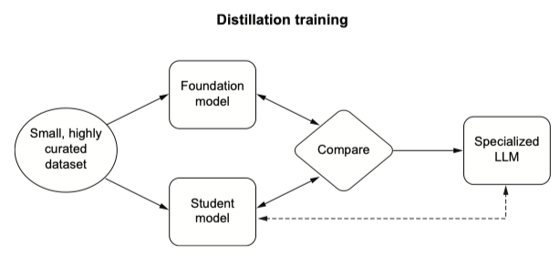

## Knowledge Distillation

Knowledge distillation is an advanced technique that provides a more efficient path to finetuning an LLM. Rather than just finetuning an LLM directly, knowledge distillation involves transferring the knowledge from a large, complex model (the teacher) to a smaller, simpler model (the student). The aim is to create a more compact model that retains the performance characteristics of the larger model but is more efficient in terms of resource usage.

#### How does it work?

The process of knowledge distillation involves the following steps:

Knowledge distillation allows a smaller model to learn from a foundation model to replicate similar behavior with fewer parameters. The student model does not always learn the emergent qualities of the foundation model, so the dataset must be especially curated. The dotted line indicates a special relationship as the student model becomes the specialized LLM.

**How to implement knowledge distillation**
- The first step in knowledge distillation is to select a pre-trained LLM as the teacher model. You also need to create or select a smaller model as the student. The student model might have a similar architecture to the teacher’s, but with fewer layers or reduced dimensionality to make it smaller and faster.
- Next, the student model is trained on the same task as the teacher model. This training is typically done by adding a term to the loss function that encourages the student model’s predictions to be similar to the teacher model’s predictions. Thus, the student model not only learns from the task-specific labels but also benefits from the rich representations learned by the teacher model.
- Once the distillation process is complete, you’ll have a compact student model that can handle the specific tasks learned from the teacher model but at a fraction of the size and computational cost.

