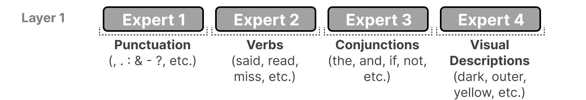
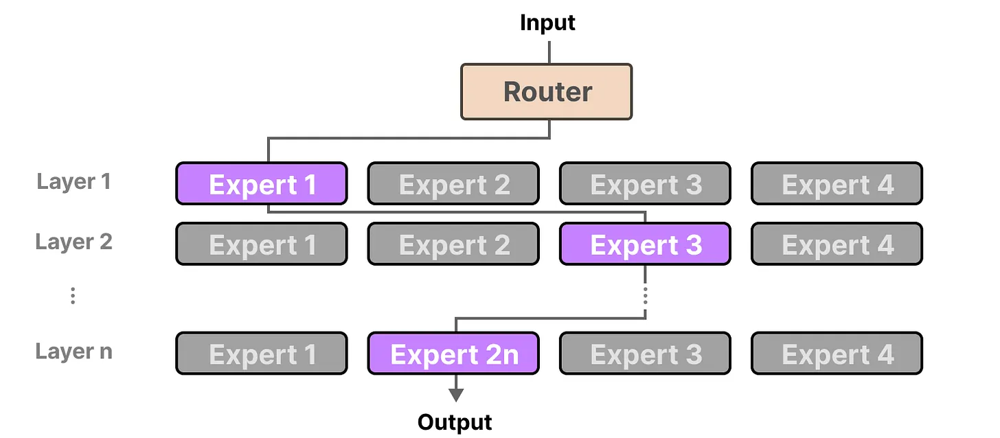

## Mixture of experts (MoE)

A mixture of experts (MoE) is functionally the same as any other model for training but contains a trick under the hood: sparsity. This gives the advantage of being able to train a bunch of models on a diverse set of data and tasks at once.

#### What is MoE?
Learn from [A Visual Guide to Mixture of Experts](https://newsletter.maartengrootendorst.com/p/a-visual-guide-to-mixture-of-experts)

Mixture of Experts (MoE) is a technique that uses many different sub-models (or “experts”) to improve the quality of LLMs.
- Experts: Each FFNN layer now has a set of “experts” of which a subset can be chosen. These “experts” are typically FFNNs themselves.
- Router or gate network: Determines which tokens are sent to which experts.

The "experts" it learns syntactic information on a word level instead, more specifically, their expertise is in handling specific tokens in specific contexts.

The router (gate network) selects the expert(s) best suited for a given input: Each expert is not an entire LLM but a submodel part of an LLM’s architecture.

