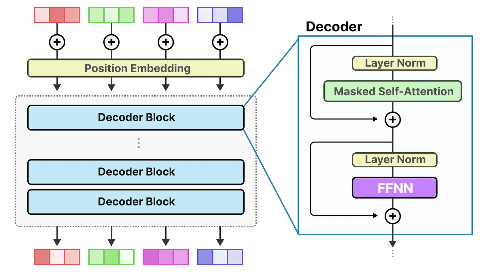
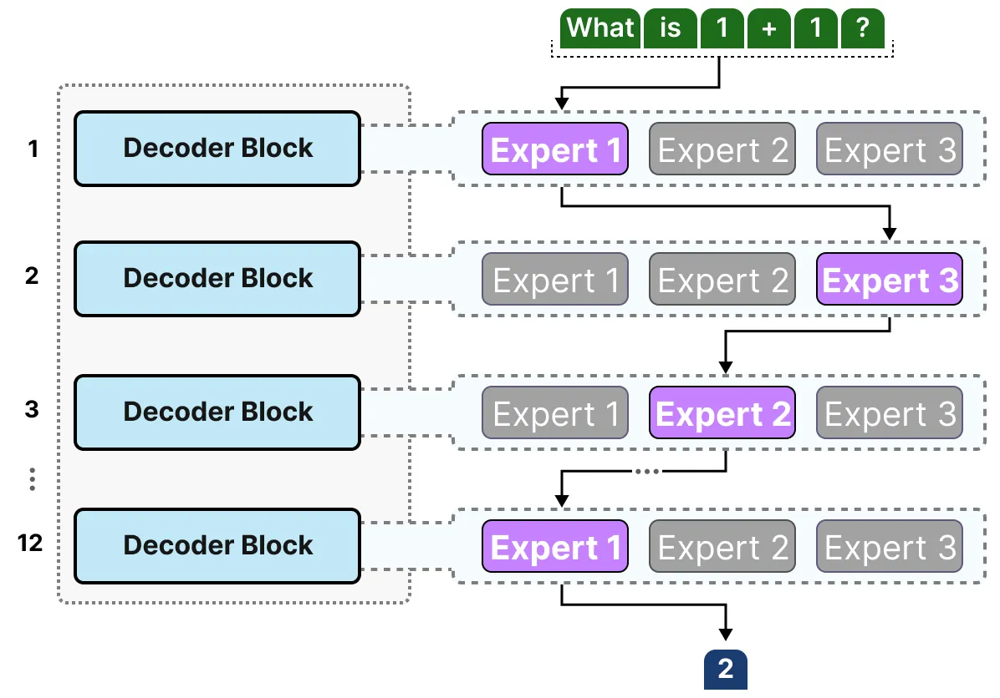
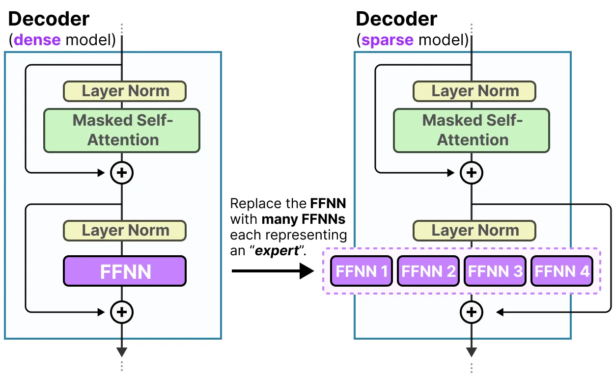
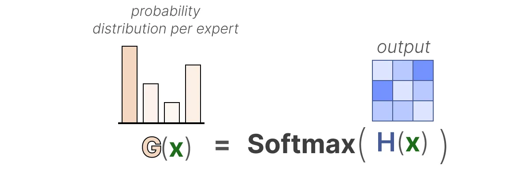

## Mixture of experts (MoE)

A mixture of experts (MoE) is functionally the same as any other model for training but contains a trick under the hood: sparsity. This gives the advantage of being able to train a bunch of models on a diverse set of data and tasks at once.

#### What is MoE?
Learn from [A Visual Guide to Mixture of Experts](https://newsletter.maartengrootendorst.com/p/a-visual-guide-to-mixture-of-experts)

Mixture of Experts (MoE) is a technique that uses many different sub-models (or “experts”) to improve the quality of LLMs.
- Experts: Each FFNN layer now has a set of “experts” of which a subset can be chosen. These “experts” are typically FFNNs themselves.
- Router or gate network: Determines which tokens are sent to which experts.

The "experts" it learns syntactic information on a word level instead, more specifically, their expertise is in handling specific tokens in specific contexts.

The router (gate network) selects the expert(s) best suited for a given input: Each expert is not an entire LLM but a submodel part of an LLM’s architecture.

#### The experts
To explore what experts represent and how they work, let us first examine what MoE is supposed to replace; the dense layers.

**Dense layers**
Mixture of Experts (MoE) all start from a relatively basic functionality of LLMs, namely the `Feedforward Neural Network (FFNN)`.

Remember that a standard decoder-only Transformer architecture has the FFNN applied after layer normalization:

An FFNN allows the model to use the contextual information created by the attention mechanism, transforming it further to capture more complex relationships in the data.

The FFNN, however, does grow quickly in size. To learn these complex relationships, it typically expands on the input it receives:

This expansion is done by the FFNN, which is a matrix multiplication of the input with a weight matrix:

**Sparse Layers**
The FFNN in a traditional Transformer is called a dense model since all parameters (its weights and biases) are activated.

In contrast, sparse models only activate a portion of their total parameters and are closely related to Mixture of Experts.

The underlying idea is that each expert learns different information during training. Then, when running inference, only specific experts are used as they are most relevant for a given task.

When asked a question, we can select the expert best suited for a given task:

**What does an Expert Learn?**

Experts in decoder models, however, do not seem to have the same type of specialization. That does not mean though that all experts are equal.

**The Architecture of Experts**

Since most LLMs have several decoder blocks, a given text will pass through multiple experts before the text is generated:

The chosen experts likely differ between tokens which results in different “paths” being taken:

If we update our visualization of the decoder block, it would now contain more FFNNs (one for each expert) instead:

The decoder block now has multiple FFNNs (each an “expert”) that it can use during inference.

#### The Routing Mechanism
Now that we have a set of experts, how does the model know which experts to use? Just before the experts, a router (also called a gate network) is added which is trained to choose which expert to choose for a given token.

**The Router**
The router (or gate network) is also an FFNN and is used to choose the expert based on a particular input. It outputs probabilities which it uses to select the best matching expert:

The expert layer returns the output of the selected expert multiplied by the gate value (selection probabilities).

The router together with the experts (of which only a few are selected) makes up the MoE Layer:

A given MoE layer comes in two sizes, either a sparse or a dense mixture of experts.

Both use a router to select experts but a Sparse MoE only selects a few whereas a Dense MoE selects them all but potentially in different distributions.

For instance, given a set of tokens, a MoE will distribute the tokens across all experts whereas a Sparse MoE will only select a few experts.

In the current state of LLMs, when you see a “MoE” it will typically be a Sparse MoE as it allows you to use a subset of experts. This is computationally cheaper which is an important trait for LLMs.

**Selection of Experts**
The gating network is arguably the most important component of any MoE as it not only decides which experts to choose during inference but also training.

In its most basic form, we multiply the `input (x)` by the `router weight matrix (W)`:

Then, we apply a `SoftMax` on the output to create a probability distribution `G(x)` per expert:

The router uses this probability distribution to choose the best matching expert for a given input.

Finally, we multiply the output of each router with each selected expert and sum the results.

Let’s put everything together and explore how the input flows through the router and experts:

#### Load Balancing

To balance the importance of experts, we will need to look at the router as it is the main component to decide which experts to choose at a given time.

**KeepTopK**
One method of load balancing the router is through a straightforward extension called KeepTopK2. By introducing trainable (gaussian) noise, we can prevent the same experts from always being picked:

