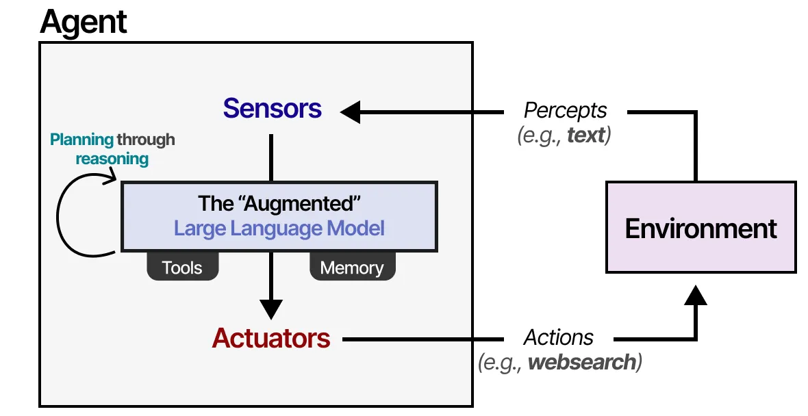
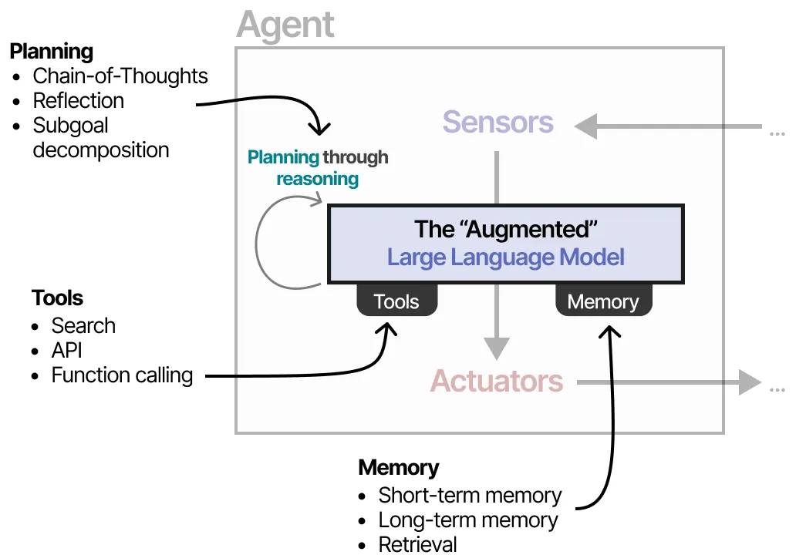
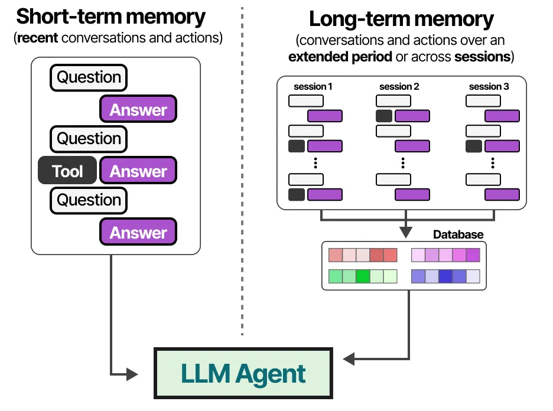
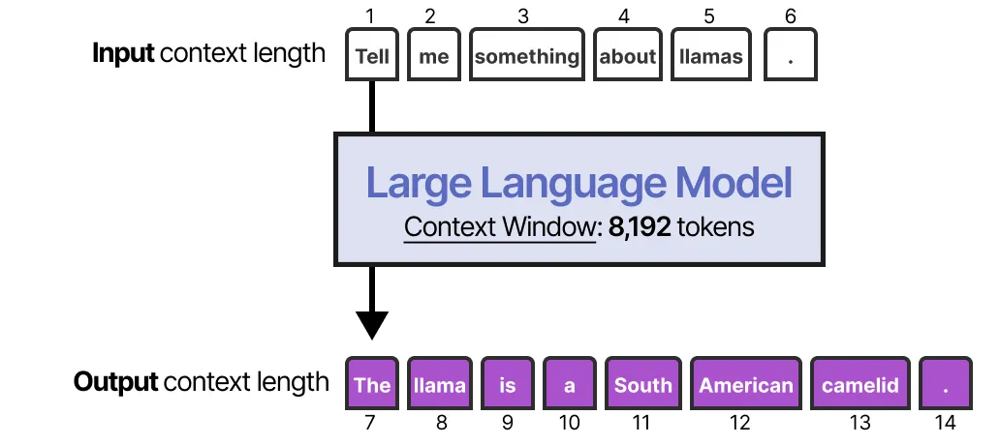
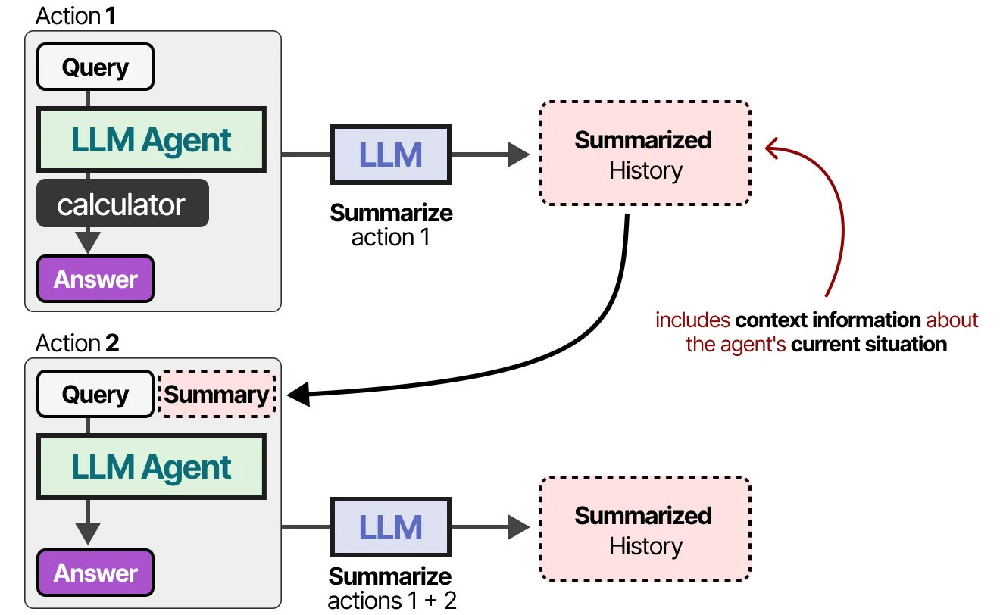
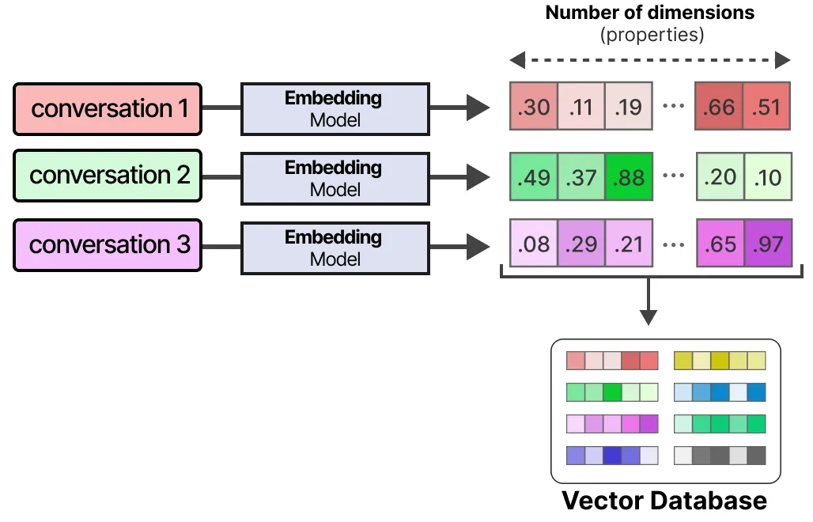
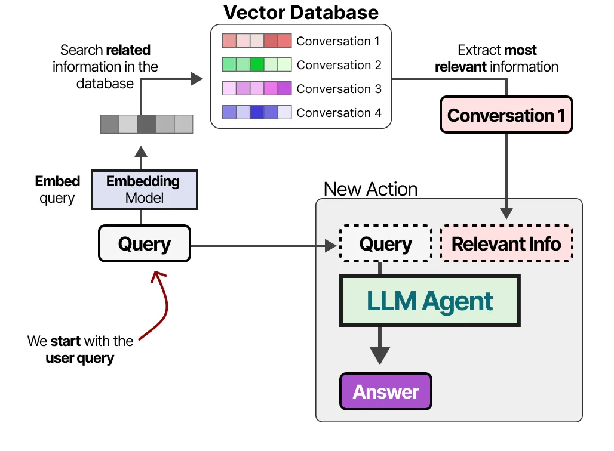

## LLM Agents

This planning behavior allows the Agent to understand the situation (LLM), plan next steps (planning), take actions (tools), and keep track of the taken actions (memory).

#### Memory
LLMs are forgetful systems, or more accurately, do not perform any memorization at all when interacting with them.

**Short-term memory**
The most straightforward method for enabling short-term memory is to use the model's context window, which is essentially the number of tokens an LLM can process.

The context window tends to be at least 8192 tokens and sometimes can scale up to hundreds of thousands of tokens!

A large context window can be used to track the full conversation history as part of the input prompt.

For models with a smaller context window, or when the conversation history is large, we can instead use another LLM to summarize the conversations that happened thus far.

By continuously summarizing conversations, we can keep the size of this conversation small. It will reduce the number of tokens while keeping track of only the most vital information.

**Long-term memory**
Long-term memory in LLM Agents includes the agent’s past action space that needs to be retained over an extended period.

A common technique to enable long-term memory is to store all previous interactions, actions, and conversations in an external vector database.

To build such a database, conversations are first embedded into numerical representations that capture their meaning.

After building the database, we can embed any given prompt and find the most relevant information in the vector database by comparing the prompt embedding with the database embeddings.

This method is often referred to as Retrieval-Augmented Generation (RAG).

Long-term memory can also involve retaining information from different sessions. For instance, you might want an LLM Agent to remember any research it has done in previous sessions. Different types of information can also be related to different types of memory to be stored.

