## LLM Agents

This planning behavior allows the Agent to understand the situation (LLM), plan next steps (planning), take actions (tools), and keep track of the taken actions (memory).

#### Memory
LLMs are forgetful systems, or more accurately, do not perform any memorization at all when interacting with them.

**Short-term memory**
The most straightforward method for enabling short-term memory is to use the model's context window, which is essentially the number of tokens an LLM can process.

The context window tends to be at least 8192 tokens and sometimes can scale up to hundreds of thousands of tokens!

A large context window can be used to track the full conversation history as part of the input prompt.

For models with a smaller context window, or when the conversation history is large, we can instead use another LLM to summarize the conversations that happened thus far.

By continuously summarizing conversations, we can keep the size of this conversation small. It will reduce the number of tokens while keeping track of only the most vital information.

**Long-term memory**
Long-term memory in LLM Agents includes the agent’s past action space that needs to be retained over an extended period.

A common technique to enable long-term memory is to store all previous interactions, actions, and conversations in an external vector database.

To build such a database, conversations are first embedded into numerical representations that capture their meaning.

After building the database, we can embed any given prompt and find the most relevant information in the vector database by comparing the prompt embedding with the database embeddings.

This method is often referred to as Retrieval-Augmented Generation (RAG).

Long-term memory can also involve retaining information from different sessions. For instance, you might want an LLM Agent to remember any research it has done in previous sessions. Different types of information can also be related to different types of memory to be stored.

#### Tools
Tools allow a given LLM to either interact with an external environment (such as databases) or use external applications (such as custom code to run).

Tools generally have two use cases: fetching data to retrieve up-to-date information and taking action like setting a meeting or ordering food.

To actually use a tool, the LLM has to generate text that fits with the API of the given tool. We tend to expect strings that can be formatted to JSON so that it can easily be fed to a code interpreter.

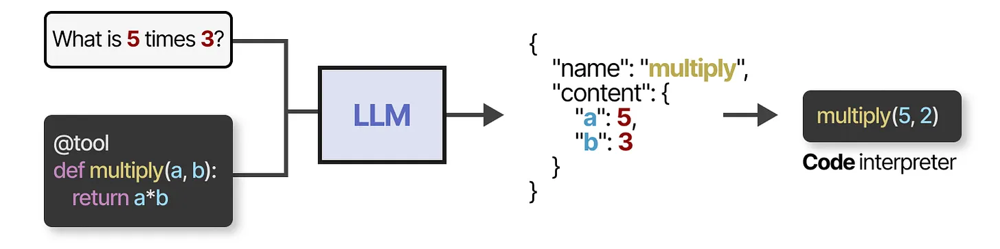

#### Model Context Protocol (MCP)
Tools are an important component of Agentic frameworks, allowing LLMs to interact with the world and extend their capabilities. However, enabling tool use when you have many different API becomes troublesome as any tool needs to be:
- Manually tracked and fed to the LLM
- Manually described (including its expected JSON schema)
- Manually updated whenever its API changes

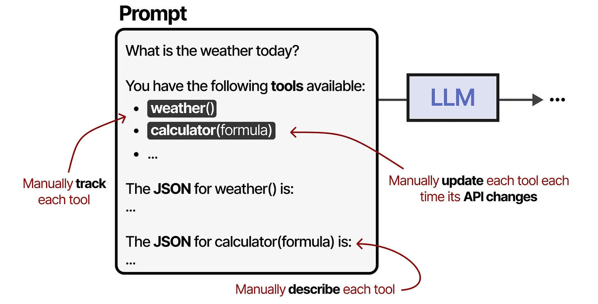

To make tools easier to implement for any given Agentic framework, Anthropic developed the Model Context Protocol (MCP). MCP standardizes API access for services like weather apps and GitHub.

It consists of three components:
- MCP Host — LLM application (such as Cursor) that manages connections
- MCP Client — Maintains 1:1 connections with MCP servers
- MCP Server — Provides context, tools, and capabilities to the LLMs

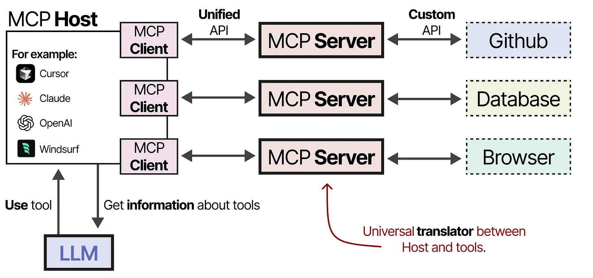

For example, let’s assume you want a given LLM application to summarize the 5 latest commits from your repository.

The MCP Host (together with the client) would first call the MCP Server to ask which tools are available.

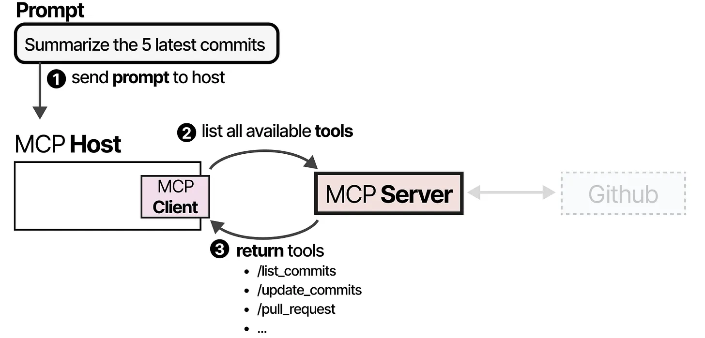

The LLM receives the information and may choose to use a tool. It sends a request to the MCP Server via the Host, then receives the results, including the tool used.

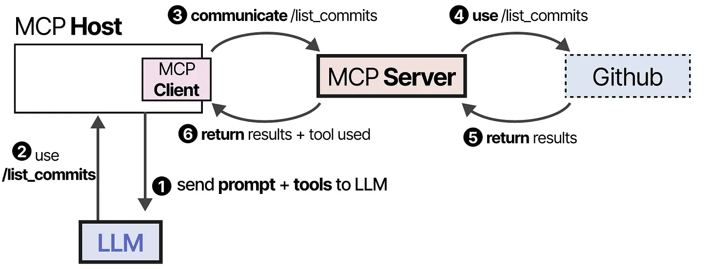

Finally, the LLM receives the results and can parse an answer to the user.

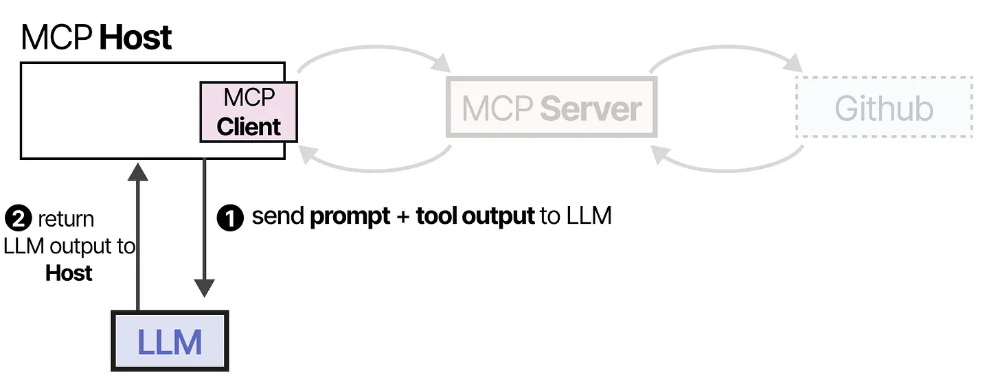

This framework makes creating tools easier by connecting to MCP Servers that any LLM application can use. 

#### Planning

**Reasoning**
Planning actionable steps requires complex reasoning behavior. As such, the LLM must be able to showcase this behavior before taking the next step in planning out the task.

This reasoning behavior can be enabled by roughly two choices: fine-tuning the LLM or specific prompt engineering.

**Reasoning and Acting**
Enabling reasoning behavior in LLMs is great but does not necessarily make it capable of planning actionable steps.
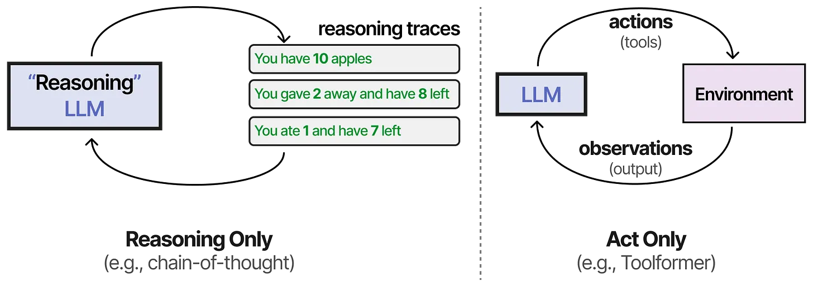

One of the first techniques to combine both processes is called ReAct (Reason and Act).

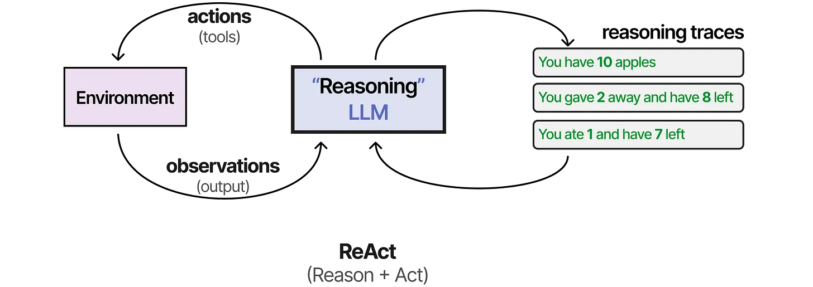

ReAct does so through careful prompt engineering. The ReAct prompt describes three steps:

- Thought - A reasoning step about the current situation
- Action - A set of actions to execute (e.g., tools)
- Observation - A reasoning step about the result of the action

The prompt itself is then quite straightforward.

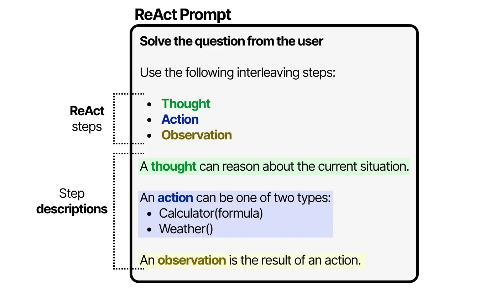

The LLM uses this prompt (which can be used as a system prompt) to steer its behaviors to work in cycles of thoughts, actions, and observations.

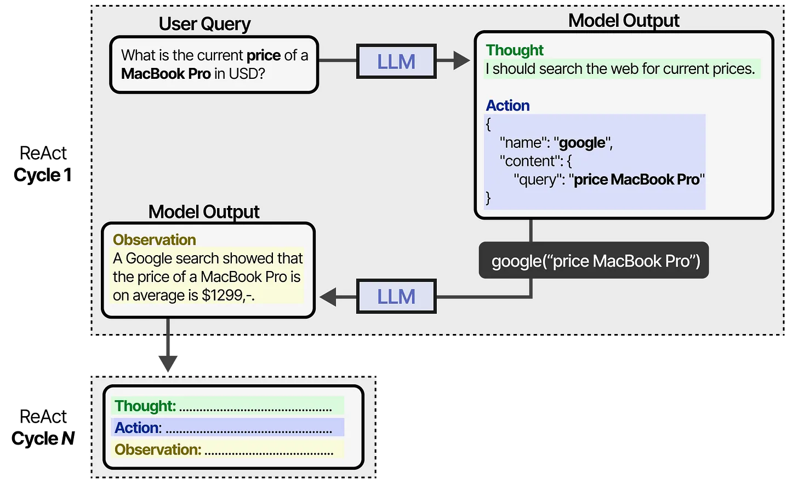

It continues this behavior until an action specifies to return the result. By iterating over thoughts and observations, the LLM can plan out actions, observe its output, and adjust accordingly.

**Reflecting**
Reflecting is a technique that allows the LLM to look back at its own actions and adjust its behavior.

The method assumes three LLM roles:
- Actor — Chooses and executes actions based on state observations. We can use methods like Chain-of-Thought or ReAct.
- Evaluator — Scores the outputs produced by the Actor.
- Self-reflection — Reflects on the action taken by the Actor and scores generated by the Evaluator.

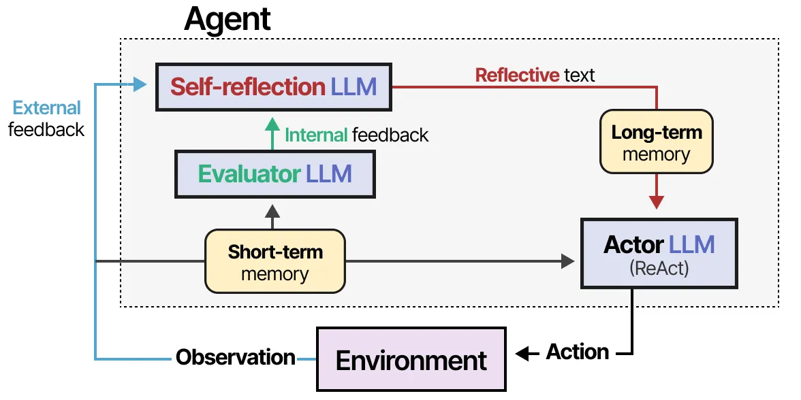

Memory modules are added to track actions (short-term) and self-reflections (long-term), helping the Agent learn from its mistakes and identify improved actions.

