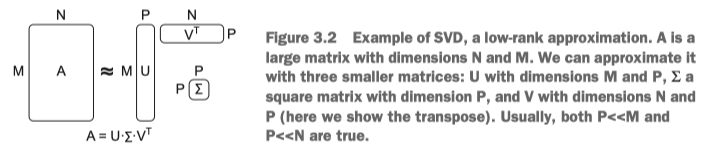
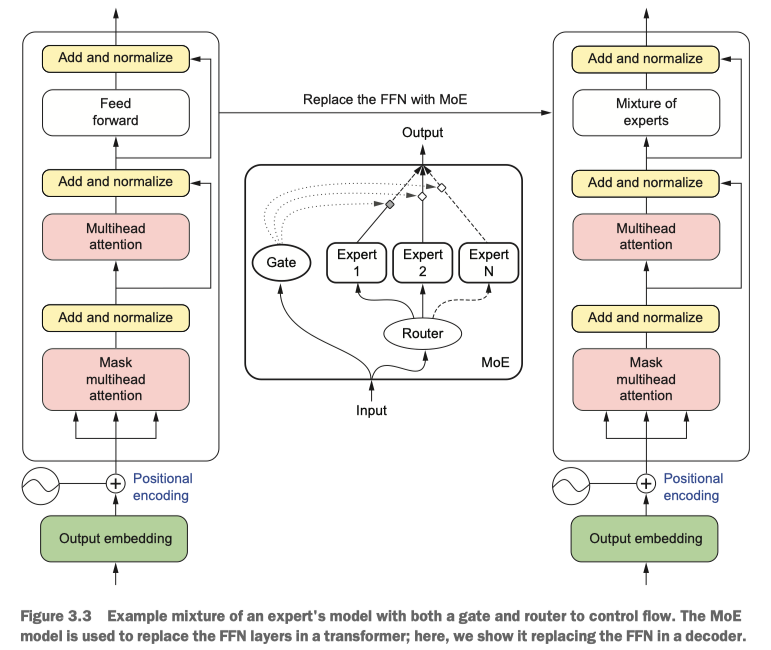

### Compression

#### 1. Post-training Quantization

Quantizing is a very powerful tool. It reduces the size of the model and the computational overhead required to run the model, thus reducing the latency and cost of running the model.

However, the best thing about quantization is that it can be done after the fact, so you don’t have to worry about whether your data scientists remembered to quantize the model during training using processes like QAT.

#### 2. Pruning
There are essentially two different pruning methods: structured and unstructured. Structured pruning is the process of finding structural components of a model that aren’t contributing to the model’s performance and then removing them—whether they are filters, channels, or layers in the neural network. The advantage of this method is that your model will be a little smaller but keep the same basic structure, which means we don’t have to worry about losing hardware efficiencies. We are also guaranteed a latency improvement, as there will be fewer computations involved.

Unstructured pruning, on the other hand, shifts through the parameters and zeros out the less important ones that don’t contribute much to the model’s performance. Unlike structured pruning, we don’t actually remove any parameters; we just set them to zero.

Like quantization, pruning can be done after a model is trained. However, unlike quantization, it’s common practice to see additional finetuning needed to prevent too great a loss of performance. It’s becoming more common to include pruning steps during the model training to avoid the need to finetune later on. Since a more sparse model will have fewer parameters to tune, adding these pruning steps may help a model converge faster as well.

#### 3. Knowledge Distillation

Knowledge distillation is probably the coolest method of compression in our minds.

It’s a simple idea too: we’ll take the large LLM and have it train a smaller language model to copy it.

#### 4. Low-rank approximation

Low-rank approximation, also known as low-rank factorization, low-rank decomposition, or matrix factorization, uses linear algebra math tricks to simplify large matrices or tensors to find a lower-dimensional representation.

There are several techniques to do this. Singular value decomposition (SVD), Tucker decomposition (TD), and canonical polyadic decomposition (CPD) are the most common ones you run into.

#### 5. Mixture of Experts

Mixture of experts (MoE) is a technique where we replace the feed-forward layers in a transformer with MoE layers instead. Feed-forward layers are notorious for being parameter-dense and computationally intensive, so replacing them with something better can often have a large effect.

The sparsity is often induced by a gate mechanism that learns which experts to use and/or a router mechanism that determines which experts should even be consulted.

