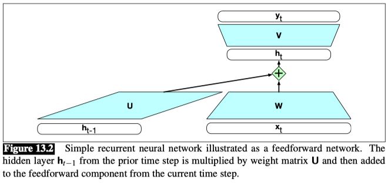
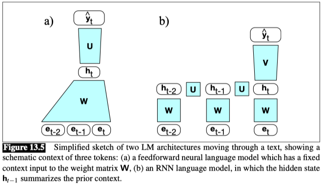
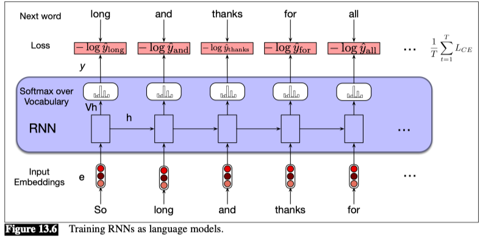

## Recurrent Neural Networks (RNNs)

A recurrent neural network (RNN) is any network that contains a cycle within its network connections, meaning that the value of some unit is directly, or indirectly, dependent on its own earlier outputs as an input.

To compute an output $y_t$ for an input $x_t$, we need the activation value for the hidden layer $h_t$.

To calculate this, we multiply the input $x_t$ with the weight matrix $W$, and the hidden layer from the previous time step $h_{t-1}$ with the weight matrix $U$. We add these values together and pass them through a suitable **activation function, $g$**, to arrive at the activation value for the current hidden layer, $h_t$. Once we have the values for the hidden layer, we proceed with the usual computation to generate the output vector.

$$ h_t = g(U h_{t-1} + W x_t) $$

$$ y_t = f(V h_t) $$

We compute y t via a softmax computation that gives a probability distribution over the possible output classes.

$$ y_t = softmax(V h_t) $$

#### Forward Inference in an RNN language model

The input sequence $X = [x_1;...;x_t;...;x_N]$ consists of a series of words each represented as a one-hot vector of size `| V | × 1`, and the output prediction, $\hat{y}$, is a vector representing a probability distribution over the vocabulary. At each step, the model uses the word embedding matrix $E$ to retrieve the embedding for the current word, multiples it by the weight matrix $W$, and then adds it to the hidden layer from the previous step (weighted by weight matrix $U$) to compute a new hidden layer. This hidden layer is then used to generate an output layer which is passed through a softmax layer to generate a probability distribution over the entire vocabulary. That is, at time $t$:

$$ e_t = E x_t $$

$$ h_t = g(U h_{t-1} + W e_t) $$

$$ \hat{y}_t = softmax(V h_t) $$

It’s convenient to make the assumption that the embedding dimension $d_e$ and the hidden dimension $d_h$ are the same. So we’ll just call both of these the **model dimension $d$**.

The probability that a particular word $k$ in the vocabulary is the next word is represented by $\hat{y}_t [k]$, the $k$th component of $\hat{y}_t$:

$$ P(w_{t+1} = k | w_{1:t}) = \hat{y}_t [k] $$

The probability of an entire sequence is just the product of the probabilities of each item in the sequence, where we’ll use $\hat{y}_i [w_i]$ to mean the probability of the true word $w_i$ at time step $i$.

$$ P(w_{1:n}) = \prod_{i=1}^n P(w_i | w_{1:i-1}) = \prod_{i=1}^n \hat{y}_i [w_i] $$

Recall that the cross-entropy loss measures the difference between a predicted probability distribution and the correct distribution.

$$ L_{CE} = - \sum_{w\in V} y_t[w] \log \hat{y}_t[w] $$

In the case of language modeling, the correct distribution $y_t$ comes from knowing the next word. This is represented as a one-hot vector corresponding to the vocabulary where the entry for the actual next word is 1, and all the other entries are 0.

Thus, the cross-entropy loss for language modeling is determined by the probability the model assigns to the correct next word. So at time $t$ the CE loss is the negative log probability the model assigns to the next word in the training sequence.

$$ L_{CE}(\hat{y}_t, y_t) = - \log \hat{y}_t[w_{t+1}] $$

Thus at each word position $t$ of the input, the model takes as input the correct word $w_t$ together with $h_{t-1}$, encoding information from the preceding $w_{1:t-1}$, and uses them to compute a probability distribution over possible next words so as to compute the model’s loss for the next token $w_{t+1}$.

Then we move to the next word, we ignore what the model predicted for the next word and instead use the correct word $w_{t+1}$ along with the prior history encoded in $h_{t-1}$ to estimate the probability of token $w_{t+2}$.
