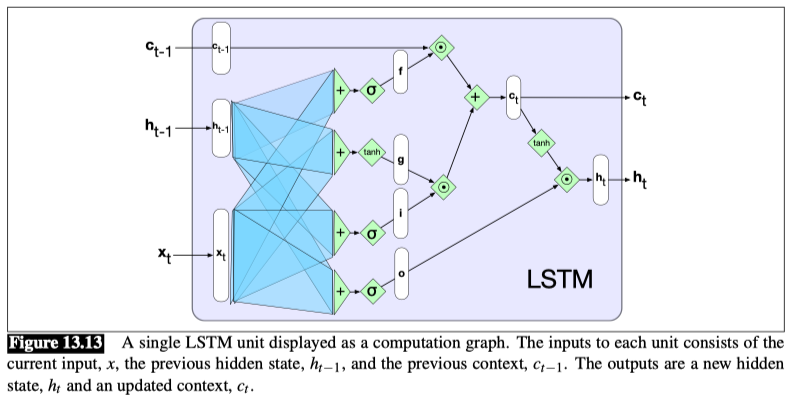
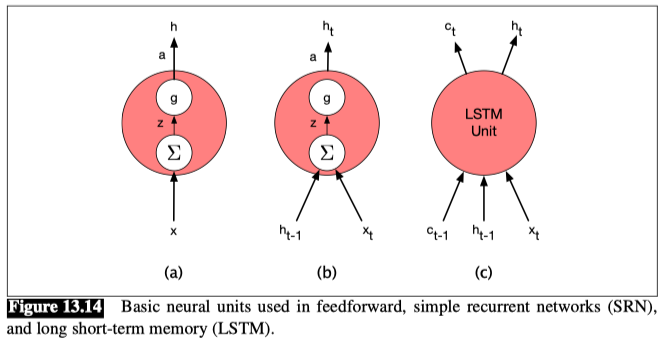

## Long Short-Term Memory (LSTM)

**Problems with RNNs:**
- RNNs struggle to remember important information because their hidden states must both process the current input and maintain relevant information for the future.
- Another challenge with training RNNs is the **vanishing gradients** problem, where gradients shrink during backpropagation through long sequences, making learning difficult.

The **gates** in an LSTM share a common design pattern; each consists of a feedforward layer, followed by a sigmoid activation function, followed by a pointwise multiplication with the layer being gated.

**输入（左侧）**
- $x_t$：当前时间步的输入（如词向量）
- $h_{t-1}$：上一时间步的隐藏状态（短期记忆）
- $c_{t-1}$：上一时间步的细胞状态（长期记忆）

**输出（右侧）**
- $h_t$：当前时间步的隐藏状态（输出）
- $c_t$：当前时间步的细胞状态（更新后的长期记忆）

**Forget gate**

- The purpose of this gate is to delete information from the context that is no longer needed. 

- The forget gate computes a weighted sum of the previous state’s hidden layer and the current input and passes that through a sigmoid.

- This mask is then multiplied element-wise by the context vector to remove the information from context that is no longer required.

$$ f_t = \sigma(U_f h_{t-1} + W_f x_t) $$

$$ k_t = c_{t-1} \odot f_t $$

The next task is to compute the actual information we need to extract from the previous hidden state and current inputs—the same basic computation we’ve been using for all our recurrent networks.

$$ g_t = \tanh(U_g h_{t-1} + W_g x_t) $$

**Add gate**

Next, we generate the mask for the add gate to select the information to add to the current context.

$$ i_t = \sigma(U_i h_{t-1} + W_i x_t) $$

$$ j_t = i_t \odot g_t $$

Next, we add this to the modified context vector to get our new context vector.

$$ c_t = j_t + k_t $$

**Output gate**

The final gate we’ll use is the output gate which is used to decide what information is required for the current hidden state (as opposed to what information needs to be preserved for future decisions).

$$ o_t = \sigma(U_o h_{t-1} + W_o x_t) $$

$$ h_t = o_t \odot \tanh(c_t) $$

The neural units used in LSTMs are obviously much more complex than those used in basic feedforward networks.

