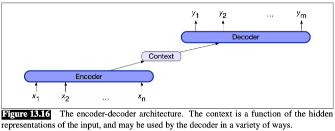
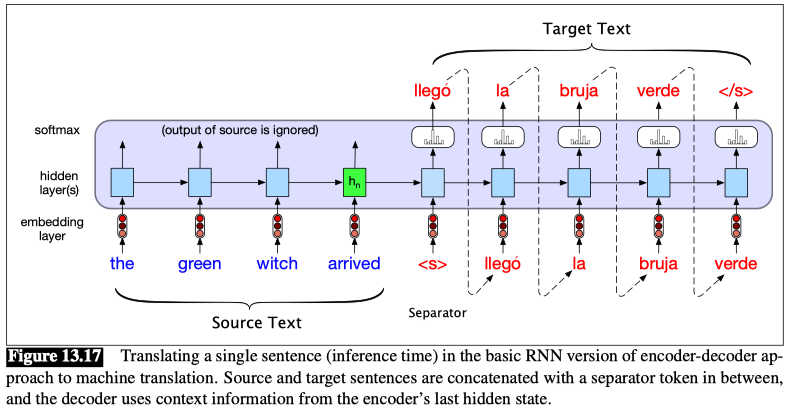
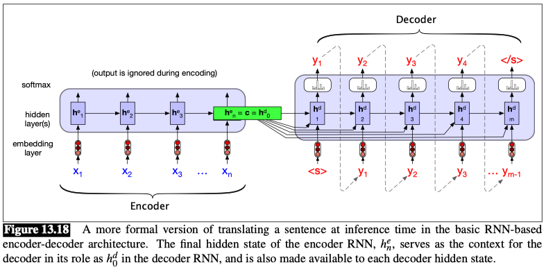
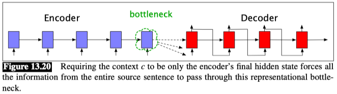
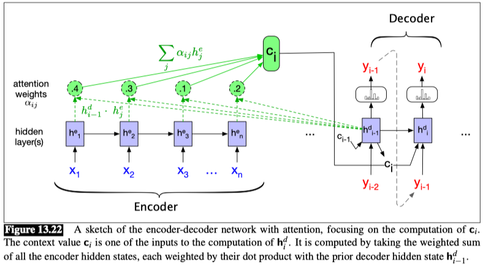

## The Encoder-Decoder Model with RNNs

**Encoder-decoder** networks, sometimes called sequence-to-sequence networks, are models capable of generating contextually appropriate, arbitrary length, output sequences given an input sequence.

The key idea underlying these networks is the use of an **encoder** network that takes an input sequence and creates a contextualized representation of it, often called the **context**. This representation is then passed to a **decoder** which generates a taskspecific output sequence.

Encoder-decoder networks consist of three conceptual components:
1. An **encoder** that accepts an input sequence, $x_{1:n}$, and generates a corresponding sequence of contextualized representations, $h_{1:n}$. LSTMs, convolutional networks, and transformers can all be employed as encoders.
2. A **context vector**, $c$, which is a function of $h_{1:n}$, and conveys the essence of the input to the decoder.
3. A **decoder**, which accepts $c$ as input and generates an arbitrary length sequence of hidden states $h_{1:m}$, from which a corresponding sequence of output states $y_{1:m}$ can be obtained.

**Sentence separation**

We only have to make one slight change to turn this language model with autoregressive generation into an encoder-decoder model that is a translation model that can translate from a source text in one language to a target text in a second: add a sentence separation marker at the end of the source text, and then simply concatenate the target text. ($<s>$ for sentence separation token)

we make the context vector c available to more than just the first decoder hidden state, to ensure that the influence of the context vector, c, doesn’t wane as the output sequence is generated. We do this by adding c as a parameter to the computation of the current hidden state. using the following equation:

$$ h_t^d = g(\hat{y}_{t-1}, h_{t-1}^d, c) $$

Recall that g is a stand-in for some flavor of RNN and $\hat{y}_{t-1}$ is the embedding for the output sampled from the softmax at the previous step:

$$ c = h_n^e $$

$$ h_0^d = c $$

$$ h_t^d = g(\hat{y}_{t-1}, h_{t-1}^d, c) $$

$$ \hat{y}_t = softmax(h_t^d) $$

Thus $\hat{y}_t$ is a vector of probabilities over the vocabulary, representing the probability of each word occurring at time $t$. To generate text, we sample from this distribution $\hat{y}_t$.

#### Attention
**Problem:**
In the model as we’ve described it so far, this context vector is $h_n$, the hidden state of the last ($n^{th}$) time step of the source text. This final hidden state is thus acting as a bottleneck: it must represent absolutely everything about the meaning of the source text, since the only thing the decoder knows about the source text is what’s in this context vector (Fig. 13.20). Information at the beginning of the sentence, especially for long sentences, may not be equally well represented in the context vector.

The **attention mechanism** is a solution to the bottleneck problem, a way of allowing the decoder to get information from all the hidden states of the encoder, not just the last hidden state.

In the attention mechanism, as in the vanilla encoder-decoder model, the context vector $c$ is a single vector that is a function of the hidden states of the encoder. But instead of being taken from the last hidden state, it’s a weighted average of **all** the hidden states of the decoder.

And this weighted average is also informed by part of the decoder state as well, the state of the decoder right before the current token $i$.

$$ c_i = f(h_1^e, \cdots, h_n^e, h_{i-1}^d) $$

This context vector, $c_i$, is generated anew with each decoding step $i$ and takes all of the encoder hidden states into account in its derivation. We then make this context available during decoding by conditioning the computation of the current decoder hidden state on it (along with the prior hidden state and the previous output generated by the decoder), as we see in the following equation:

$$ h_i^d = g(\hat{y}_{i-1}, h_{i-1}^d, c_i) $$

The first step in computing $c_i$ is to compute how much to focus on each encoder state, how relevant each encoder state is to the decoder state captured in $h_{i-1}^d$. We capture relevance by computing— at each state $i$ during decoding—a score $(h_{i-1}^d, h_j^e)$ for each encoder state $j$.

The simplest such score, called dot-product attention, implements relevance as similarity: measuring how similar the decoder hidden state is to an encoder hidden state, by computing the dot product between them:

$$ \text{score}(h_j^e, h_{i-1}^d) = h_j^e \cdot h_{i-1}^d $$

We then normalize these scores with a softmax to create a vector of weights, $\alpha_{ij}$, that tells us the proportional relevance of each encoder hidden state $j$ to the prior hidden decoder state, $h_{i-1}^d$.

$$ \alpha_{ij} = \text{softmax}(\text{score}(h_j^e, h_{i-1}^d)) = \frac{\exp(\text{score}(h_j^e, h_{i-1}^d))}{\sum_{k=1}^n \exp(\text{score}(h_k^e, h_{i-1}^d))} $$

$$ \text{score}(h_j^e, h_{i-1}^d) = h_j^e \cdot h_{i-1}^d $$

$$ c_i = \sum_{j=1}^n \alpha_{ij} h_j^e $$

