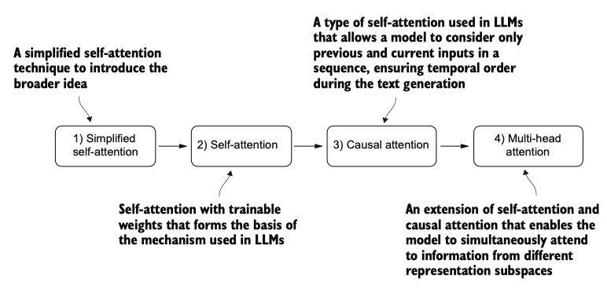
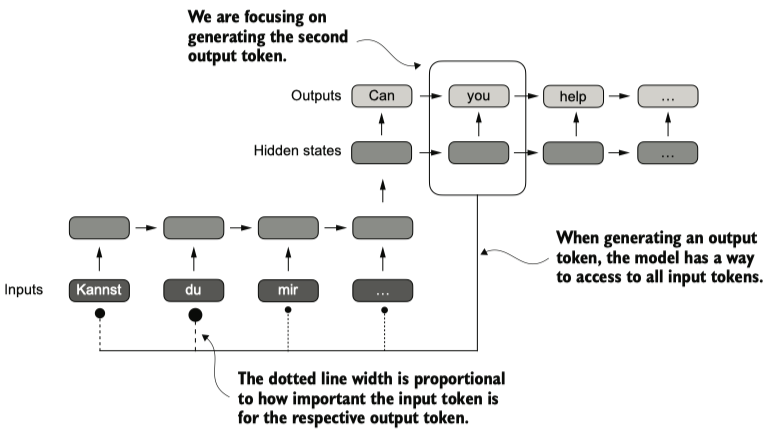
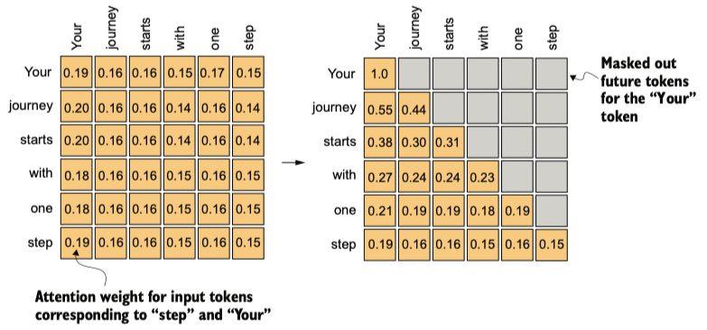
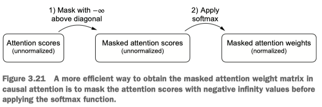
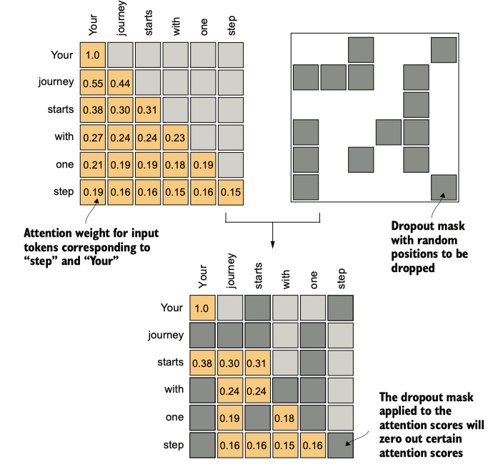
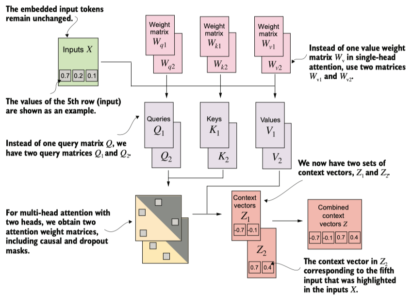
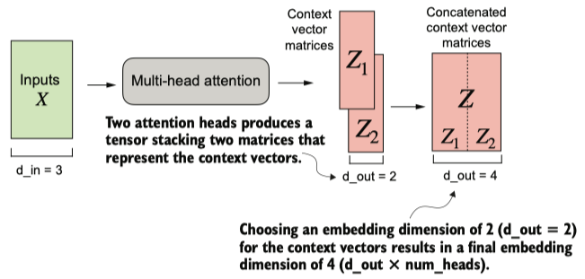

## Attention mechanism



The figure depicts different attention mechanisms, starting with a simplified version of self-attention before adding the trainable weights. The causal attention mechanism adds a mask to self-attention that allows the LLM to generate one word at a time. Finally, multi-head attention organizes the attention mechanism into multiple heads, allowing the model to capture various aspects of the input data in parallel.

**The problem with modeling long sequences**
we can’t simply translate a text word by word due to the grammatical structures in the source and target language.


To address this problem, it is common to use a deep neural network with two submodules, an encoder and a decoder. The job of the encoder is to first read in and process the entire text, and the decoder then produces the translated text.

Before the advent of transformers, recurrent neural networks (RNNs) were the most popular encoder–decoder architecture for language translation. An RNN is a type of neural network where outputs from previous steps are fed as inputs to the current step.

The encoder takes a sequence of tokens from the source language as input, where a hidden state (an intermediate neural network layer) of the encoder encodes a compressed representation of the entire input sequence. Then, the decoder uses its current hidden state to begin the translation, token by token.

### Capture data dependencies with attention mechanisms



Using an attention mechanism, the text-generating decoder part of the network can access all input tokens selectively. This means that some input tokens are more important than others for generating a given output token. The importance is determined by the attention weights, which we will compute later. 

**Self-attention** is a mechanism that allows each position in the input sequence to consider the relevancy of, or “attend to,” all other positions in the same sequence when computing the representation of a sequence. Self-attention is a key component of contemporary LLMs based on the transformer architecture, such as the GPT series.

In self-attention, the goal is to calculate context vectors `z(i)` for each element `x(i)`  in the input sequence. A context vector can be interpreted as an enriched embedding vector. Context vectors play a crucial role in self-attention. Their purpose is to create enriched representations of each element in an input sequence.

### Self-attention with trainable weights


In self-attention, we transform the input vectors in the input matrix $X$ with the three weight matrices, $W_q$ , $W_k$ , and $W_v$ . The new compute the attention weight matrix based on the resulting queries (Q) and keys (K). Using the attention weights and values (V), we then compute the context vectors (Z). 

```
class SelfAttention(nn.Module):
    def __init__(self, d_in, d_out, qkv_bias=False):
        super().__init__()
        self.W_query = nn.Linear(d_in, d_out, bias=qkv_bias)
        self.W_key   = nn.Linear(d_in, d_out, bias=qkv_bias)
        self.W_value = nn.Linear(d_in, d_out, bias=qkv_bias)

    def forward(self, x):
        keys = self.W_key(x)
        queries = self.W_query(x)
        values = self.W_value(x)
        
        attn_scores = queries @ keys.T
        attn_weights = torch.softmax(attn_scores / keys.shape[-1]**0.5, dim=-1)

        context_vec = attn_weights @ values
        return context_vec

torch.manual_seed(789)
sa = SelfAttention(d_in, d_out)
print(sa(inputs))
```

### Causal attention
Causal attention, also known as masked attention, is a specialized form of self-attention. It restricts a model to only consider previous and current inputs in a sequence when processing any given token when computing attention scores.
In contrast to the standard self-attention mechanism, which allows access to the entire input sequence at once.



In causal attention, we mask out the attention weights above the diagonal such that for a given input, the LLM can’t access future tokens when computing the context vectors using the attention weights. For example, for the word “journey” in the second row, we only keep the attention weights for the words before (“Your”) and in the current position (“journey”).

**Apply a causal mask to the attention**


- However, if the **mask were applied after softmax**, like above, it would disrupt the probability distribution created by softmax
- Softmax ensures that all output values sum to 1
- Masking after softmax would require re-normalizing the outputs to sum to 1 again, which complicates the process and might lead to unintended effects


Instead of zeroing out attention weights above the diagonal and renormalizing the results, we can mask the unnormalized attention scores above the diagonal with negative infinity before they enter the softmax function:



**Masking additional attention weights with dropout**
Dropout in deep learning is a technique where randomly selected hidden layer units are ignored during training, effectively “dropping” them out. This method helps prevent overfitting by ensuring that a model does not become overly reliant on any specific set of hidden layer units.

**Dropout** in the attention mechanism is typically applied at two specific times: **after calculating the attention weights** or **after applying the attention weights to the value vectors**.



- Furthermore, in this specific example, we use a dropout rate of 50%, which means randomly masking out half of the attention weights. 
- When we train the GPT model later, we will use a lower dropout rate, such as 0.1 or 0.2
- If we apply a dropout rate of 0.5 (50%), the non-dropped values will be scaled accordingly by a factor of 1/0.5 = 2
- The scaling is calculated by the formula 1 / (1 - dropout_rate)

**Implementing a compact causal attention class**

```
class CausalAttention(nn.Module):

    def __init__(self, d_in, d_out, context_length, dropout, qkv_bias=False):
        super().__init__()
        self.d_out = d_out
        self.W_query = nn.Linear(d_in, d_out, bias=qkv_bias)
        self.W_key   = nn.Linear(d_in, d_out, bias=qkv_bias)
        self.W_value = nn.Linear(d_in, d_out, bias=qkv_bias)

        self.dropout = nn.Dropout(dropout) # New, add a dropout layer

        # 注册一个持久的注意力掩码（mask）“生成一个上三角矩阵作为注意力掩码，并注册为模型的固定属性，确保自回归模型不会作弊看到未来信息”
        # New, The register_buffer call is also a new addition, more information is provided in the following text).
        self.register_buffer('mask', torch.triu(torch.ones(context_length, context_length), diagonal=1)) 

    def forward(self, x):
        b, num_tokens, d_in = x.shape # new batch dimension b; batch size（批大小）;token数量; embedding维度

        # For inputs where `num_tokens` exceeds `context_length`, this will result in errors
        # in the mask creation further below.
        # do not exceed `context_length` before reaching this forward method. 
        keys = self.W_key(x)
        queries = self.W_query(x)
        values = self.W_value(x)

        attn_scores = queries @ keys.transpose(1, 2)

        attn_scores.masked_fill(
            self.mask.bool()[:num_tokens, :num_tokens],
            -torch.inf
        )

        attn_weights = torch.softmax(attn_scores / keys.shape[-1]**0.5, dim=-1)
        attn_weights = self.dropout(attn_weights) # New

        context_vec = attn_weights @ values
        return context_vec
```

### Multi-head attention
The term “multi-head” refers to dividing the attention mechanism into multiple “heads,” each operating independently. In this context, a single causal attention module can be considered single-head attention, where there is only one set of attention weights processing the input sequentially.

**Stacking multiple single-head attention layers**
Implementing multi-head attention involves creating multiple instances of the self-attention mechanism, each with its own set of trainable weights.



For example in the figure above. The multi-head attention module includes two single-head attention modules stacked on top of each other. So, instead of using a single matrix $W_v$ for computing the value matrices, in a multi-head attention module with two heads, we now have two value weight matrices: $W_{v1}$ and $W_{v2}$. The same applies to the other weight matrices, $W_Q$ and $W_k$. We obtain two sets of context vectors $Z_1$ and $Z_2$ that we can combine into a single context vector matrix $Z$.

**Implementing a multi-head attention class**
We simply stack multiple single-head attention modules to obtain a multi-head attention module:

```
class MultiHeadAttentionWrapper(nn.Module):

    def __init__(self, d_in, d_out, context_length, dropout, num_heads, qkv_bias=False):
        super().__init__()
        self.heads = nn.ModuleList(
            [CausalAttention(d_in, d_out, context_length, dropout, qkv_bias) 
             for _ in range(num_heads)]
        )

    def forward(self, x):
        return torch.cat([head(x) for head in self.heads], dim=-1)

```



Using the MultiHeadAttentionWrapper, we specified the number of attention heads (num_heads). If we set num_heads=2, as in this example, we obtain a tensor with two sets of context vector matrices. In each context vector matrix, the rows represent the context vectors corresponding to the tokens, and the columns correspond to the embedding dimension specified via d_out=4. We concatenate these context vector matrices along the column dimension. Since we have two attention heads and an embedding dimension of 2, the final embedding dimension is 2 × 2 = 4.

**Implementing multi-head attention with weight splits**

```
class MultiHeadAttention(nn.Module):
    def __init__(self, d_in, d_out, context_length, dropout, num_heads, qkv_bias=False):
        super().__init__()
        assert (d_out % num_heads == 0), "d_out must be divisible by num_heads"

        self.d_out = d_out
        self.num_heads = num_heads
        self.head_dim = d_out // num_heads # Reduce the projection dim to match desired output dim

        self.W_query = nn.Linear(d_in, d_out, bias=qkv_bias)
        self.W_key = nn.Linear(d_in, d_out, bias=qkv_bias)
        self.W_value = nn.Linear(d_in, d_out, bias=qkv_bias)
        self.out_proj = nn.Linear(d_out, d_out)  # Linear layer to combine head outputs
        self.dropout = nn.Dropout(dropout)
        self.register_buffer(
            "mask",
            torch.triu(torch.ones(context_length, context_length),
                       diagonal=1)
        )

    def forward(self, x):
        b, num_tokens, d_in = x.shape

        keys = self.W_key(x) # Shape: (b, num_tokens, d_out)
        queries = self.W_query(x)
        values = self.W_value(x)

        # We implicitly split the matrix by adding a `num_heads` dimension
        # Unroll last dim: (b, num_tokens, d_out) -> (b, num_tokens, num_heads, head_dim)
        keys = keys.view(b, num_tokens, self.num_heads, self.head_dim) 
        values = values.view(b, num_tokens, self.num_heads, self.head_dim)
        queries = queries.view(b, num_tokens, self.num_heads, self.head_dim)

        # Transpose: (b, num_tokens, num_heads, head_dim) -> (b, num_heads, num_tokens, head_dim)
        keys = keys.transpose(1, 2)
        queries = queries.transpose(1, 2)
        values = values.transpose(1, 2)

        # Compute scaled dot-product attention (aka self-attention) with a causal mask
        attn_scores = queries @ keys.transpose(2, 3)  # Dot product for each head

        # Original mask truncated to the number of tokens and converted to boolean
        mask_bool = self.mask.bool()[:num_tokens, :num_tokens]

        # Use the mask to fill attention scores
        attn_scores.masked_fill_(mask_bool, -torch.inf)
        
        attn_weights = torch.softmax(attn_scores / keys.shape[-1]**0.5, dim=-1)
        attn_weights = self.dropout(attn_weights)

        # Shape: (b, num_tokens, num_heads, head_dim)
        context_vec = (attn_weights @ values).transpose(1, 2) 
        
        # Combine heads, where self.d_out = self.num_heads * self.head_dim
        context_vec = context_vec.contiguous().view(b, num_tokens, self.d_out)
        context_vec = self.out_proj(context_vec) # optional projection

        return context_vec
```

