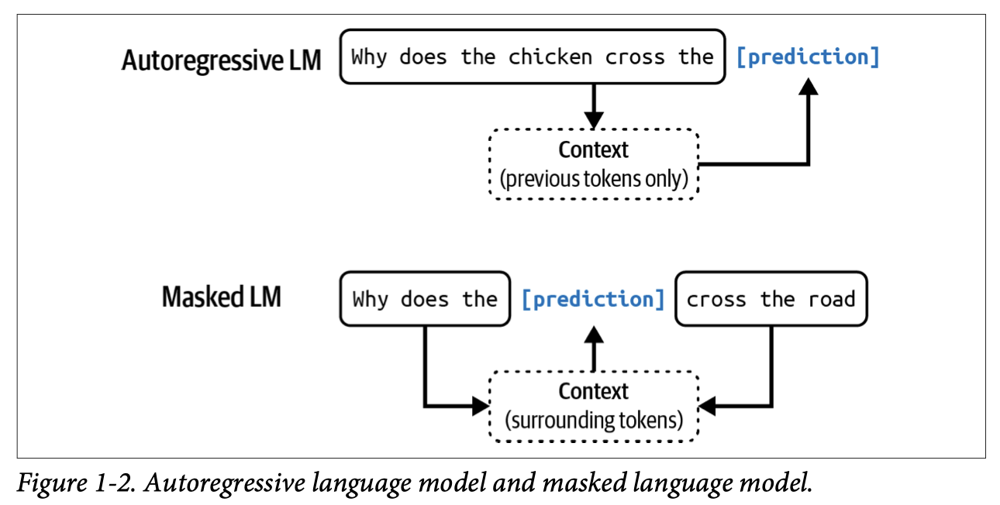
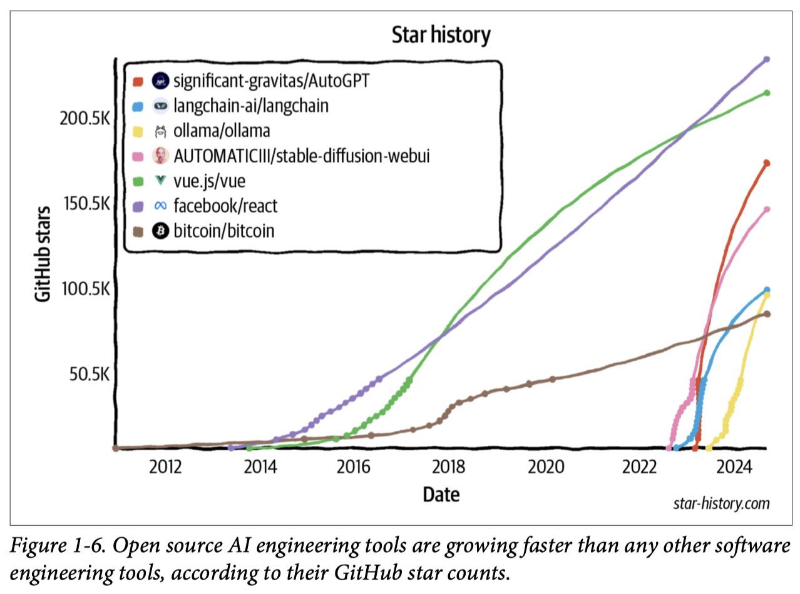
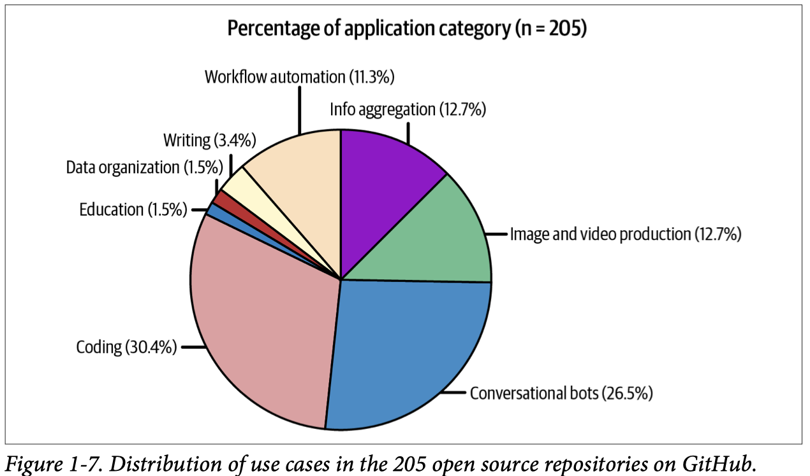
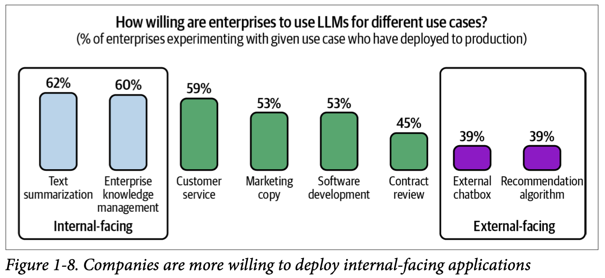

## From Generative Models to Large Language Models

- Generated Pre-trained Transformer 2 (GPT-2)
- Text-to-Text Transfer Transformer (T5) 

The following are popular text-to-text models that keep the encoder and decoder part of the transformer:

- `T5`: Exploring the limits of transfer learning with a unified text-to-text transformer
- `BART`: Bidirectional and Auto-Regressive Transformer
- `PEGASUS`: Pre-training with Extracted Gap-sentences for Abstractive Summarization Sequence-to-Sequence models

### Multi-task training with T5
How to apply multi-task training in a T5 architecture with the SimpleT5 library. 

## 1. From Language Models to Large Language Models

There are two main types of language models: masked language models and autoregressive language models. They differ based on what information they can use to predict a token:

- Masked language models: 
  - A masked language model is trained to predict missing tokens anywhere in a sequence, using the context from both before and after the missing tokens.

- Autoregressive language models:
  - An autoregressive language model is trained to predict the next token in a sequence, using only the preceding tokens.

## 2. From Large Language Models to Foundation Models
While many people still call Gemini and GPT-4V LLMs, they’re better characterized as foundation models. 

The word `foundation` signifies both the importance of these models in AI applications and the fact that they can be built upon for different needs.

A model that can work with more than one data modality is also called a **multimodal** model. A generative multimodal model is also called a large multimodal model (LMM).

Using a database to supplement the instructions is called `retrieval-augmented generation (RAG)`. You can also finetune—further train—the model on a dataset of high-quality product descriptions.

## 3. From Foundation Models to AI Engineering
AI engineering refers to the process of building applications on top of foundation models.

The availability and accessibility of powerful foundation models lead to three factors that, together, create ideal conditions for the rapid growth of AI engineering as a discipline:

- General-purpose AI capabilities
- Increased AI investments
- Low entrance barrier to building AI applications

### Foundation Model Use Cases

Note that the small percentage of education, data organization, and writing use cases doesn’t mean that these use cases aren’t popular. It just means that these applications aren’t open source. Builders of these applications might find them more suitable for enterprise use cases.

The enterprise world generally prefers applications with lower risks.

Internal applications help companies develop their AI engineering expertise while minimizing the risks associated with data privacy, compliance, and potential catastrophic failures. Similarly, while foundation models are open-ended and can be used for any task, many applications built on top of them are still close-ended, such as classification. Classification tasks are easier to evaluate, which makes their risks easier to estimate.

