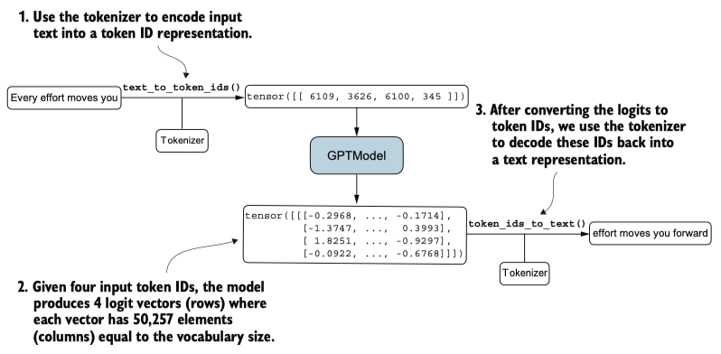
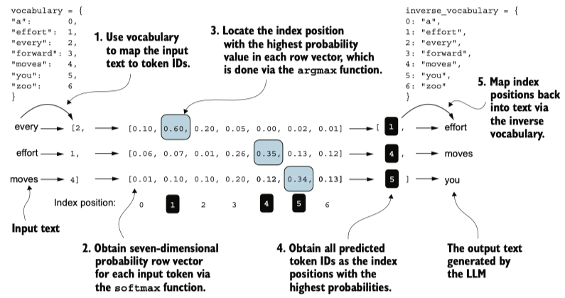
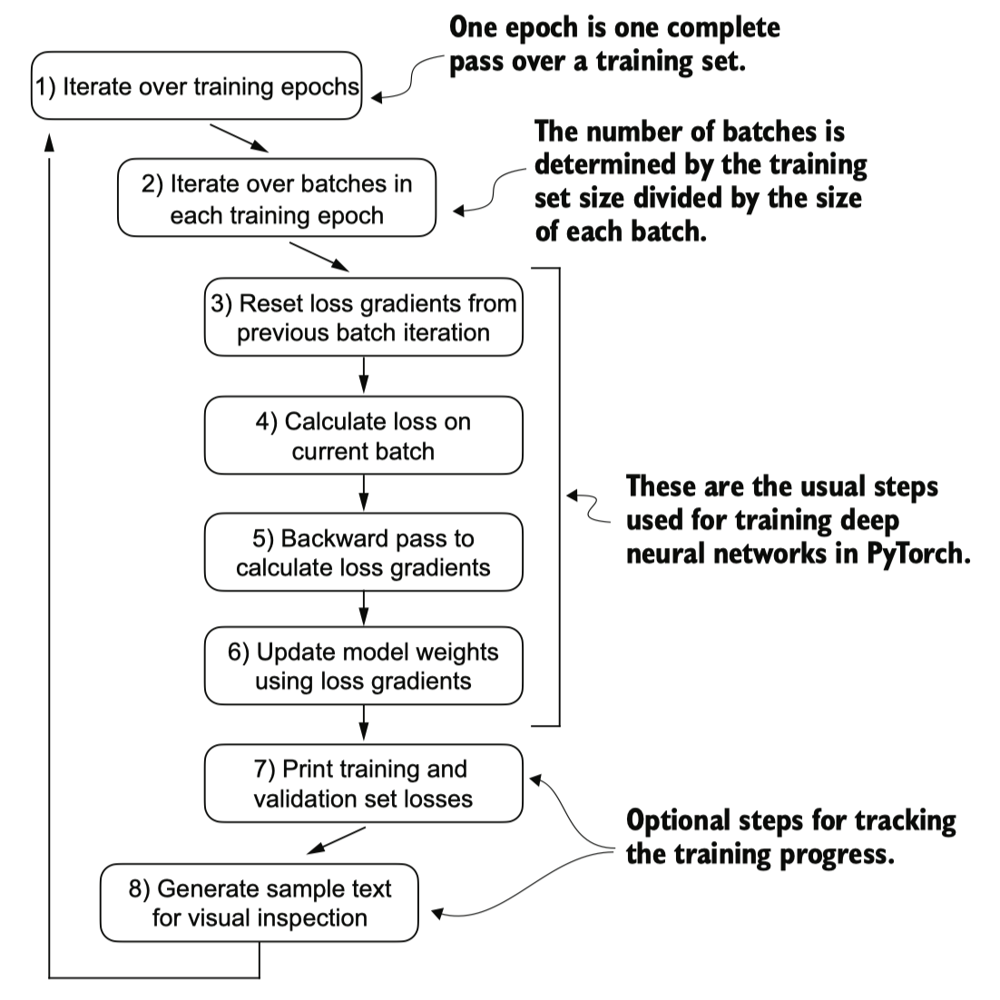

## Pretraining data


### Evaluating generative text models
#### 1. Using GPT to generate text

```python
GPT_CONFIG_124M = {
    "vocab_size": 50257,   # Vocabulary size
    "context_length": 256, # Shortened context length (orig: 1024)
    "emb_dim": 768,        # Embedding dimension
    "n_heads": 12,         # Number of attention heads
    "n_layers": 12,        # Number of layers
    "drop_rate": 0.1,      # Dropout rate
    "qkv_bias": False      # Query-key-value bias
}
```

- Use dropout of 0.1 above, but it's relatively common to train LLMs without dropout nowadays.
- Modern LLMs also don't use bias vectors in the `nn.Linear` layers for the query, key, and value matrices (unlike earlier GPT models), which is achieved by setting `qkv_bias`: False
- We reduce the context length (context_length) of only `256` tokens to reduce the computational resource requirements for training the model, whereas the original 124 million parameter GPT-2 model used `1024` tokens




#### 2. Calculating the text generation loss
Calculate a loss metric for the generated outputs. This loss serves as a progress and success indicator of the training progress.



- The figure illustrates the overall flow from input text to LLM-generated text using a five-step procedure.
- The figure outlines the text generation process with a small seven-token vocabulary to fit this image on a single page. However, our GPTModel works with a much larger vocabulary of 50,000 tokens; hence, the token IDs in the following code will range from 0 to 50,256 rather than 0 to 6.

Before training, the model produces random next-token probability vectors. The goal of model training is to ensure that the probability values corresponding to the highlighted target token IDs are maximized.

- The model produces random text that is different from the target text because it has not been trained yet.
- To train the model, we need to know how far it is away from the correct predictions (targets)

**Cross entropy loss**

交叉熵损失衡量的是模型预测的概率分布与真实概率分布之间的差异，差异越大，损失值越高。

At its core, the cross entropy loss is a popular measure in machine learning and deep learning that **measures the difference between two probability distributions—typically**, the true distribution of labels (here, tokens in a dataset) and the predicted distribution from a model (for instance, the token probabilities generated by an LLM).

In the context of machine learning and specifically in frameworks like PyTorch, the `cross_entropy` function computes this measure for discrete outcomes, which is similar to the negative average log probability of the target tokens given the model’s generated token probabilities, making the terms `cross entropy` and `negative average log probability` related and often used interchangeably in practice.


**Perplexity in Language Models**
困惑度是交叉熵损失的指数形式
Perplexity is a measurement of uncertainty in the predictions of a language model. The lower the perplexity, the better the model at predicting the next word in a sequence, reflecting higher confidence in its predictions.

- Perplexity can be calculated as `perplexity = torch.exp(loss)`

#### 3. Calculating the training and validation set losses
```python
def calc_loss_batch(input_batch, target_batch, model, device):
    input_batch, target_batch = input_batch.to(device), target_batch.to(device)
    logits = model(input_batch)
    loss = torch.nn.functional.cross_entropy(logits.flatten(0, 1), target_batch.flatten())
    return loss
```

### Training an LLM


A typical training loop for training deep neural networks in PyTorch consists of numerous steps, iterating over the batches in the training set for several epochs. In each loop, we calculate the loss for each training set batch to determine loss gradients, which we use to update the model weights so that the training set loss is minimized.

