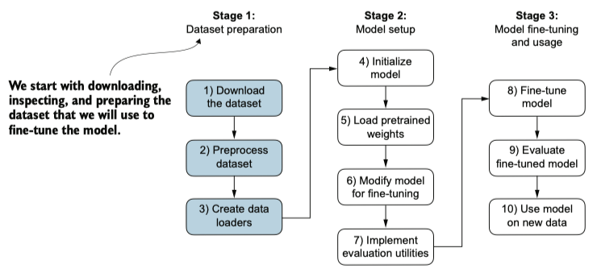
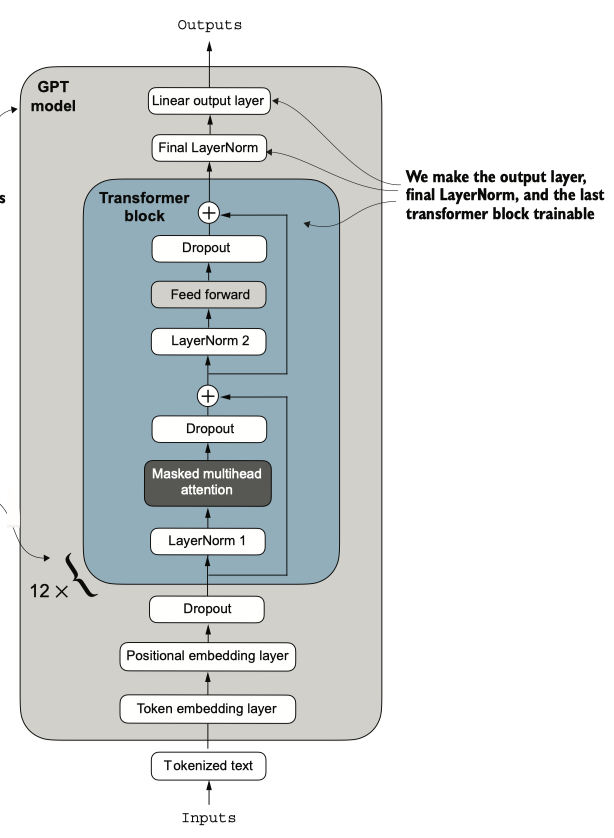

# Fine-tuning for classification

The most common ways to fine-tune language models are `instruction fine-tuning` and `classification fine-tuning`.

### Choosing the right approach

- `Instruction fine-tuning` improves a model’s ability to understand and generate responses based on specific user instructions. Instruction fine-tuning is best suited for models that need to handle a variety of tasks based on complex user instructions, improving flexibility and interaction quality. 

- `Classification fine-tuning` is ideal for projects requiring precise categorization of data into predefined classes, such as sentiment analysis or spam detection.

- While instruction fine-tuning is more versatile, it demands larger datasets and greater computational resources to develop models proficient in various tasks. In contrast, classification fine-tuning requires less data and compute power, but its use is confined to the specific classes on which the model has been trained.

The three-stage process for classification fine-tuning an LLM. 
- Stage 1 involves dataset preparation. 
- Stage 2 focuses on model setup. 
- Stage 3 covers fine-tuning and evaluating the model.

### Dataset preparation

Note that the text messages have different lengths; if we want to combine multiple training examples in a batch, we have to either
- truncate all messages to the length of the shortest message in the dataset or batch
- pad all messages to the length of the longest message in the dataset or batch

We choose option 2 and pad all messages to the longest message in the dataset
- For that, use `<|endoftext|>` as a padding token 

### Fine-tuning selected layers vs. all layers
- Since we start with a pretrained model, it’s not necessary to fine-tune all model layers. In neural network-based language models, the lower layers generally capture basic language structures and semantics applicable across a wide range of tasks and datasets. 
- So, fine-tuning only the last layers (i.e., layers near the output), which are more specific to nuanced linguistic patterns and task-specific features, is often sufficient to adapt the model to new tasks.

The GPT model includes 12 repeated transformer blocks. Alongside the output layer, we set the final LayerNorm and the last transformer block as trainable. The remaining 11 transformer blocks and the embedding layers are kept nontrainable.