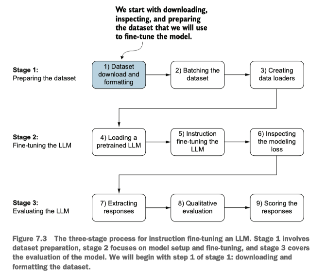
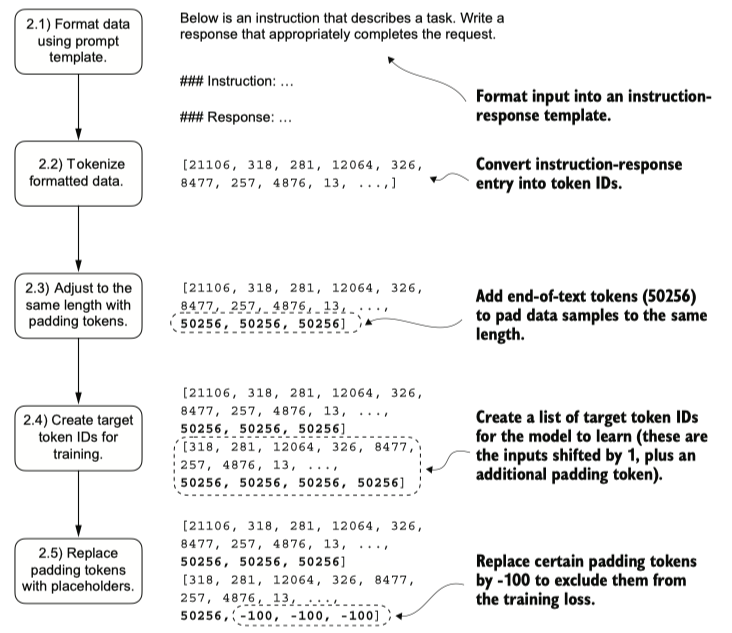

## The instruction fine-tuning process of LLMs

Pretraining an LLM involves a training procedure where it learns to generate one word at a time. The resulting pretrained LLM is capable of text completion, meaning it can finish sentences or write text paragraphs given a fragment as input.

**Instruction fine-tuning**, also known as **supervised instruction fine-tuning**, is a process where we train an LLM to follow specific instructions.




#### Organizing data into training batches
The training batches were created automatically by the PyTorch DataLoader class, which employs a default collate function to combine lists of samples into batches. A collate function is responsible for taking a list of individual data samples and merging them into a single batch that can be processed efficiently by the model during training.

Notes:
在PyTorch中，collate_fn（整理函数）是一个用于自定义如何将多个数据样本合并成一个批量的函数。它的作用类似于“数据打包员”，决定如何把零散的数据样本整理成模型能够处理的整齐批次。

```python
# 处理变长文本，需要自动填充到最长句子的长度
import torch
from torch.utils.data import DataLoader

# 假设数据集返回的是变长文本（每个样本是字id列表）
data = [
    [1, 2, 3],       # 长度3
    [4, 5],          # 长度2
    [6, 7, 8, 9]     # 长度4
]

def collate_fn(batch):
    # 找出本批次中最长的样本长度
    max_len = max(len(sample) for sample in batch)
    
    # 对每个样本填充0直到max_len
    padded_batch = [
        sample + [0] * (max_len - len(sample))
        for sample in batch
    ]
    
    return torch.tensor(padded_batch)

# 使用示例
loader = DataLoader(data, batch_size=2, collate_fn=collate_fn)
for batch in loader:
    print(batch)

# output:
tensor([[1, 2, 3, 0],
        [4, 5, 0, 0]])
tensor([[6, 7, 8, 9],
        [0, 0, 0, 0]])
```

**batching process**

- Applying the prompt template
- Using tokenization from previous steps
- Adding padding tokens
- Creating target token IDs
- Replacing -100 placeholder tokens to mask padding tokens in the loss function



In practice, instruction-finetuned LLMs such as chatbots are evaluated via multiple approaches

- short-answer and multiple choice benchmarks such as MMLU ("Measuring Massive Multitask Language Understanding", https://arxiv.org/abs/2009.03300), which test the knowledge of a model
- human preference comparison to other LLMs, such as LMSYS chatbot arena (https://arena.lmsys.org)
- automated conversational benchmarks, where another LLM like GPT-4 is used to evaluate the responses, such as AlpacaEval (https://tatsu-lab.github.io/alpaca_eval/)